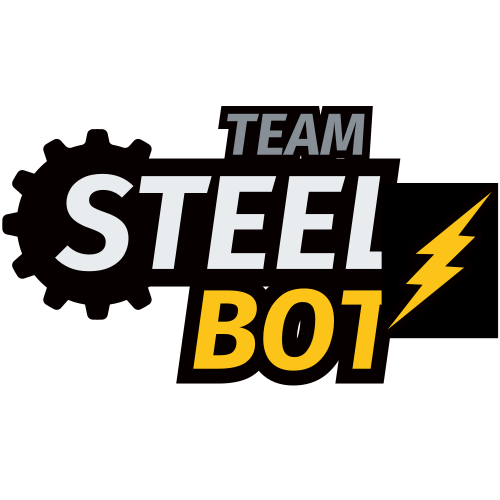

<h1 id="index">Índice</h1>

1. **[Introducción](#introduccion)**
2. **[Descripción de la Mecánica](v-photos/prototype1/README.md)**
3. **[Lista de Componentes](#lista-de-componentes)**
   1. [Raspberry Pi 5](#componentes-raspberry-pi-5)
   2. [Raspberry Pi Camera Module 3 Wide](#componentes-raspberry-pi-camera-module-3-wide)
   3. [Raspberry Pi AI HAT+ (26 TOPS)](#componentes-raspberry-pi-ai-hat-26-tops)
   4. [Raspberry Pi Pico 2 WH](#componentes-raspberry-pi-pico-2-wh) 
   5. [RPLIDAR C1](#componentes-rplidar-c1) 
   6. [Shargeek Storm 2](#componentes-shargeek-storm-2) 
   7. [INJORA 180 Motor 48T](#componentes-injora-180-motor-48t)
   8. [INJORA MB100 20A mini ESC](#componentes-injora-mb100-20a-mini-esc) 
   9. [URGENEX 7.4V Battery](#componentes-urgenex-74v-battery) 
   10. [INJORA 7KG 2065 Micro Servo](#componentes-injora-7kg-2065-micro-servo) 
   11. [HiLetgo Time-of-Flight Sensor VL53L0X](#sensor-tof-hiletgo)
   12. [9-Axis IMU Gyroscope GY-BNO085](#gyroscope-gy-bno085)
4. **[Esquemas y Diagramas](#esquemas)**
   1. [Esquemas de Conexiones](schemes/detailed-klevor-wiring-diagram.png)
   2. [Diagrama de Flujo](schemes/open-challenge-flowchart.png)
5. **[Lenguajes de Programación](#lenguajes-de-programacion)**
   1. [Python](#python)
   2. [MicroPython](#micropython)
   3. [CircuitPython](#circuitpython)
6. Código
   1. [Raspberry Pi 5](src/raspberry-pi-5/README.md)
      1. [YOLO](src/raspberry-pi-5/yolo/README.md)
   2. [Raspberry Pi Pico 2 WH](src/raspberry-pi-pico-2w/README.md)
      1. [CircuitPython](src/raspberry-pi-pico-2w/circuit-python/README.md)
      2. [MicroPython](src/raspberry-pi-pico-2w/micro-python/README.md)
7. **[Librerías](#librerias)**
   1. [Ultralytics YOLO](#ultralytics-yolo)
   2. [OpenCV](#opencv)
   3. [NumPy](#numpy)
   4. [PyTorch](#pytorch)
   5. [PiCamera2](#picamera-2)
   6. [Hailo Platform](#hailo-platform)
8. **[Fotos del equipo](t-photos/README.md)**
9. **[Vídeos](video/README.md)**
10. **[Recursos Externos](#recursos-externos)**

*NOTA: Este listado contiene todo el contenido respectivo al desarollo de Klevor, sin embargo no todo está presente en este README.md, asegurese de hacer click para poder ser redireccionado si es necesario.*
<h1 id="introduccion">Introducción</h1>

    

Este es el repositorio del Team Steel Bot, compitiendo en la World Robot Olympiad 2025, en la categoría Futuros Ingenieros. Representando al Colegio Salto Ángel en Maracaibo, Estado Zulia, Venezuela. 

Actualmente, este equipo está conformado por 3 miembros:

- Ramón Álvarez, 19 años. [ralvarezdev](https://github.com/ralvarezdev).
- Otto Piñero, 16 años. [Ottorafaelpg](https://github.com/Ottorafaelpg).
- Sebastián Álvarez, 15 años. [salvarezdev](https://github.com/salvarezdev).

<h1 id="estructura-de-archivos">Estructura de archivos</h1>

- `models` contiene todos los archivos en 3D que se utilizaron para poder construir a nuestro robot (Klevor).

- `schemes` contiene todos los esquemas y diagramas de todas las conexiones de nuestro robot (Klevor).

- `src` contiene todo el código el cual fue utilizado para poder controlar este robot de manera autónoma.

- `t-photos` contiene las fotos del equipo.

- `v-photos` contiene las fotos de Klevor.

- `video` contiene los vídeos de Klevor en la pista, tanto en el Desafío Abierto como en el Desafío con Obstáculos (Desafío Cerrado).

<h1 id="lista-de-componentes">Lista de Componentes</h1>

A continuación, está la descripción de todos los componentes principales de Klevor (mencionados en el índice).

<h2 id="componentes-raspberry-pi-5">Raspberry Pi 5 (16GB RAM)</h2>

  

Equipada con un procesador ARM Cortex-A76 de 64 bits a 2.4 Ghz. [[1](#raspberry-pi-5-16gb-8gb-4gb-2gb-tiendatec)][[2](#raspberry-pi-16gb-ram)][[3](#raspberry-pi-5-datasheet)] La Raspberry Pi 5 es nuestro controlador principal de elección, decidimos usar a la Raspberry Pi 5 debido a múltiples factores, entre ellos:

- **Compatibilidad**: Existen muchos componentes de Klevor (como el Camera Module 3 Wide) que a su vez pertenecen al ecosistema Raspberry, lo que hace que implementarlos a la Raspberry Pi 5 no requiera tanto esfuerzo.

- **Potencia**: La Raspberry Pi 5 es uno de los controladores más potentes actualmente, gracias a esto, funciones demandantes como lo es el procesamiento de imágenes en tiempo real, son fácilmente realizables por una Raspberry Pi 5.

- **Portabilidad**: La Raspberry Pi 5 destaca entre los controladores, ya que no es una computadora bastante pesada, apenas llegando a los 60g, hace que incorporarlo a Klevor sea una opción prácticamente segura.

| **Medida** | **Valor** |
|------------|-----------|
| Largo      | 85 mm     |
| Alto       | 58.9 mm   |
| Ancho      | 56 mm     |
| Peso       | 46 g      |

<h2 id="componentes-raspberry-pi-camera-module-3-wide">Raspberry Pi Camera Module 3 Wide</h2>

  

La Raspberry Pi Camera Module 3 Wide es nuestra elección de preferencia, como los demás componentes Raspberry, esta se destaca por ser bastante ligera y portátil, ya que, pues es una cámara bastante pequeña, midiendo apenas 25 mm × 24 mm × 12.4 mm y pesando 4 gramos, sin perder absolutamente ni una pizca de eficiencia, porque puede grabar a 1536 x 864p120, ahora bien, decidimos utilizar la versión Wide por su campo de visión horizontal de 102 grados, [[4](#raspberry-pi-camera-module-3-geek-factory)][[5](#raspberry-pi-camera-documentation)] porque nos permite tener un rango de visión óptimo para poder detectar todos los obstáculos de la pista.

| **Medida** | **Valor** |
|------------|-----------|
| Largo      | 24 mm     |
| Alto       | 25 mm     |
| Ancho      | 12.4 mm   |
| Peso       | 4 g       |

<h2 id="componentes-raspberry-pi-ai-hat-26-tops">Raspberry Pi AI HAT+ (26 TOPS)</h2>

  

Si bien la Raspberry Pi 5 es capaz de procesar imágenes en tiempo real, tuvimos en cuenta que necesitaba un poco más de poder, por lo cual decidimos incorporar el AI HAT+ a la Raspberry Pi 5 para poder alcanzar el nivel de procesamiento necesario. 

El Raspberry Pi AI HAT+ tiene dos versiones, una de 13 Trillones de Operaciones por Segundo (TOPS) y otra de 26 TOPS. [[6](#kit-ai-ai-hat-plus-raspberry-pi-kubii)][[7](#raspberry-pi-ai-hat-documentation)] Como se menciona en el índice, Klevor posee un Raspberry Pi AI HAT+ de 26 TOPS, gracias a este procesador de imágenes, Klevor puede analizar hasta 30 imágenes por segundo con una resolución de 640 px × 640 px.

| **Medida** | **Valor** |
|------------|-----------|
| Largo      | 65 mm     |
| Alto       | 5.5 mm    |
| Ancho      | 56 mm     |
| Peso       | 9.07 g    |

<h2 id="componentes-raspberry-pi-pico-2-wh">Raspberry Pi Pico 2 WH</h2>

  

Construido sobre el chip RP2350, [[8](#raspberry-pi-pico-2-2w-2h-2wh-kubii)][[9](#raspberry-pi-pico-2-wh-datasheet)] la Raspberry Pi Pico 2W es el microcontrolador de Klevor, además de ser un microcontrolador ligero y pequeño, este chip permite una fácil integración con el resto de los componentes Raspberry, debido a que establecer una comunicación serial con una Raspberry Pi 5 es mucho más fácil de hacer con una Raspberry Pi Pico que con algún otro microcontrolador de distinto fabricante.

Además de ofrecer una frecuencia de procesamiento de 150 Mhz, superior a varios microcontroladores de similar tamaño, como, por ejemplo, el Arduino Nano el cual cuenta con una frecuencia de procesamiento de 20 Mhz.

Y, la versión con el módulo de WiFi integrado ofrece una gran ventaja a la hora de poder practicar, ya que nos permite ver exactamente qué está procesando Klevor en el momento, sin necesidad de utilizar, por ejemplo, LEDs de distintos colores para poder señalizar distintas decisiones, logrando que el producto final sea mucho más limpio.

| **Medida** | **Valor** |
|------------|-----------|
| Largo      | 51 mm     |
| Alto       | 12 mm     |
| Ancho      | 21 mm     |
| Peso       | 6 g       |

<h2 id="componentes-rplidar-c1">RPLiDAR C1</h2>

  

El RPLiDAR C1 es un escáner de rango láser de 360 grados, el cual puede detectar superficies que están hasta 12 metros de distancia, su punto ciego es de tan solo 5 centímetros alrededor del mismo [[10](#rplidar-c1-robot-shop)][[11](#rplidar-c1-datasheet)], todos estos factores hacen que el RPLiDAR C1 sea una gran opción para poder guíar a Klevor por la pista.

Este RPLiDAR C1 permite a Klevor poder identificar exactamente dónde está ubicado en la pista, gracias a la gran cantidad de datos que este LiDAR ofrece.

| **Medida** | **Valor** |
|------------|-----------|
| Largo      | 55.6 mm   |
| Alto       | 41.3 mm   |
| Ancho      | 55.6 mm   |
| Peso       | 110 g     |

Especificaciones técnicas:

| **Especificación**     | **Valor**                                                                           |
|------------------------|-------------------------------------------------------------------------------------|
| Rango de distancia     | Blanco: 0,05-12 m (70 % de reflectividad); Negro: 0,05-6 m (10 % de reflectividad)  |
| Frecuencia de muestreo | 5 kHz                                                                               |
| Resolución angular     | 0,72°                                                                               |
| Ángulo de inclinación  | 0°-1,5°                                                                             |

<h2 id="componentes-shargeek-storm-2">Shargeek Storm 2</h2>

  

El Shargeek Storm 2 es un Power Bank, con múltiples características interesantes [[12](#shargeek-storm-2-amazon)][[13](#shargeek-storm-2-100w-power-bank)]como:

- 25600 mAh de almacenamiento.
- Salida ajustable de hasta 100 W.
- Pantalla integrada IPS.
- Carga de 0% a 100% en tan solo 1 hora y media.

Todos estos factores hacen que sea una opción perfecta para alimentar un controlador potente como lo es la Raspberry Pi 5.

Sin embargo, debido a su gran peso, es un componente un tanto díficil de poder incorporar

| **Medida** | **Valor** |
|------------|-----------|
| Largo      | 150.8 mm  |
| Alto       | 58.9 mm   |
| Ancho      | 45.9 mm   |
| Peso       | 579 g     |

<h2 id="componentes-injora-180-motor-48t">INJORA 180 Motor 48T</h2>

  

El INJORA 180 Motor 48T es un motor diseñado para carros controlados por radio, ya que estos carros suelen tener un peso y medidas similares a las de Klevor, decidimos que este motor sería una buena incorporación. Debido a su tamaño compacto, bajo voltaje (necesitando apenas 7.4V, llegamos a considerar motores de 12V hasta, incluso de 24V para Klevor), y bajo peso. [[14](#injora-180-48t-amazon)].

A pesar de todas estas ventajas, un motor DC con capacidades de Encoder (es decir, que pueda contar sus vueltas) puede ser de mayor ventaja debido a que permite regular perfectamente los movimientos de Klevor, gracias a que, en vez de asignarle al motor que se mueva por cierto tiempo (lo cual puede hacer que, debido al mas mínimo problema de rendimiento) sea suceptible a fallar, en cambio, con un motor con encoder, es mucho más sencillo debido a que, en vez de mover por tiempo, puedes mover por distancia lo que a pesar de algún problema de rendimiento, Klevor sepa perfectamente cuánta distancia recorrió, aligerando un poco la carga en la necesidad de conocer la distancia a sus alrededores 

| **Medida** | **Valor** |
|------------|-----------|
| Largo      | 42.7 mm   |
| Alto       | 10 mm     |
| Ancho      | 15 mm     |
| Peso       | 38 g      |

Especificaciones mecánicas:

| **Especificación** | **Valor** |
|--------------------|-----------|
| Velocidad sin carga| 20500rpm  |
| Corriente sin carga| 0.48A     |

<h2 id="componentes-injora-mb100-20a-mini-esc">INJORA MB100 20A mini ESC</h2>

  

El INJORA MB100 20A mini ESC es un controlador de velocidad electrónico [[15](#injora-mb100-r80-amazon)], normalmente (en carros RC) este se usa en conjunto con algún motor de la marca INJORA, este permite la conexión entre el INJORA 180 Motor 48T y la Raspberry Pi Pico 2.

Gracias a este dispositivo, podemos asegurar una conexión segura y efectiva entre el motor y la Pico 2, sin necesitar componentes más grandes (como un puente H L298N) para cumplir la misma función. Además que, este mini controlador de velocidad es capaz de soportar el alto amperaje (este puede superar hasta picos de 100A) que pueda consumir el motor INJORA 180.

Además de todo esto, es una parte del código bastante fáciles de configurar gracias a librerías como `adafruit_motor` que permite configurar al motor principal como un servo de rotación continua gracias al módulo `servo`.

A su vez, gracias a que incorpora un BEC (Battery Eliminator Circuit) podemos alimentar al [INJORA 7Kg 2065 Micro Servo](#componentes-injora-7kg-2065-micro-servo), sin necesidad de proporcionar una tercera batería o una alimentación secundaria de la misma batería.

| **Medida** | **Valor** |
|------------|-----------|
| Largo      | 37 mm     |
| Alto       | 22 mm     |
| Ancho      | 10 mm     |
| Peso       | 15 g      |

Especificaciones mecánicas:

| **Especificación**        | **Valor**                                    |
|---------------------------|----------------------------------------------|
| Tipo de motor compatible: | Motor Escobillado (030/050/130/**180**/370)  |
| Salida BEC                | 6V/3A (Modo Lineal)                          |

<h2 id="componentes-urgenex-74v-battery">URGENEX 7.4V Battery</h2>

  

La URGENEX 7.4 V Battery es nuestra segunda batería la cual cumple la única función de alimentar al INJORA 180 Motor 48T, además de esto es una batería recargable lo que lo convierte en una opción sólida para poder alimentar el motor principal.

Si bien cualquier batería de 7.4 V funcionaría perfectamente para poder utilizar al INJORA 180 Motor 48T, decidimos utilizar a la URGENEX 7.4v Battery por su alta calidad, ya que, el motor INJORA 180, en casos extremos puede llegar a consumir 100A, lo que podría causarle problemas a la Shargeek Storm 2, por lo cual decidimos irnos por la ruta más segura y utilizar al motor con su batería propia.

Además de esto, esta batería ofrece una alta capacidad comparada con el resto del mercado, pues que esta alcanza los 3000mAh [[16](#urgenex-3000-mah-amazon)].

| **Medida** | **Valor** |
|------------|-----------|
| Largo      | 37 mm     |
| Alto       | 70 mm     |
| Ancho      | 19 mm     |
| Peso       | 103 g     |

<h2 id="componentes-injora-7kg-2065-micro-servo">INJORA 7Kg 2065 Micro Servo</h2>

  

El INJORA 7KG 2065 Micro Servo es el servomotor encargado de controlar la dirección de Klevor, decidimos utilizar este modelo debido a su reducido tamaño y peso, además de una precisión más que suficiente para poder manejar a Klevor. [[17](#injora-7kg-2065-amazon)].

No sólo estos aspectos definieron la elección, el INJORA 7KG 2065 ofrece también una gran precisión a pesar de su reducido tamaño, algo esencialmente vital en esta competencia.

Gracias a la librería antes mencionada, la `adafruit_motor` con el módulo `servo`, nos permiten configurar el servo a nuestra elección, conviertiendo el uso de funciones para controlar el servo previamente establecidos mucho más fácil de leer sin arriesgar el rendimiento del programa.

| **Medida** | **Valor** |
|------------|-----------|
| Largo      | 23 mm     |
| Alto       | 25.8 mm   |
| Ancho      | 13 mm     |
| Peso       | 20 g      |

<h2 id="sensor-tof-hiletgo">HiLetgo Time-of-Flight Sensor VL53L0X</h2>

  

El sensor VL53L0X en sí mismo es un pequeño sensor de distancia muy popular que utiliza la tecnología Time-of-Flight (ToF) para medir la distancia a un objeto. El sensor VL53L0X emite un pulso de luz láser infrarroja invisible y mide el tiempo que tarda en regresar al sensor. 

Estos sensores son una buena alternativa a los sensores ultrasónicos como el HC-SR04, además de ser más pequeños y confiables[[18](#sensor-tof)].

Al inicio, queríamos utilizar varios de estos sensores para poder cubrir los puntos ciegos del RPLiDAR C1 con mayor facilidad, sin embargo mientras más probábamos múltiples de estos sensores a la vez, notábamos que eran mucho menos confiables y con menor rango (estos problemas se especifican mejor [aqui](/src/raspberry-pi-pico-2w/circuit-python/README.md)) por lo tanto, en vez de utilizar los 8 sensores que pensábamos utilizar como guía para el Desafío Abierto, decidimos que era mejor tener sencillamente sólo un sensor ToF en la aprte trasera de Klevor.

| **Medida** | **Valor** |
|------------|-----------|
| Largo      | 25 mm     |
| Alto       | 1 mm      |
| Ancho      | 10.7 mm   |
| Peso       | 0.8 g     |

<h2 id="gyroscope-gy-bno085">9-Axis IMU Gyroscope GY-BNO085</h2>

  

El GY-BNO085 es un sensor de orientación inercial (IMU) de 9 Grados de Libertad (9DOF), ampliamente utilizado en aplicaciones que requieren un seguimiento de movimiento preciso. En el caso de Klevor, optamos por utilizar este sensor para poder lograr una mayor autonomía del robot en los cruces, ya que este sensor le permite alinearse casi perfectamente y poder ajustarse.

Además de todo esto, el poder utilizar un giroscopio le permite a Klevor contar las vueltas que ha dado tanto en el Desafío Abierto como el Desafío Cerrado de la forma más segura, ya que, a pesar de algún problema mecánico que impida que el robot sea capaz de ir completamente derecho, el giroscopio le puede hacer saber que tanto se está desvíando, siendo éste uno de los componentes indispensables para poder completar este desafío.

La forma en la que lo implementamos es bastante sencilla, el giroscopio siempre está actualizando los datos de manera asíncrona cada 50 milisegundos, y Klevor maneja dos variables, `yaw_deg` (la diferencia en grados en su orientación desde que inició en la pista hasta dónde está ubicado ahora mismo), y `relative_yaw` la cual utiliza el mismo `yaw_deg` para asignarse un valor pero, en vez de reiniciarse cada vez que pasa de los -180 grados ó 180 grados, simplemente le resta o suma (dependiendo del caso) 360 grados a `relative_yaw`, luego dividimos este número entre 90, y redondeamos hacia abajo (es decir, 10.57 para a ser simplemente 10), y si la división es igual a -12 o 12, sabemos que ya está casi en su zona de estacionamiento y Klevor simplemente avanza un poquito y se detiene (en el caso del Desafío Abierto)

| **Medida** | **Valor** |
|------------|-----------|
| Largo      | 25.75 mm  |
| Alto       | 15.5 mm   |
| Ancho      | 1.8 mm    |
| Peso       | 3 g       |

<h1 id="lenguajes-de-programacion">Lenguajes de Programación</h1>

Muchos robots autónomos necesitan de un lenguaje de programación para poder llevar a cabo tareas complejas, en el caso de Klevor, utilizamos un lenguaje principal: Python, y una implementación en microcontroladores como la Raspberry Pi Pico 2 WH, MicroPython.

<h2 id="python">Python</h2>

  

Python es un lenguaje de programación de alto nivel, este lenguaje es cumple muchísimas funciones en general y es uno de los más vérsatiles en general. Klevor utiliza Python como lenguaje de programación para tareas como la detección de los obstáculos y el estacionamiento, escaneo 2D de los datos del RPLidar C1 y el control de los dos motores. 

La ventaja principal de Python es la versatilidad, pues no necesitamos administrar cada tarea en su lenguaje de programación distinto. [[18](#lenguaje-python)]

<h2 id="micropython">MicroPython</h2>

  

MicroPython es una implementación de Python en microcontroladores, a pesar de estar escrito en en el lenguaje de programación C, éste replica todas las funciones de Python en microcontroladores como la ESP32 y ESP8266.

En el caso de Klevor, utilizamos MicroPython en la Raspberry Pi Pico 2 WH, para permitir una comunicación más eficiente entre la Raspberry Pi 5 y la Raspberry Pi Pico 2 WH. [[19](#lenguaje-micropython)]

<h2 id="circuitpython">CircuitPython</h2>

    

CircuitPython es una ramificación de MicroPython diseñada para ser compatibles con microcontroladores pequeños y baratos. [[21](#circuit-python)]

Debido a unos problemas de compatibilidad con la librería del giroscopio GY-BNO085 de Adafruit, ya que ésta estaba diseñada para ser utilizada con CircuitPython, decidimos utilizar CircuitPython en la Raspberry Pi Pico para evitar estos problemas de compatibilidad y no tener que modificar la librería casi en su totalidad.

<h1 id="librerias">Librerías</h1> 

<h2 id="ultralytics-yolo">Ultralytics YOLO</h2>

    

La librería Ultralytics YOLO está construida sobre PyTorch y se caracteriza por su modularidad y su enfoque en la eficiencia y la facilidad de uso. Todo gira en torno a la clase YOLO, que encapsula todas las funcionalidades clave. En su núcleo se basa en los modelos YOLO (You Only Look Once) originales, que, a diferencia de los algoritmos de dos etapas (primero proponen regiones y luego la clasifica) los modelos YOLO se caracterizan por su detección de objetos de una pasada en la red neuronal, dándole una gran velocidad de detección.

Clase YOLO: Es la interfaz principal para interactuar con los modelos. Permite cargar modelos pre-entrenados, construir nuevos modelos desde cero, entrenar, validar, realizar inferencias, exportar y rastrear objetos. Además de la clase,la librería contiene múltiples modos para  poder organizar todas sus funciones (como `train`, `val`, `predict` o `export`)

Detección de Objetos: La tarea central de YOLO. Identifica la ubicación de objetos en una imagen/video mediante cajas delimitadoras (bounding boxes) y asigna una clase a cada objeto. Los modelos están disponibles en diferentes tamaños (Nano `n`, Small `s`, Medium `m`, Large `l`, XLarge `x`) para escalar según las necesidades de rendimiento y precisión. Si bien la librería contiene múltiples usos, en el caso de Klevor utilizamos la Detección de Objetos para poder detectar e identificar los obstáculos. [[22](#ultralytics-yolo-docs)]

<h2 id="opencv">OpenCV</h2>

    

OpenCV (Open Source Computer Vision Library) es una de las librerías de software más populares y potentes del mundo para la visión por computadora y el aprendizaje automático (Machine Learning). Fue desarrollada inicialmente por Intel y ahora es mantenida por una comunidad global activa. En su esencia, OpenCV es una colección masiva de algoritmos y funciones que te permiten procesar imágenes y videos, extraer información de ellos y hacer que las computadoras "vean" y "entiendan" el mundo visual de una manera similar a como lo hacen los humanos.

Su propósito principal es proporcionar una infraestructura común para aplicaciones de visión por computadora y acelerar el uso de la percepción automática en productos comerciales, investigación y desarrollo.[[23](#opencv-documentation)]

<h2 id="numpy">NumPy</h2>

    

La librería NumPy o Numerical Python es una librería la cual contiene muchísimas funciones utilizadas ampliamente en el ecosistema de Python, gracias a esta librería, otras más populares y más flexibles como TensorFlow y PyTorch pudieron ser construidas. Esta librería se basa en la computación numérica y científica en Python.

El propósito general es permitir operaciones numéricas rápidas y eficientes en grandes cantidades de datos.[[24](#numpy-documentation)]Estos cálculos tan extensos, se utilizan para el procesamiento de imágenes de Klevor, aunque también tiene usos como el análisis de datos.

<h2 id="pytorch">Pytorch</h2>

    

PyTorch es una librería de software de código abierto diseñada en el Aprendizaje Automático (Machine Learning), y, en particular para el Aprendizaje Profundo (Deep Learning). PyTorch se ha convertido en uno de los frameworks más populares para el desarrollo de las IA. [[25](#pytorch-documentation)]

Al igual que muchas de las librerías ya mencionadas, PyTorch es bastante útil cuando se trata de desarrollar un programa que involucre Visión por Computadoras, o el Aprendizaje por Refuerzo. Ya que, facilitan el desarrollo de modelos de Inteligencia Artificial.

<h2 id="picamera-2">PiCamera 2</h2>

    

La librería PiCamera 2 es la sucesora de la `picamera` original, desarrollada por Raspberry Pi Foundation. [[26](#the-picamera2-library)] Esta librería permite la conexión entre la RPi Camera Module 3 y el Modelo de Detección de Obstáculos. Entre sus múltiples funciones se encuentran:

- Obtener streams de video para procesamiento en tiempo real (por ejemplo, con OpenCV o NumPy).
- Controlar diversos parámetros de la cámara (exposición, ganancia, balance de blancos, modos de enfoque, etc.).

Además de, obviamente, permitir la toma de imágenes y videos

<h2 id="hailo-platform">Hailo Platform</h2>

    

Hailo Platform es un ecosistema tanto de hardware y software desarrollado por la empresa Hailo, este ecosistema está diseñado para llevar un modelo de Deep Learning desde su entrenamiento hasta su aplicación en tiempo real en periféricos. [[27](#hailo-ai-software-suite)]

Además de esto, la Hailo Platform también incluye múltiples librerías, el objetivo principal de estas librerías (como HailoRT o PyHailoRT) es la de acelerar el proceso de desarrollo de extremo a extremo, tanto en la compilación y optimización hasta su uso en tiempo real.

# Recursos Externos

1. *RASPBERRY PI 5 16GB, 8GB, 4GB, 2GB – MODELO B*. (2025). tiendatec. <a id="raspberry-pi-5-16gb-8gb-4gb-2gb-tiendatec">https://www.tiendatec.es/raspberry-pi/gama-raspberry-pi/2149-raspberry-pi-5-16gb-8gb-4gb-2gb-modelo-b.html</a>

2. *Raspberry Pi 5 16GB RAM*. (2025). RaspberryPiCL. 
<a id="raspberry-pi-16gb-ram">https://raspberrypi.cl/producto/raspberry-pi-5-16gb-ram/</a>

3. *Raspberry Pi 5 Datasheet*. (2025). Raspberry Pi Ltd. <a id="raspberry-pi-5-datasheet">https://datasheets.raspberrypi.com/rpi5/raspberry-pi-5-product-brief.pdf</a>

4. *Raspberry Pi camera module 3 (standard | wide | NOIR)*. (2025). GeekFactory. <a id="raspberry-pi-camera-module-3-geek-factory">https://www.geekfactory.mx/producto/raspberry-pi-camera-module-3/</a>

5. *Raspberry Pi Camera Documentation*. (2025). Raspberry Pi Ltd. <a id="raspberry-pi-camera-documentation">https://www.raspberrypi.com/documentation/accessories/camera.html</a>

6. *Kit AI, AI HAT+ Raspberry Pi*. (2025). Kubii. <a id="kit-ai-ai-hat-plus-raspberry-pi-kubii">https://www.kubii.com/es/tarjetas-integradas/4343-kit-ai-ai-hat-raspberry-pi-3272496319608.html</a>

7. *Raspberry Pi AI HAT+ Documentation*. (2025). Raspberry Pi Ltd. <a id="raspberry-pi-ai-hat-documentation">https://www.raspberrypi.com/documentation/accessories/ai-hat-plus.html</a>

8. *Raspberry Pi Pico 2, 2W, 2H, 2WH*. (2025). Kubii. <a id="raspberry-pi-pico-2-2w-2h-2wh-kubii">https://www.kubii.com/es/microcontroladores/4377-raspberry-pi-pico-2-2w-2h-2wh-3272496319394.html</a>

9. *Raspberry Pi Pico 2 WH Datasheet*. (2025). Raspberry Pi Ltd. <a id="raspberry-pi-pico-2-wh-datasheet">https://datasheets.raspberrypi.com/pico/pico-2-product-brief.pdf</a>

10. *Escáner Láser DTOF 360° SLAMTEC RPLIDAR C1*. (2025). RobotShop. <a id="rplidar-c1-robot-shop">https://www.robotshop.com/es/products/escaner-laser-dtof-360-slamtec-rplidar-c1?qd=3ec3808f4c3dd74dab521269d23d2fb2</a>

11. *RPLidar C1 360 ToF LiDAR Datasheet*. (2025). RobotShop. <a id="rplidar-c1-datasheet">https://cdn.robotshop.com/media/R/Rpk/RB-Rpk-35/pdf/rp-lidar-360-tof-lidar-datasheet.pdf</a>

12. *Shargeek Storm 2, banco de energía para portátil de 100 W, cargador portátil de 25600 mAh, primer banco de energía transparente del mundo con pantalla IPS, Samsung Galaxy, MacBook y más*. (2025). Amazon. <a id="shargeek-storm-2-amazon">https://www.amazon.es/Shargeek-port%C3%A1til-cargador-transparente-pantalla/dp/B09NY8GN76</a>

13. *Shargeek Storm 2, 100W Portable Power Bank*. (2025). Sharge Technology (Shenzhen) Co., Ltd. <a id="shargeek-storm-2-100w-power-bank">https://docs.google.com/gview?embedded=true&url=manuals.plus/m/74637553dc00ed21580afe764bb86b7b118410fa97478a675e0edc76f8214d87_optim.pdf</a>

14. *INJORA Motor Cepillado 180 48T con Piñón de Acero Inoxidable, Conector JST-PH2.0 para Upgrade 1/18 RC Crawler Redcat Ascent-18*. (2025). Amazon. <a id="injora-180-48t-amazon">https://www.amazon.es/INJORA-Cepillado-Inoxidable-JST-PH2-0-Ascent-18/dp/B0D97YNMLG?ref_=ast_sto_dp</a>

15. *INJORA MB100-R80 20A Brushed Mini ESC con Motor 180 de 48T para Actualización TRX4M 1/18 RC Crawler*. (2025). Amazon. <a id="injora-mb100-r80-amazon">https://www.amazon.es/INJORA-MB100-Brushed-Actualizaci%C3%B3n-Crawler/dp/B0CXT74XV6?ref_=ast_sto_dp</a>

16. *URGENEX 3000mAh 7.4 V Li-ion Battery with Dean-Style T Plug 2S Rechargeable RC Battery Fit for WLtoys 4WD High Speed RC Cars and Most 1/10, 1/12, 1/16 Scale RC Cars Trucks with 7.4V Battery Charger*. (2025). Amazon. <a id="urgenex-3000-mah-amazon">https://www.amazon.com/URGENEX-Bater%C3%ADa-enchufe-recargable-velocidad/dp/B0CYNVSN7W?ref_=ast_sto_dp</a>

17. *INJORA 7KG 2065 Digital Servo Waterproof High Voltage Sub-Micro Shift Servo for TRX4 TRX6 SCX10 III 1/10 RC Crawler Car,1PCS*. (2025). Amazon. <a id="injora-7kg-2065-amazon">https://www.amazon.com/digital-impermeable-voltaje-Sub-Micro-Crawler/dp/B0BLBMVYCW?ref_=ast_sto_dp</a>

18. *VL53L0X*. (2025). STMicroElectronics. <a id="sensor-tof">https://www.st.com/en/imaging-and-photonics-solutions/vl53l0x.html</a>

19. *El tutorial de Python*. (2025). Python Software Fundation. <a id="lenguaje-python">https://docs.python.org/es/3/tutorial/</a>

20. *Qué es MicroPython, el lenguaje de programación que ya puedes usar en tu Arduino.* (2022). GenBeta. <a id="lenguaje-micropython">https://www.genbeta.com/desarrollo/que-micropython-lenguaje-programacion-que-puedes-usar-tu-arduino-probar-tu-navegador</a>

21. *CircuitPython*. (2025). CircuitPython. <a id="circuitpython">https://docs.circuitpython.org/en/latest/README.html</a>

22. *Ultralytics Docs*. (2025). Ultralytics Inc. <a id="ultralytics-yolo-docs">https://docs.ultralytics.com/#where-to-start</a>

23. *OpenCV Documentation*. (2025). OpenCV. <a id="opencv-documentation">https://docs.opencv.org/4.11.0/d1/dfb/intro.html</a>

24. *NumPy Documentation*. (2024). NumPy Developers. <a id="numpy-documentation">https://numpy.org/doc/stable/user/index.html</a>

25. *PyTorch Documentation*. (2025). PyTorch Contributors. <a id="pytorch-documentation">https://docs.pytorch.org/docs/stable/index.html</a>

26. *The PiCamera 2 Library*. (2025). Raspberry Pi Ltd. <a id="the-picamera2-library">https://datasheets.raspberrypi.com/camera/picamera2-manual.pdf</a>

27. *Hailo AI Software Suite*. (2025). Hailo Technologies Ltd. <a id="hailo-ai-software-suite">https://hailo.ai/products/hailo-software/hailo-ai-software-suite/#sw-overview</a>
