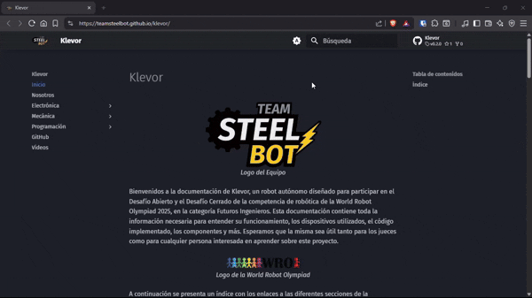

# Klevor

    
     
    <i>Logo del Equipo</i>

Bienvenidos al repositorio de Klevor, el robot del Team Steel Bot, que compite en la World Robot Olympiad 2025 en la categoría Futuros Ingenieros. Aquí encontrarás toda la información sobre el robot, incluyendo su código, modelos 3D, esquemas y documentación.

Actualmente, toda la documentación oficial se encuentra [aquí](https://teamsteelbot.github.io/klevor/), en GitHub Pages, donde podrás acceder a toda la documentación presente en este repositorio en un formato web fácil y rápido. Esta documentación está organizada en varias secciones, cada una de las cuales contiene información específica sobre el robot y su desarrollo.

> [!IMPORTANT]
> Si te gusta leer la documentación en un formato más tradicional, puedes descargarla en formato PDF puedes hacerlo ubicando el botón de descarga, el cual es el primer ícono (de izquierda a derecha) en el pie de página de la documentación en GitHub Pages, que te permitirá descargar un archivo PDF con toda la documentación del robot Klevor. 

También puedes acceder a la documentación desde el repositorio en GitHub, donde encontrarás los archivos de la documentación en formato Markdown, en la carpeta [`docs`](/docs), sin embargo, la forma recomendada de acceder a la documentación es a través de la página web en GitHub Pages, ya que ofrece una experiencia de lectura más fluida y visualmente atractiva, además de que por la naturaleza de la tecnología empleada para el desarrollo de la página web ([MkDocs](https://www.mkdocs.org/)), ciertos enlaces y recursos pueden no funcionar correctamente al acceder directamente a los archivos Markdown en el repositorio.

> [!IMPORTANT]
> En el caso de fallas con el enlace de GitHub Pages principal, contamos con un enlace alternativo que también te llevará a la documentación oficial de Klevor: [GitHub Pages Alternativo](https://ralvarezdev.github.io/klevor/).