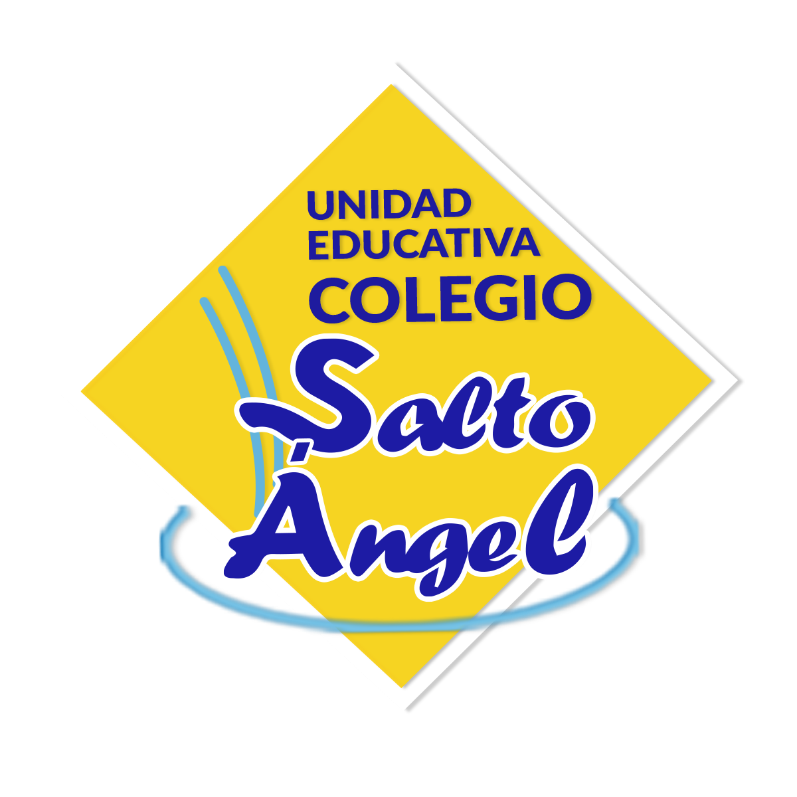

# About Us

<!-- github-only-start -->

	
	 
	<i>Team Steel Bot's Logo</i>

<!-- github-only-end -->

<!-- mkdocs-only-start

    
    <i>Team Steel Bot's Logo</i>

mkdocs-only-end -->

This is Team Steel Bot's repository, or well, the documentation, a participating team in the World Robot Olympiad 2025, in the Future Engineers category. Representing the Salto Angel School, in Maracaibo, Estado Zulia, Venezuela.

<!-- github-only-start -->

	
	 
	<i>World Robot Olympiad's Logo</i>

<!-- github-only-end -->

<!-- mkdocs-only-start

	
	<i>World Robot Olympiad's Logo</i>

mkdocs-only-end -->

Currently, this team is conformed by 3 members:

- **Ramón Álvarez**, 19 years old. [ralvarezdev](https://github.com/ralvarezdev). The team's captain and in charge of the robot's code. Currently, he is in his 9th trimester in Computer Engineering at Universidad Rafael Urdaneta (URU).
- **Sebastián Álvarez**, 15 years old. [salvarezdev](https://github.com/salvarezdev). Currently in charge of robot's code, the documentation and the robot's logic. Currently, he is in his 4th year of high school at Colegio Salto Ángel.
- **Otto Piñero**, 16 years old. [Ottorafaelpg](https://github.com/Ottorafaelpg). Currently in charge of the robot's design and manufacturing, he is also in his 4th year of high school at Colegio Salto Ángel.

<!-- github-only-start -->

	
	 
	<i>From left to right: Sebastián Álvarez, Ramón Álvarez and Otto Piñero</i>

	

		
		 
		<i>Universidad Rafael Urdaneta's Logo</i>
	

	

		
		 
		<i>Colegio Salto Ángel's Logo</i>
	

<!-- github-only-end -->

<!-- mkdocs-only-start

    
    <i>From left to right: Sebastián Álvarez, Ramón Álvarez and Otto Piñero</i>

    

        
        <i>Universidad Rafael Urdaneta's Logo</i>
    

    

        
        <i>Colegio Salto Ángel's Logo</i>
    

mkdocs-only-end -->