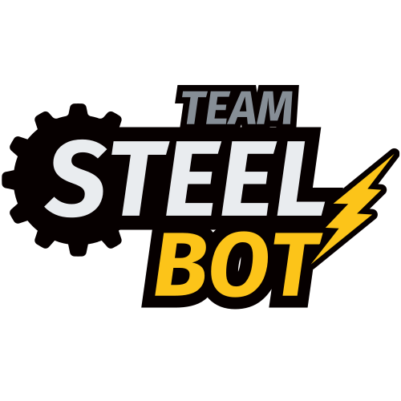
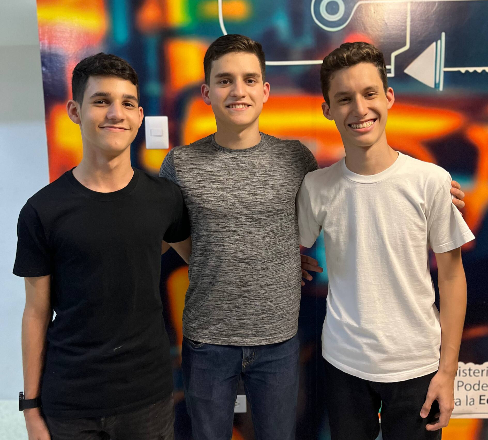

# Nosotros

    

Este es el repositorio, o en su defecto la documentación, del Team Steel Bot, 
equipo compitiendo en la World Robot Olympiad 2025, en la categoría Futuros
Ingenieros. Representando al Colegio Salto Ángel en Maracaibo, 
Estado Zulia, Venezuela.

Actualmente, este equipo está conformado por 3 miembros:

- **Ramón Álvarez**, 19 años. [ralvarezdev](https://github.com/ralvarezdev). 
  Ejerce como líder del equipo y es el encargado de la programación. Actualmente, cursa 
  el 9no trimestre de Ingeniería en Computación en la Universidad Rafael Urdaneta (URU).
- **Sebastián Álvarez**, 15 años. [salvarezdev](https://github.com/salvarezdev). 
  Encargado tanto de la programación, como de la documentación y la
  toma de decisiones con respecto a la lógica del robot. Actualmente, cursa 
  el 4to año de bachillerato en el Colegio Salto Ángel.
- **Otto Piñero**, 16 años. [Ottorafaelpg](https://github.com/Ottorafaelpg). 
  Encargado del diseño y la fabricación del robot. Actualmente, cursa el 4to año de
  bachillerato en el Colegio Salto Ángel.

    
    <i>De izquierda a derecha: Sebastián Álvarez, Ramón Álvarez y Otto 
Piñero.</i>

