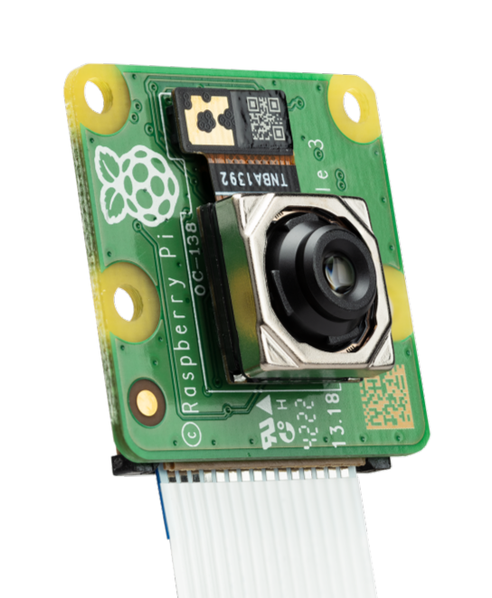
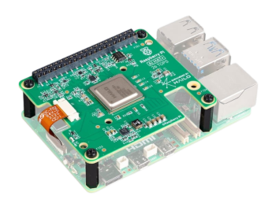
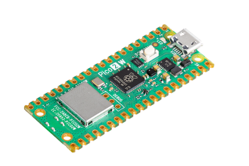
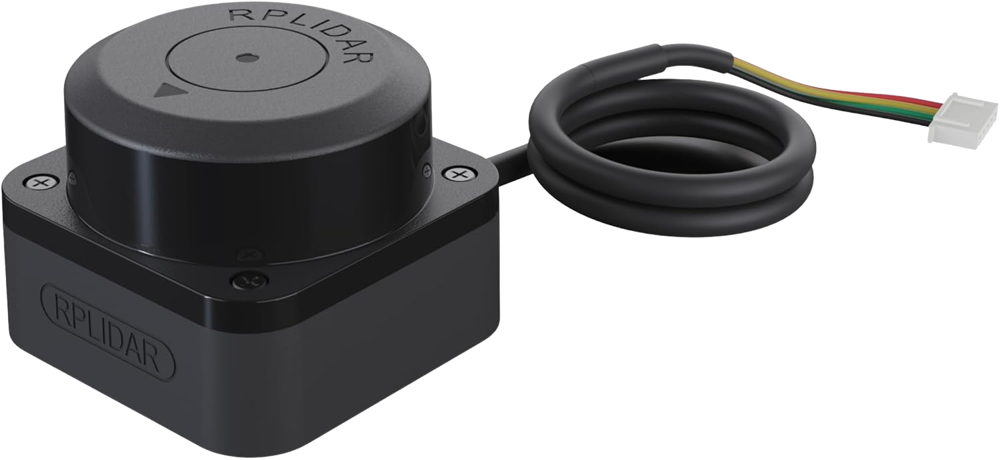
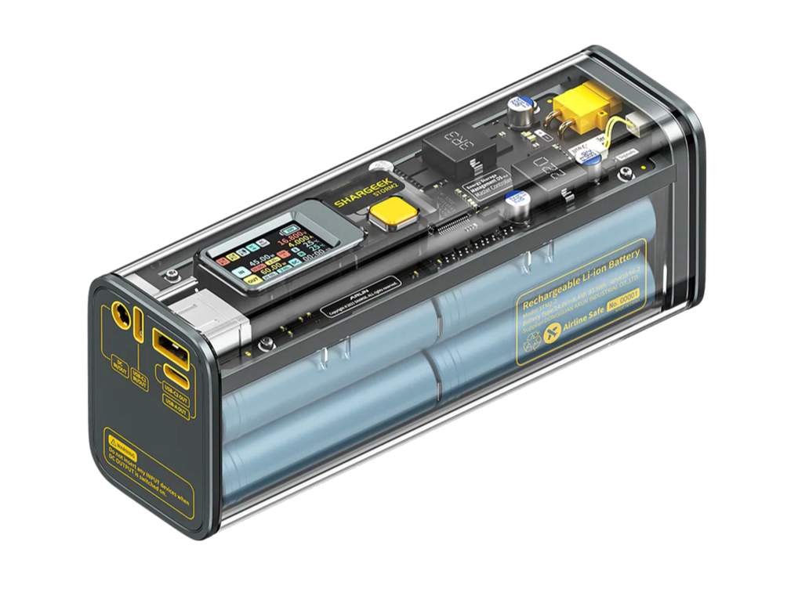
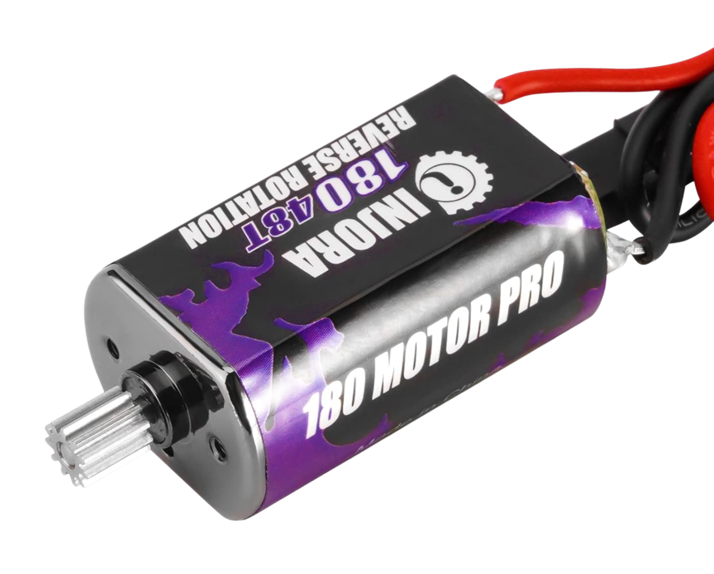
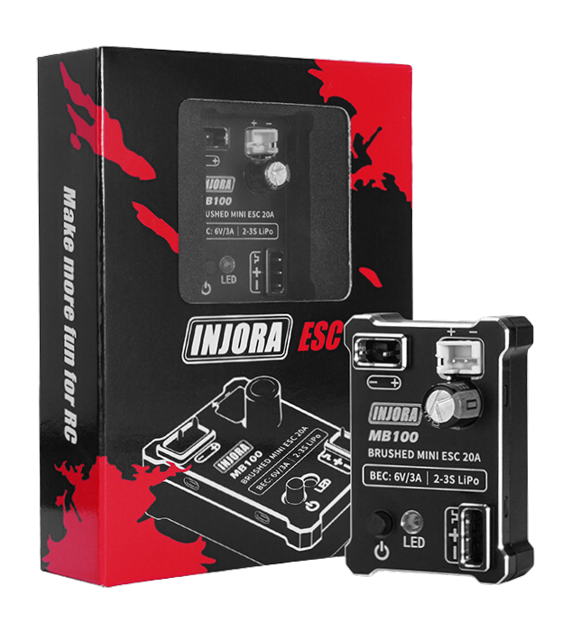
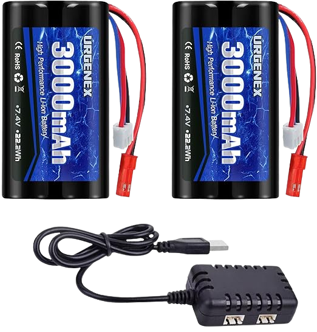
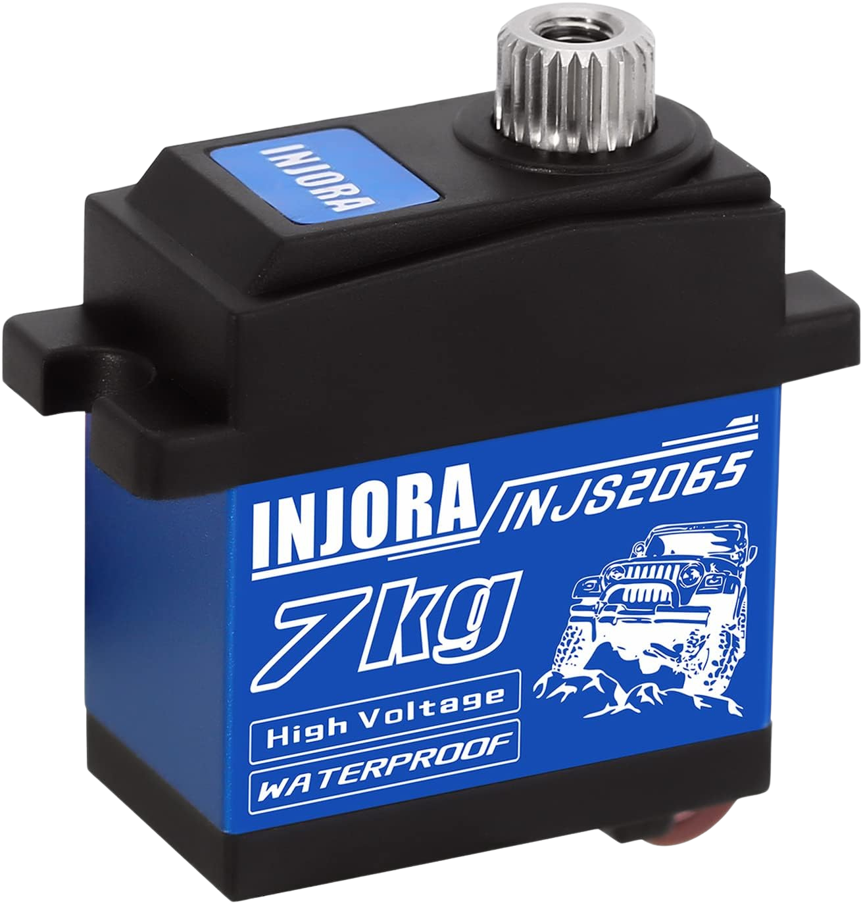
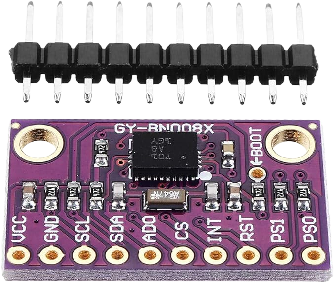

# Lista de Componentes Actuales {:#current-components-list}

A continuación, está la descripción de todos los componentes principales de Klevor.

## Raspberry Pi 5 (16GB RAM) {:#raspberry-pi-5}

    
    <i>Raspberry Pi 5</i>

Equipada con un procesador ARM Cortex-A76 de 64 bits a 2.4 GHz [[1](#raspberry-pi-5-datasheet)]. La Raspberry Pi 5 es nuestro controlador principal de elección, decidimos usar a la Raspberry Pi 5 debido a múltiples factores, entre ellos:

- **Compatibilidad**: Existen muchos componentes de Klevor (como la Camera Module 3 Wide) que a su vez pertenecen al ecosistema Raspberry, lo que hace que implementarlos a la Raspberry Pi 5 no requiera tanto esfuerzo.

- **Potencia**: La Raspberry Pi 5 es uno de los computadores portátiles más potentes actualmente, gracias a esto, funciones demandantes como lo es el procesamiento de imágenes en tiempo real, son fácilmente realizables por una Raspberry Pi 5.

- **Portabilidad**: La Raspberry Pi 5 destaca entre los controladores, ya que no es una computadora bastante pesada, apenas llegando a los 60 g, hace que incorporarlo a Klevor sea una opción prácticamente segura [[1](#raspberry-pi-5-datasheet)].

| **Medida** | **Valor** |
|------------|-----------|
| Largo      | 85 mm     |
| Alto       | 58.9 mm   |
| Ancho      | 56 mm     |
| Peso       | 46 g      |

## Raspberry Pi Camera Module 3 Wide {:#raspberry-pi-camera-module-3-wide}

    
    <i>Raspberry Pi Camera Module 3</i>

La Raspberry Pi Camera Module 3 Wide es nuestra elección de preferencia, como los demás componentes Raspberry, esta se destaca por ser bastante ligera y portátil, ya que, pues es una cámara bastante pequeña, midiendo apenas 25 mm × 24 mm × 12.4 mm y pesando 4 gramos, sin perder absolutamente ni una pizca de eficiencia, porque puede grabar a 1536 x 864p120, ahora bien, decidimos utilizar la versión Wide por su campo de visión horizontal de 102 grados [[2](#raspberry-pi-camera-module-3-geek-factory)] | [[3](#raspberry-pi-camera-documentation)], porque nos permite tener un rango de visión óptimo para poder detectar todos los obstáculos de la pista.

| **Medida** | **Valor** |
|------------|-----------|
| Largo      | 24 mm     |
| Alto       | 25 mm     |
| Ancho      | 12.4 mm   |
| Peso       | 4 g       |

## Raspberry Pi AI HAT+ (26 TOPS) {:#raspberry-pi-ai-hat-26-tops}

    
    <i>Raspberry Pi AI HAT+ 26 TOPS</i>

Si bien la Raspberry Pi 5 es capaz de procesar imágenes en tiempo real, tuvimos en cuenta que necesitaba un poco más de poder, por lo cual decidimos incorporar la AI HAT+ a la Raspberry Pi 5 para poder alcanzar el nivel de procesamiento necesario.

El Raspberry Pi AI HAT+ tiene dos versiones, una de 13 Trillones de Operaciones por Segundo (TOPS) y otra de 26 TOPS [[4](#raspberry-pi-ai-hat-documentation)]. Como se menciona en el índice, Klevor posee un Raspberry Pi AI HAT+ de 26 TOPS, gracias a este procesador de imágenes, Klevor puede analizar hasta 30 imágenes por segundo con una resolución de 640 px × 640 px.

| **Medida** | **Valor** |
|------------|-----------|
| Largo      | 65 mm     |
| Alto       | 5.5 mm    |
| Ancho      | 56 mm     |
| Peso       | 9.07 g    |

## Raspberry Pi Pico 2 WH {:#raspberry-pi-pico-2-wh}

  
  <i>Raspberry Pi Pico 2 W</i>

Construido sobre el chip RP2350 [[5](#raspberry-pi-pico-2-wh-datasheet)], la Raspberry Pi Pico 2 W es el microcontrolador de Klevor, además de ser un microcontrolador ligero y pequeño, este chip permite una fácil integración con el resto de los componentes Raspberry, debido a que establecer una comunicación serial con una Raspberry Pi 5 es mucho más fácil de hacer con una Raspberry Pi Pico que con algún otro microcontrolador de distinto fabricante.

Además de ofrecer una frecuencia de procesamiento de 150 Mhz, superior a varios microcontroladores de similar tamaño, como, por ejemplo, el Arduino Nano el cual cuenta con una frecuencia de procesamiento de 20 Mhz.

La versión con el módulo de WiFi integrado ofrece una gran ventaja a la hora de poder practicar, ya que nos permite ver exactamente qué está procesando Klevor en el momento, sin necesidad de utilizar, por ejemplo, LED de distintos colores para poder señalizar distintas decisiones, logrando que el producto final sea mucho más limpio.

| **Medida** | **Valor** |
|------------|-----------|
| Largo      | 51 mm     |
| Alto       | 12 mm     |
| Ancho      | 21 mm     |
| Peso       | 6 g       |

## RPLiDAR C1 {:#rplidar-c1}

    
    <i>RPLiDAR C1</i>

El RPLiDAR C1 es un escáner de rango láser de 360 grados, el cual puede detectar superficies que están hasta 12 metros de distancia, su punto ciego es de tan solo 5 centímetros alrededor del mismo [[6](#rplidar-c1-robot-shop)] | [[7](#rplidar-c1-datasheet)], todos estos factores hacen que el RPLiDAR C1 sea una gran opción para poder guíar a Klevor por la pista.

Este RPLiDAR C1 permite a Klevor poder identificar exactamente dónde está ubicado en la pista, gracias a la gran cantidad de datos que este LiDAR ofrece.

| **Medida** | **Valor** |
|------------|-----------|
| Largo      | 55.6 mm   |
| Alto       | 41.3 mm   |
| Ancho      | 55.6 mm   |
| Peso       | 110 g     |

Especificaciones técnicas:

| **Especificación**     | **Valor**                                                                          |
|------------------------|------------------------------------------------------------------------------------|
| Rango de distancia     | Blanco: 0,05-12 m (70 % de reflectividad); Negro: 0,05-6 m (10 % de reflectividad) |
| Frecuencia de muestreo | 5 kHz                                                                              |
| Resolución angular     | 0,72°                                                                              |
| Ángulo de inclinación  | 0°-1,5°                                                                            |

## Shargeek Storm 2 {:#shargeek-storm-2}

    
    <i>Shargeek Storm 2</i>

El Shargeek Storm 2 es un Power Bank, con múltiples características interesantes [[8](#shargeek-storm-2-amazon)] | [[9](#shargeek-storm-2-100w-power-bank)] como:

- 25600 mAh de almacenamiento.
- Salida ajustable de hasta 100 W.
- Pantalla integrada IPS.
- Carga de 0% a 100% en tan solo 1 hora y media.

Todos estos factores hacen que sea una opción perfecta para alimentar un controlador potente como lo es la Raspberry Pi 5.

Sin embargo, debido a su gran peso, es un componente un tanto difícil de poder incorporar

| **Medida** | **Valor** |
|------------|-----------|
| Largo      | 150.8 mm  |
| Alto       | 58.9 mm   |
| Ancho      | 45.9 mm   |
| Peso       | 579 g     |

## INJORA 180 Motor 48T {:#injora-180-motor-48t}

    
    <i>INJORA 180 Motor 48T</i>

El INJORA 180 Motor 48T es un motor diseñado para carros controlados por radio, ya que estos carros suelen tener un peso y medidas similares a las de Klevor, decidimos que este motor sería una buena incorporación. Debido a su tamaño compacto, bajo voltaje (necesitando apenas 7.4 V, llegamos a considerar motores de 12 V hasta, incluso de 24 V para Klevor), y bajo peso [[10](#injora-180-48t-amazon)].

A pesar de todas estas ventajas, un motor DC con capacidades de Encoder (es decir, que pueda contar sus vueltas) puede ser de mayor ventaja debido a que permite regular perfectamente los movimientos de Klevor, gracias a que, en vez de asignarle al motor que se mueva por cierto tiempo (lo cual puede hacer que, debido al más mínimo problema de rendimiento) sea susceptible a fallar, en cambio, con un motor con encoder, es mucho más sencillo debido a que, en vez de mover por tiempo, puedes mover por distancia lo que a pesar de algún problema de rendimiento, Klevor sepa perfectamente cuánta distancia recorrió, aligerando un poco la carga en la necesidad de conocer la distancia a sus alrededores

| **Medida** | **Valor** |
|------------|-----------|
| Largo      | 42.7 mm   |
| Alto       | 10 mm     |
| Ancho      | 15 mm     |
| Peso       | 38 g      |

Especificaciones mecánicas:

| **Especificación**  | **Valor** |
|---------------------|-----------|
| Velocidad sin carga | 20500rpm  |
| Corriente sin carga | 0.48A     |

## INJORA MB100 20A mini ESC {:#injora-mb100-20a-mini-esc}

    
    <i>INJORA MB100 20A Mini ESC</i>

El INJORA MB100 20A mini ESC es un controlador de velocidad electrónico [[11](#injora-mb100-r80-amazon)], normalmente (en carros RC) este se usa en conjunto con algún motor de la marca INJORA, este permite la conexión entre el INJORA 180 Motor 48T y la Raspberry Pi Pico 2.

Gracias a este dispositivo, podemos asegurar una conexión segura y efectiva entre el motor y la Pico 2, sin necesitar componentes más grandes (como un puente H L298N) para cumplir la misma función. Además que, este mini controlador de velocidad es capaz de soportar el alto amperaje (este puede superar hasta picos de 100A) que pueda consumir el motor INJORA 180.

Además de todo esto, es una parte del código bastante fácil de configurar gracias a librerías como `adafruit_motor` que permite configurar al motor principal como un servo de rotación continua gracias al módulo `servo`.

A su vez, gracias a que incorpora un BEC (Battery Eliminator Circuit) podemos alimentar al [INJORA 7Kg 2065 Micro Servo](#injora-7kg-2065-micro-servo), sin necesidad de proporcionar una tercera batería o una alimentación secundaria de la misma batería.

| **Medida** | **Valor** |
|------------|-----------|
| Largo      | 37 mm     |
| Alto       | 22 mm     |
| Ancho      | 10 mm     |
| Peso       | 15 g      |

Especificaciones mecánicas:

| **Especificación**        | **Valor**                                   |
|---------------------------|---------------------------------------------|
| Tipo de motor compatible: | Motor Escobillado (030/050/130/**180**/370) |
| Salida BEC                | 6V/3A (Modo Lineal)                         |

## URGENEX 7.4 V Battery {:#urgenex-7-4v-battery}

    
    <i>URGENEX 7.4 V Battery</i>

La URGENEX 7.4 V Battery es nuestra segunda batería la cual cumple la única función de alimentar al INJORA 180 Motor 48T, además de esto es una batería recargable lo que lo convierte en una opción sólida para poder alimentar el motor principal.

Si bien cualquier batería de 7.4 V funcionaría perfectamente para poder utilizar al INJORA 180 Motor 48T, decidimos utilizar a la URGENEX 7.4v Battery por su alta calidad, ya que, el motor INJORA 180, en casos extremos puede llegar a consumir 100A, lo que podría causarle problemas a la Shargeek Storm 2, por lo cual decidimos irnos por la ruta más segura y alimentar al motor con su batería propia.

Además de esto, esta batería ofrece una alta capacidad comparada con el resto del mercado, pues que esta alcanza los 3000 mAh [[12](#urgenex-3000-mah-amazon)].

| **Medida** | **Valor** |
|------------|-----------|
| Largo      | 37 mm     |
| Alto       | 70 mm     |
| Ancho      | 19 mm     |
| Peso       | 103 g     |

## INJORA 7 kg 2065 Micro Servo {:#injora-7kg-2065-micro-servo}

    
    <i>INJORA 7 kg 2065 Micro Servo</i>

El INJORA 7 kg 2065 Micro Servo es el servomotor encargado de controlar la dirección de Klevor, decidimos utilizar este modelo debido a su reducido tamaño y peso, además de una precisión más que suficiente para poder manejar a Klevor. [[13](#injora-7kg-2065-amazon)].

No solo estos aspectos definieron la elección, el INJORA 7 kg 2065 ofrece también una gran precisión a pesar de su reducido tamaño, algo esencialmente vital en esta competencia.

Gracias a la librería antes mencionada, la `adafruit_motor` con el módulo `servo`, nos permiten configurar el servo a nuestra elección, convirtiendo el uso de funciones para controlar el servo previamente establecido mucho más fácil de leer sin arriesgar el rendimiento del programa.

| **Medida** | **Valor** |
|------------|-----------|
| Largo      | 23 mm     |
| Alto       | 25.8 mm   |
| Ancho      | 13 mm     |
| Peso       | 20 g      |

## 9-Axis IMU Gyroscope GY-BNO085 {:#gyroscope-gy-bno085}

    
    <i>BNO085</i>

El GY-BNO085 es un sensor de orientación inercial (IMU) de 9 Grados de Libertad (9DOF), ampliamente utilizado en aplicaciones que requieren un seguimiento de movimiento preciso. En el caso de Klevor, optamos por utilizar este sensor para poder lograr una mayor autonomía del robot en los cruces, ya que este sensor le permite alinearse casi perfectamente y poder ajustarse.

Además de todo esto, el poder utilizar un giroscopio le permite a Klevor contar las vueltas que ha dado tanto en el Desafío sin Obstáculos como el Desafío Cerrado de la forma más segura, ya que, a pesar de algún problema mecánico que impida que el robot sea capaz de ir completamente derecho, el giroscopio le puede hacer saber que tanto se está desvíando, siendo este uno de los componentes indispensables para poder completar este desafío.

La forma en la que lo implementamos es bastante sencilla, el giroscopio siempre está actualizando los datos de manera asíncrona cada 50 milisegundos, y Klevor maneja dos variables, `yaw_deg` (la diferencia en grados en su orientación desde que inició en la pista hasta dónde está ubicado ahora mismo), y `relative_yaw` la cual utiliza el mismo `yaw_deg` para asignarse un valor, pero, en vez de reiniciarse cada vez que pasa de los -180 grados o 180 grados, simplemente le resta o suma (dependiendo del caso) 360 grados a `relative_yaw`, luego dividimos este número entre 90, y redondeamos hacia abajo (es decir, 10.57 pasa a ser simplemente 10), y si la división es igual a -12 o 12, sabemos que ya está casi en su zona de estacionamiento y Klevor simplemente avanza un poquito y se detiene (en el caso del Desafío sin Obstáculos).

| **Medida** | **Valor** |
|------------|-----------|
| Largo      | 25.75 mm  |
| Alto       | 15.5 mm   |
| Ancho      | 1.8 mm    |
| Peso       | 3 g       |

# Referencias Bibliográficas

1. *Raspberry Pi 5 Datasheet*. (2025). Raspberry Pi Ltd. <a id="raspberry-pi-5-datasheet" href="https://datasheets.raspberrypi.com/rpi5/raspberry-pi-5-product-brief.pdf">https://datasheets.raspberrypi.com/rpi5/raspberry-pi-5-product-brief.pdf</a>

2. *Raspberry Pi camera module 3 (standard | wide | NOIR)*. (2025). GeekFactory. <a id="raspberry-pi-camera-module-3-geek-factory" href="https://www.geekfactory.mx/producto/raspberry-pi-camera-module-3/">https://www.geekfactory.mx/producto/raspberry-pi-camera-module-3/</a>

3. *Raspberry Pi Camera Documentation*. (2025). Raspberry Pi Ltd. <a id="raspberry-pi-camera-documentation" href="https://www.raspberrypi.com/documentation/accessories/camera.html">https://www.raspberrypi.com/documentation/accessories/camera.html</a>

4. *Raspberry Pi AI HAT+ Documentation*. (2025). Raspberry Pi Ltd. <a id="raspberry-pi-ai-hat-documentation" href="https://www.raspberrypi.com/documentation/accessories/ai-hat-plus.html">https://www.raspberrypi.com/documentation/accessories/ai-hat-plus.html</a>

5. *Raspberry Pi Pico 2 WH Datasheet*. (2025). Raspberry Pi Ltd. <a id="raspberry-pi-pico-2-wh-datasheet" href="https://datasheets.raspberrypi.com/pico/pico-2-product-brief.pdf">https://datasheets.raspberrypi.com/pico/pico-2-product-brief.pdf</a>

6. *Escáner Láser DTOF 360° SLAMTEC RPLIDAR C1*. (2025). RobotShop. <a id="rplidar-c1-robot-shop" href="https://www.robotshop.com/es/products/escaner-laser-dtof-360-slamtec-rplidar-c1?qd=3ec3808f4c3dd74dab521269d23d2fb2">https://www.robotshop.com/es/products/escaner-laser-dtof-360-slamtec-rplidar-c1?qd=3ec3808f4c3dd74dab521269d23d2fb2</a>

7. *RPLidar C1 360 ToF LiDAR Datasheet*. (2025). RobotShop. <a id="rplidar-c1-datasheet" href="https://cdn.robotshop.com/media/R/Rpk/RB-Rpk-35/pdf/rp-lidar-360-tof-lidar-datasheet.pdf">https://cdn.robotshop.com/media/R/Rpk/RB-Rpk-35/pdf/rp-lidar-360-tof-lidar-datasheet.pdf</a>

8. *Shargeek Storm 2, banco de energía para portátil de 100 W, cargador portátil de 25600 mAh, primer banco de energía transparente del mundo con pantalla IPS, Samsung Galaxy, MacBook y más*. (2025). Amazon. <a id="shargeek-storm-2-amazon" href="https://www.amazon.es/Shargeek-port%C3%A1til-cargador-transparente-pantalla/dp/B09NY8GN76">https://www.amazon.es/Shargeek-port%C3%A1til-cargador-transparente-pantalla/dp/B09NY8GN76</a>

9. *Shargeek Storm 2, 100W Portable Power Bank*. (2025). Sharge Technology (Shenzhen) Co., Ltd. <a id="shargeek-storm-2-100w-power-bank" href="https://docs.google.com/gview?embedded=true&url=manuals.plus/m/74637553dc00ed21580afe764bb86b7b118410fa97478a675e0edc76f8214d87_optim.pdf">https://docs.google.com/gview?embedded=true&url=manuals.plus/m/74637553dc00ed21580afe764bb86b7b118410fa97478a675e0edc76f8214d87_optim.pdf</a>

10. *INJORA Motor Cepillado 180 48T con Piñón de Acero Inoxidable, Conector JST-PH2.0 para Upgrade 1/18 RC Crawler Redcat Ascent-18*. (2025). Amazon. <a id="injora-180-48t-amazon" href="https://www.amazon.es/INJORA-Cepillado-Inoxidable-JST-PH2-0-Ascent-18/dp/B0D97YNMLG?ref_=ast_sto_dp">https://www.amazon.es/INJORA-Cepillado-Inoxidable-JST-PH2-0-Ascent-18/dp/B0D97YNMLG?ref_=ast_sto_dp</a>

11. *INJORA MB100-R80 20A Brushed Mini ESC con Motor 180 de 48T para Actualización TRX4M 1/18 RC Crawler*. (2025). Amazon. <a id="injora-mb100-r80-amazon" href="https://www.amazon.es/INJORA-MB100-Brushed-Actualizaci%C3%B3n-Crawler/dp/B0CXT74XV6?ref_=ast_sto_dp">https://www.amazon.es/INJORA-MB100-Brushed-Actualizaci%C3%B3n-Crawler/dp/B0CXT74XV6?ref_=ast_sto_dp</a>

12. *URGENEX 3000mAh 7.4 V Li-ion Battery with Dean-Style T Plug 2S Rechargeable RC Battery Fit for WLtoys 4WD High Speed RC Cars and Most 1/10, 1/12, 1/16 Scale RC Cars Trucks with 7.4V Battery Charger*. (2025). Amazon. <a id="urgenex-3000-mah-amazon" href="https://www.amazon.com/URGENEX-Bater%C3%ADa-enchufe-recargable-velocidad/dp/B0CYNVSN7W?ref_=ast_sto_dp">https://www.amazon.com/URGENEX-Bater%C3%ADa-enchufe-recargable-velocidad/dp/B0CYNVSN7W?ref_=ast_sto_dp</a>

13. *INJORA 7 kg 2065 Digital Servo Waterproof High Voltage Sub-Micro Shift Servo for TRX4 TRX6 SCX10 III 1/10 RC Crawler Car,1PCS*. (2025). Amazon. <a id="injora-7kg-2065-amazon" href="https://www.amazon.com/digital-impermeable-voltaje-Sub-Micro-Crawler/dp/B0BLBMVYCW?ref_=ast_sto_dp">https://www.amazon.com/digital-impermeable-voltaje-Sub-Micro-Crawler/dp/B0BLBMVYCW?ref_=ast_sto_dp</a>