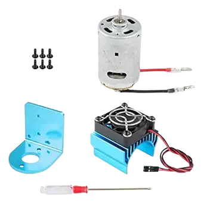
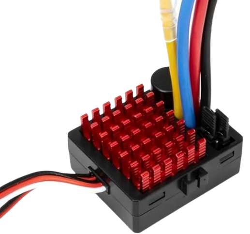
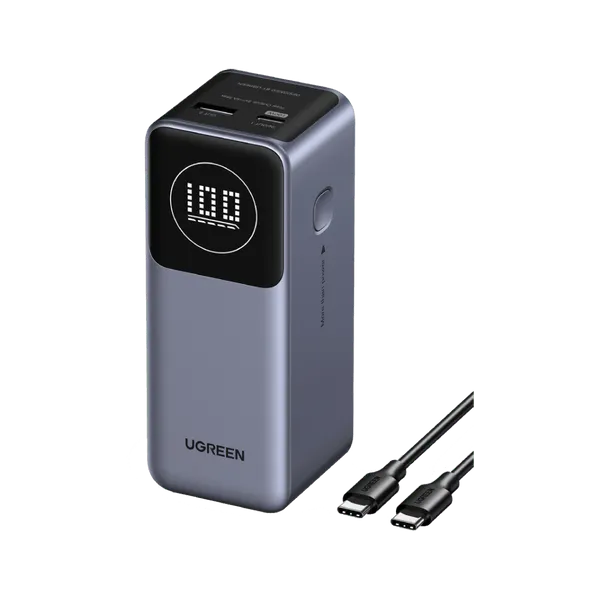
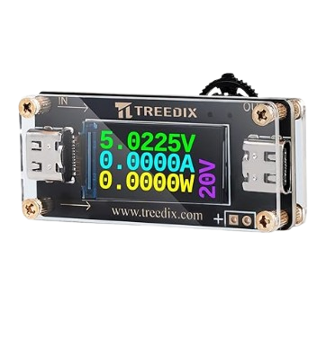

# Lista de Componentes Futuros {:#future-components-list}

A continuación, está la descripción de todos los componentes que se planean utilizar para Klevor.

## Motor 540 {:#motor-540}

    
    <i>Motor 540</i>

El Motor 540 se refiere a un tipo de motores DC empleados principalmente en carros controlados por radio [[1](#motor-540-product-info)], en el caso del motor específico que se planea utilizar en Klevor, éste motor cumple con las siguientes especificaciones:

| **Medida** | **Valor** |
|------------|-----------|
| Alto       | 51 mm     |
| Diámetro   | 35 mm     |
| Peso       | 50 g      |

Especificaciones mecánicas:

| **Especificación**  | **Valor** |
|---------------------|-----------|
| Velocidad sin carga | >12000rpm |
| Corriente sin carga | >0.5A     |

La razón principal por la cual pensamos que cambiar de motor sería una buena opción, es debido a que nos permite reducir un poco el peso de los componentes utilizados en Klevor, y así utilizar piezas más robustas en el sistema de transmisión del mismo.

## ESC para Motores 540/550 2-3S 60 A {:#esc-for-540-550-motors-2-3s-60-a}

    
    <i>ESC</i>

Además del nuevo motor que se planea incorporar en Klevor, éste necesita de un ESC que sea compatible con motores del mismo tipo (540), así que, además de reemplazar el motor, también se debe de reemplazar el ESC, además de esto, también tiene múltiple ventajas, como una configuración del modo de uso, simplemente cambiando de posición a los cables [[2](#esc-motor-540-product-info)].

Especificaciones físicas:

| **Medida** | **Valor** |
|------------|-----------|
| Alto       | 20.5 mm   |
| Largo      | 31.5 mm   |
| Ancho      | 38 mm     |
| Peso       | 38 g      |

## UGREEN Nexode Power Bank 12000mAh 100W PD PPS {:#ugreen-nexode-power-bank-12000mah-100w-pd-pps}

    
    <i>UGREEN Power Bank</i>

El Power Bank UGREEN de 12000mAh ofrece una gran ventaja en comparación al Shargeek Storm 2, siendo este su reducido peso, si bien es cierto que el UGREEN Nexode tiene una funcionalidad menor, sigue cumpliendo con todos los requisitos de un Power Bank común para poder usarse con una RPi 5.

Especificaciones físicas:

| **Medida** | **Valor** |
|------------|-----------|
| Largo      | 115 mm    |
| Alto       | 46 mm     |
| Ancho      | 45.5 mm   |
| Peso       | 309 g     |

## USB-C QC PD3.0 Trigger 5V/9V/12V/15V/20V 5A {:#usb-c-qc-pd3-0-trigger-5v-9v-12v-15v-20v-5a}

    
    <i>Power Delivery Trigger</i>

Anteriormente, notamos que la RPi 5, no consumía los 5V @ 5A que debería, lo que resultaba en un comportamiento un tanto errático cuando tenía conectado varios periféricos, lo que significaba que necesitaba de alguna manera forzar la entrega de la corriente por PD (Power Delivery), por lo que, este componente soluciona el problema, al forzar la alimentación de la RPi 5 por Power Delivery y que el Power Bank le entregue los 5V @ 5A que debería, algo que es bastante crucial para que la RPi 5 utilice todos los componentes como debería.

Especificaciones físicas:

| **Medida** | **Valor** |
|------------|-----------|
| Largo      | 115 mm    |
| Alto       | 46 mm     |
| Ancho      | 45.5 mm   |
| Peso       | 309 g     |

# Referencias Bibliográficas

1. *Motor 540 y disipador de calor de aluminio con ventilador de refrigeración de 5 V para Wltoys 1/18 RC Cars A949-B A959-B A969-B A979-B K929-B*. (2025). Amazon. <a id="motor-540-product-info" href="https://www.amazon.com/dp/B0995W966Z">https://www.amazon.com/dp/B0995W966Z</a>

2. *60A cepillado 2-3s ESC T-Plug ESC controlador electrónico de velocidad impermeable para 1/10 RC Car RC barco RC para uso con motores 540/550*. (2025). Amazon. <a id="esc-motor-540-product-info" href="https://www.amazon.com/gp/product/B0F9Y6CMC8">https://www.amazon.com/gp/product/B0F9Y6CMC8</a>

3. *UGREEN Nexode Power Bank 12000mAh 100W PD PPS Cargador portátil de carga rápida con 1USB-C 1USB-A y pantalla inteligente para MacBook Air/iPad/iPhone 16/Galaxy S24/Steam Deck/Googl*. (2025). Amazon. <a id="ugreen-power-bank-product-info" href="https://www.amazon.com/gp/product/B0CXJ1F1M7">https://www.amazon.com/gp/product/B0CXJ1F1M7</a>

4. *USB-C QC PD3.0 Trigger Board Module Type-C Female Interface*. (2025). Amazon. <a id="pd-trigger-product-info" href="https://www.amazon.com/gp/product/B0DRJWBG7G">https://www.amazon.com/gp/product/B0DRJWBG7G</a>
