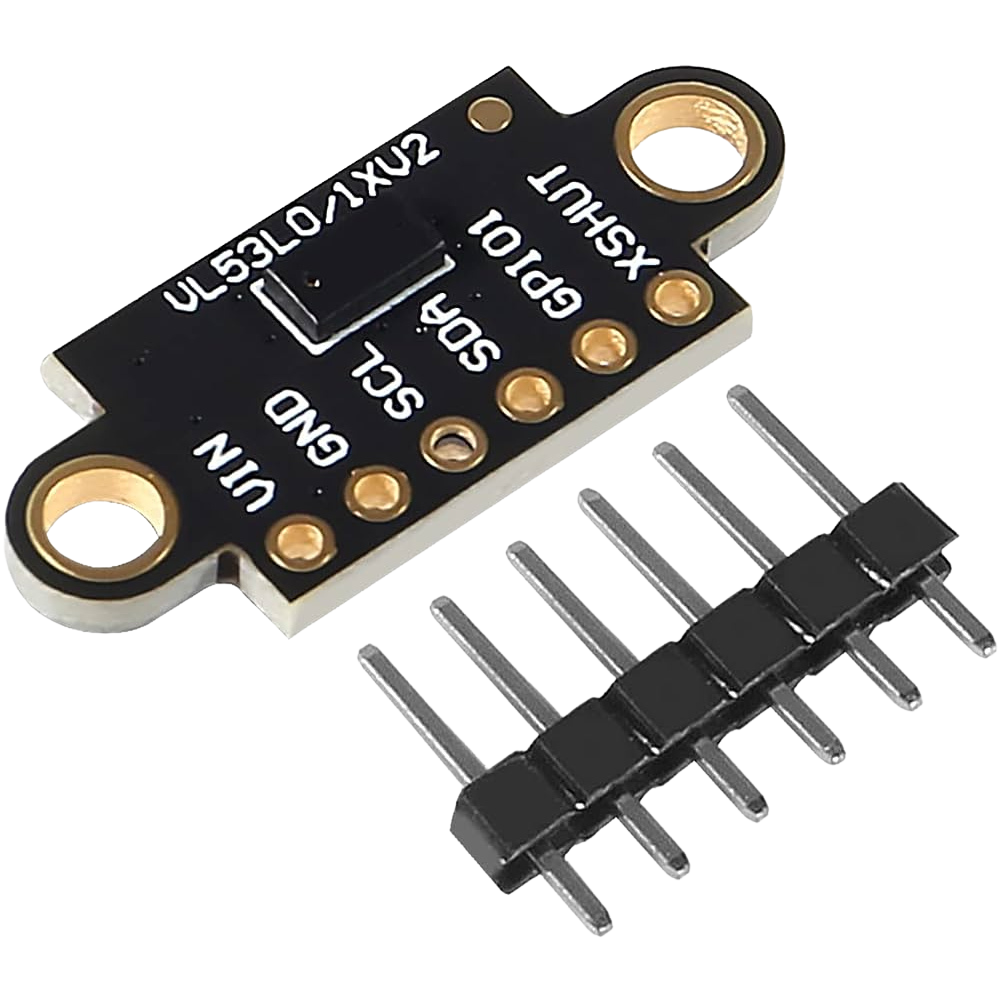

# Lista de Componentes {:#components-list}

## HiLetgo Time-of-Flight Sensor VL53L0X {:#sensor-tof-hiletgo}

    
    <i>Sensor VL53L0X</i>

El sensor VL53L0X en sí mismo es un pequeño sensor de distancia muy popular que
utiliza la tecnología Time-of-Flight (ToF) para medir la distancia a un objeto.
El sensor VL53L0X emite un pulso de luz láser infrarroja invisible y mide el
tiempo que tarda en regresar al sensor.

Estos sensores son una buena alternativa a los sensores ultrasónicos como el
HC-SR04, además de ser más pequeños y confiables [[1](#sensor-tof)].

Al inicio, queríamos utilizar varios de estos sensores para poder cubrir los
puntos ciegos del RPLiDAR C1 con mayor facilidad; sin embargo, mientras más
probábamos múltiples de estos sensores a la vez, notábamos que eran mucho menos
confiables y con menor rango, por lo tanto, en vez de utilizar los 8 sensores 
que pensábamos utilizar como guía para el Desafío Abierto, decidimos migrar a un 
sensor láser más confiable, el [RPLIDAR C1](current.md#rplidar-c1), que es 
un sensor láser que detecta distancias de hasta 12 metros en 360 grados, lo que 
nos permite tener una visión completa del entorno y evitar obstáculos de manera
más efectiva.

| **Medida** | **Valor** |
|------------|----------|
| Largo      | 25 mm    |
| Alto       | 1 mm     |
| Ancho      | 10.7 mm  |
| Peso       | 0.8 g    |

# Referencias Bibliográficas

1. *VL53L0X*. (2025).
    STMicroElectronics. <a id="sensor-tof" href="https://www.st.com/en/imaging-and-photonics-solutions/vl53l0x.html">https://www.st.com/en/imaging-and-photonics-solutions/vl53l0x.html</a>