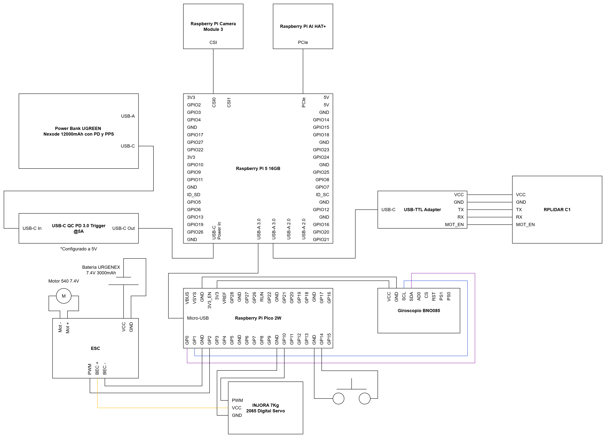
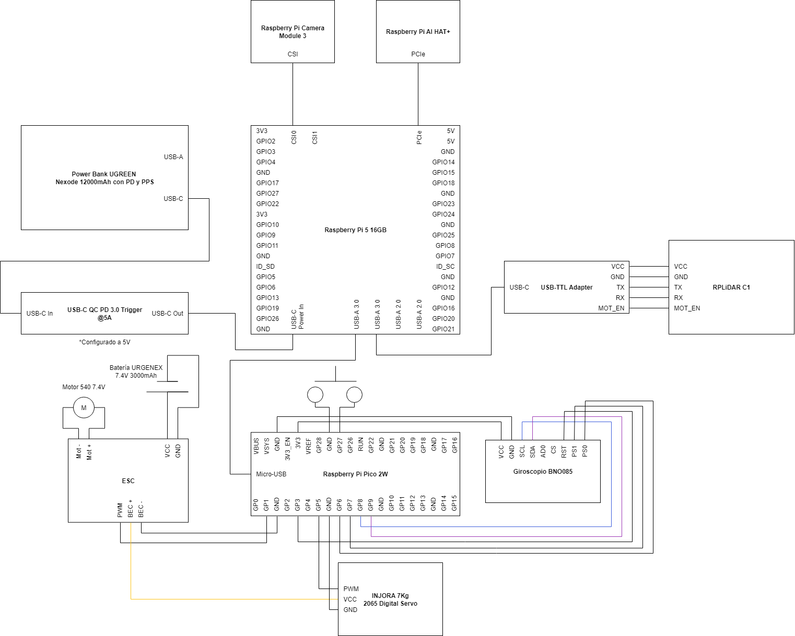

# Diagramas de Conexiones

## Versión 1: Empleada en el Prototipo 1

<!-- github-only-start -->

	
	 
	<i>Versión 1 del diagrama de Conexiones</i>

<!-- github-only-end -->

<!-- mkdocs-only-start

    
    <i>Versión 1 del diagrama de Conexiones</i>

mkdocs-only-end -->

## Versión 2: Empleada en el Prototipo 2 y 3

<!-- github-only-start -->

	
	 
	<i>Versión 2 del diagrama de Conexiones</i>

<!-- github-only-end -->

<!-- mkdocs-only-start

    
    <i>Versión 2 del diagrama de Conexiones</i>

mkdocs-only-end -->

## Versión 3: Empleada en el Prototipo 4

<!-- github-only-start -->

	
	 
	<i>Versión 3 del diagrama de Conexiones</i>

<!-- github-only-end -->

<!-- mkdocs-only-start

    
    <i>Versión 3 del diagrama de Conexiones</i>

mkdocs-only-end -->

## Versión 4: Empleada en el Prototipo 4

<!-- github-only-start -->

	
	 
	<i>Versión 4 del diagrama de Conexiones</i>

<!-- github-only-end -->

<!-- mkdocs-only-start

    
    <i>Versión 4 del diagrama de Conexiones</i>

mkdocs-only-end -->