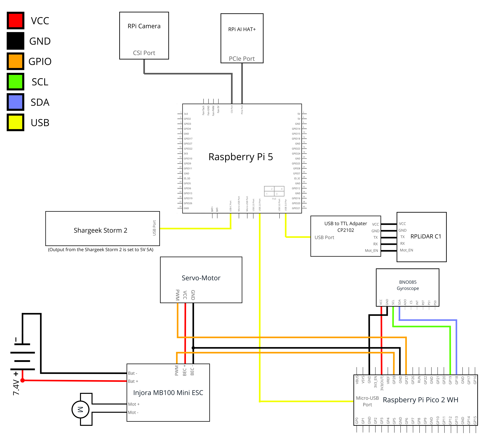

# Diagramas de Conexiones {:#wiring-diagrams}

## Prototipo 1 {:#prototype1}

    
    <i>Diagrama de Conexiones del Prototipo 1</i>

## Prototipo 2 {:#prototype2}

    
    <i>Diagrama de Conexiones del Prototipo 2</i>

## Prototipo 3 {:#prototype3}

    
    <i>Diagrama de Conexiones del Prototipo 3</i>

