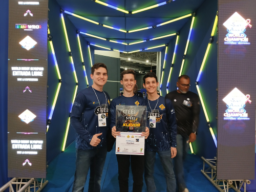

# Home

    
    <i>Team's Logo</i>

Welcome to Klevor's documentation, an autonomous robot designed to participate on the World Robot Olympiad 2025, in the Future Engineers category. This documentation aims to offer all the necessary info to understand how Klevor works, the different devices involved, the source code and more. We hope that it is as useful as possible for both the judges and anyone that is interested in the project.

    

        
        <i>World Robot Olympiad's Logo</i>
    

    

        
        <i>MINCYT's Logo</i>
    

Below is an index with all the links to access all the different sections of this documentation. Each section has detailed information about the robot's technical aspects, including the mechanics, source code, the different devices, the components, the schemes and diagrams, the team's photos and videos of Klevor in action. Also, we included additional resources to amplify the information to facilitate the comprehension for all the concepts involved.

    
    <i>Team Steel Bot at Salto Ángel's regional competition</i>

## Index

1. **[About us](about.en.md)**
2. **Electronics**
	1. Components
		1. [Previous Components](electronic/components/previous.en.md)
		2. [Current Components](electronic/components/current.en.md)
		3. [Future Components](electronic/components/future.en.md)
	2. Diagrams
		1. [Connection Diagrams](electronic/diagrams/wiring.en.md)
3. **Mechanics**
	1. Parts
		1. Common Parts
			1. [Previous Common Parts](mechanical/parts/common/previous.en.md)
			2. [Present Common Parts](mechanical/parts/common/current.en.md)
		2. [Prototype 1's Parts](mechanical/parts/prototype1.en.md)
		3. [Prototype 2's Parts](mechanical/parts/prototype2.en.md)
		4. [Prototype 3's Parts](mechanical/parts/prototype3.en.md)
	2. Prototypes
		1. [Prototype 1](mechanical/prototypes/prototype1.en.md)
		2. [Prototype 2](mechanical/prototypes/prototype2.en.md)
		3. [Prototype 3](mechanical/prototypes/prototype3.en.md)
		4. [Prototype 4](mechanical/prototypes/prototype4.en.md)
4. **Programación**
	1. Programming Languages
		1. [Previous Programming Languages](programming/languages/previous.en.md)
		2. [Current Programming Languages](programming/languages/current.en.md)
		3. [Future Programming Languages](programming/languages/future.en.md)
	2. Libraries
		1. [Python Libraries](programming/libraries/python.en.md)
		2. [CircuitPython Libraries](programming/libraries/circuit-python.en.md)
	3. Diagrams
		1. [Flowchart](programming/diagrams/flowcharts.en.md)
	4. [Glossary](programming/glossary.en.md)
	5. Guides
		1. [MkDocs' Guide](programming/guides/mkdocs.en.md)
		2. [CircuitPython's Guide](programming/guides/circuit-python.en.md)
		3. [MicroPython's Guide](programming/guides/micro-python.en.md)
		4. [Raspberry Pi 5's  Guide](programming/guides/raspberry-pi-5.en.md)
		5. [Raspberry Pi Pico 2W's Guide](programming/guides/raspberry-pi-pico-2w.en.md)
		6. [Object Detection's Guide](programming/guides/object-detection.en.md)
	6. Source Code References
		1. Raspberry Pi 5
			1. [Args Module](programming/code/raspberry-pi-5/args.en.md)
			2. [Camera Module](programming/code/raspberry-pi-5/camera.en.md)
			3. [Common Module](programming/code/raspberry-pi-5/common.en.md)
			4. [Files Module](programming/code/raspberry-pi-5/files.en.md)
			5. [Hailo Module](programming/code/raspberry-pi-5/hailo.en.md)
			6. [Log Module](programming/code/raspberry-pi-5/log.en.md)
			7. [Model Module](programming/code/raspberry-pi-5/model.en.md)
			8. [OpenCV Module](programming/code/raspberry-pi-5/opencv.en.md)
			9. [Pilot Module](programming/code/raspberry-pi-5/pilot.en.md)
			10. [Plot Module](programming/code/raspberry-pi-5/plot.en.md)
			11. [RPLiDAR Module](programming/code/raspberry-pi-5/rplidar.en.md)
			12. [Serial Communication Module](programming/code/raspberry-pi-5/serial-communication.en.md)
			13. [Server Module](programming/code/raspberry-pi-5/server.en.md)
			14. [Spawner Module](programming/code/raspberry-pi-5/spawner.en.md)
			15. [Utils Module](programming/code/raspberry-pi-5/utils.en.md)
			16. [YOLO Module](programming/code/raspberry-pi-5/yolo.en.md)
		2. Raspberry Pi Pico 2W
			1. [Lib Module](programming/code/raspberry-pi-pico-2w/lib.en.md)
			2. [Source Code](programming/code/raspberry-pi-pico-2w/code.en.md)
5. **[GitHub](github.en.md)**
6. **[Videos](videos.en.md)**
7. **[Software](software.en.md)**
8. **[Gadgets](gadgets.en.md)**
9. **[Sponsors](sponsors.en.md)**
10. **[Contact Us](contact.en.md)**

## Sponsors

    
    <i>Viajes Giorgio's Logo</i>

    
    <i>Nathaly's Star's Logo</i>

    
    <i>Steel C.A.'s Logo</i>

