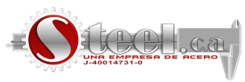

# Inicio

<!-- github-only-start -->

	
	 
	<i>Logo del Equipo Steel Bot</i>

<!-- github-only-end -->

<!-- mkdocs-only-start

    
    <i>Logo del Equipo Steel Bot</i>

mkdocs-only-end -->

Bienvenidos a la documentación de Klevor, un robot autónomo diseñado para participar en la competencia de robótica de la World Robot Olympiad 2025, en la categoría Futuros Ingenieros. Esta documentación contiene toda la información necesaria para entender su funcionamiento, los dispositivos utilizados, el código implementado, los componentes y más. Esperamos que la misma sea útil tanto para los jueces como para cualquier persona interesada en aprender sobre este proyecto.

<!-- github-only-start -->

	

		
		 
		<i>Logo de la World Robot Olympiad</i>
	

	 	
	

		
		 
		<i>Logo del MINCYT</i>
	

<!-- github-only-end -->

<!-- mkdocs-only-start

    

        
        <i>Logo de la World Robot Olympiad</i>
    

    

        
        <i>Logo del MINCYT</i>
    

mkdocs-only-end -->

A continuación se presenta un índice con los enlaces a las diferentes secciones de la documentación. Cada sección contiene información detallada sobre los aspectos técnicos y prácticos del robot, incluyendo la mecánica, el código, los dispositivos utilizados, los componentes, los esquemas y diagramas, las fotos del equipo y los vídeos de Klevor en acción. Además, se incluyen recursos externos para ampliar la información y facilitar la comprensión de los conceptos presentados.

<!-- github-only-start -->

	
	 
	<i>Equipo Steel Bot en la competencia regional del Salto Ángel</i>

<!-- github-only-end -->

<!-- mkdocs-only-start

    
    <i>Equipo Steel Bot en la competencia regional del Salto Ángel</i>

mkdocs-only-end -->

## Índice

1. **[Sobre Nosotros](about.es.md)**
2. **Electrónica**
	1. Componentes
		1. [Componentes Previos](electronic/components/previous.es.md)
		2. [Componentes Actuales](electronic/components/current.es.md)
		3. [Componentes Futuros](electronic/components/future.es.md)
	2. Diagramas
		1. [Diagramas de Conexiones](electronic/diagrams/wiring.es.md)
3. **Mecánica**
	1. Piezas
		1. Piezas Comunes
			1. [Piezas Comunes Previas](mechanical/parts/common/previous.es.md)
			2. [Piezas Comunes Actuales](mechanical/parts/common/current.es.md)
		2. [Piezas del Prototipo 1](mechanical/parts/prototype1.es.md)
		3. [Piezas del Prototipo 2](mechanical/parts/prototype2.es.md)
		4. [Piezas del Prototipo 3](mechanical/parts/prototype3.es.md)
	2. Prototipos
		1. [Prototipo 1](mechanical/prototypes/prototype1.es.md)
		2. [Prototipo 2](mechanical/prototypes/prototype2.es.md)
		3. [Prototipo 3](mechanical/prototypes/prototype3.es.md)
		4. [Prototipo 4](mechanical/prototypes/prototype4.es.md)
4. **Programación**
	1. Lenguajes de Programación
        1. [Lenguajes de Programación Previos](programming/languages/previous.es.md)
        2. [Lenguajes de Programación Actuales](programming/languages/current.es.md)
        3. [Lenguajes de Programación Futuros](programming/languages/future.es.md)
	2. Librerías
		1. [Librerías de Python](programming/libraries/python.es.md)
		2. [Librerías de CircuitPython](programming/libraries/circuit-python.es.md)
	3. Diagramas
		1. [Diagramas de Flujo](programming/diagrams/flowcharts.es.md)
	4. [Glosario de Términos](programming/glossary.es.md)
	5. Guías
		1. [Guía de MkDocs](programming/guides/mkdocs.es.md)
		2. [Guía de CircuitPython](programming/guides/circuit-python.es.md)
		3. [Guía de MicroPython](programming/guides/micro-python.es.md)
		4. [Guía de la Raspberry Pi 5](programming/guides/raspberry-pi-5.es.md)
		5. [Guía de la Raspberry Pi Pico 2 W](programming/guides/raspberry-pi-pico-2w.es.md)
		6. [Guía de Detección de Objetos](programming/guides/object-detection.es.md)
5. **[GitHub](github.es.md)**
6. **[Vídeos](videos.es.md)**
7. **[Software](software.es.md)**
8. **[Gadgets](gadgets.es.md)**
9. **[Patrocinadores](sponsors.es.md)**
10. **[Contacto](contact.es.md)**

## Patrocinadores

<!-- github-only-start -->

	<a href="sponsors.en.md#viajes-giorgio">
		
		 
		<i>Logo de Viajes Giorgio</i>
	</a>
	 
	<a href="sponsors.en.md#nathalys-star">
		
		 
		<i>Logo de Nathaly's Star</i>
	</a>
	 
	<a href="sponsors.en.md#steel-ca">
		
		 
		<i>Logo de Steel C.A.</i>
	</a>

<!-- github-only-end -->

<!-- mkdocs-only-start

    
    <i>Logo de Viajes Giorgio</i>

    
    <i>Logo de Nathaly's Star</i>

    
    <i>Logo de Steel C.A.</i>

mkdocs-only-end -->
