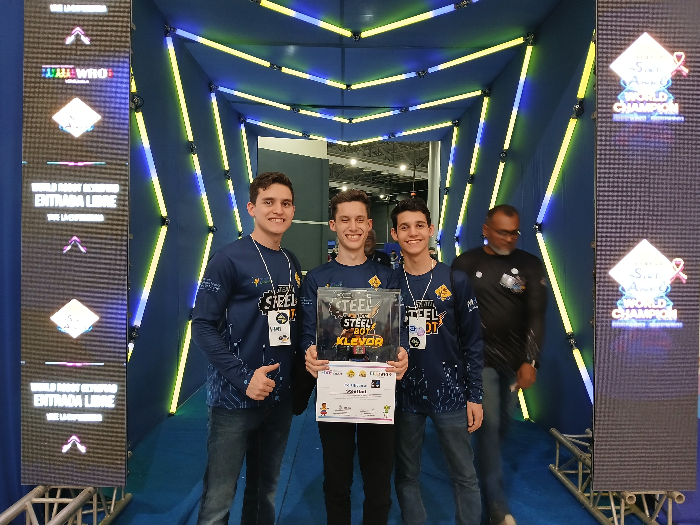

# Klevor {:#klevor}

    
    <i>Logo del Equipo</i>

Bienvenidos a la documentación de Klevor, un robot autónomo diseñado para participar en el Desafío Abierto y el Desafío Cerrado de la competencia de robótica de la World Robot Olympiad 2025, en la categoría Futuros Ingenieros. Esta documentación contiene toda la información necesaria para entender su funcionamiento, los dispositivos utilizados, el código implementado, los componentes y más. Esperamos que la misma sea útil tanto para los jueces como para cualquier persona interesada en aprender sobre este proyecto.

    

        
        <i>Logo de la World Robot Olympiad</i>
    

    

        
        <i>Logo del MINCYT</i>
    

A continuación se presenta un índice con los enlaces a las diferentes secciones de la documentación. Cada sección contiene información detallada sobre los aspectos técnicos y prácticos del robot, incluyendo la mecánica, el código, los dispositivos utilizados, los componentes, los esquemas y diagramas, las fotos del equipo y los vídeos de Klevor en acción. Además, se incluyen recursos externos para ampliar la información y facilitar la comprensión de los conceptos presentados.

    
    <i>Team Steel Bot en la competencia regional del Salto Ángel</i>

## Índice {#index}

1. **[Nosotros](about.md)**
2. **Electrónica**
    1. Componentes
        1. [Previos](electronic/components/previous.md#previous-components-list)
            1. [HiLetgo Time-of-Flight Sensor VL53L0X](electronic/components/previous.md#sensor-tof-hiletgo)
        2. [Actuales](electronic/components/current.md#current-components-list)
            1. [Raspberry Pi 5](electronic/components/current.md#raspberry-pi-5)
            2. [Raspberry Pi Camera Module 3 Wide](electronic/components/current.md#raspberry-pi-camera-module-3-wide)
            3. [Raspberry Pi AI HAT+ (26 TOPS)](electronic/components/current.md#raspberry-pi-ai-hat-26-tops)
            4. [Raspberry Pi Pico 2 WH](electronic/components/current.md#raspberry-pi-pico-2-wh)
            5. [RPLIDAR C1](electronic/components/current.md#rplidar-c1)
            6. [Shargeek Storm 2](electronic/components/current.md#shargeek-storm-2)
            7. [INJORA 180 Motor 48T](electronic/components/current.md#injora-180-motor-48t)
            8. [INJORA MB100 20A mini ESC](electronic/components/current.md#injora-mb100-20a-mini-esc)
            9. [URGENEX 7.4V Battery](electronic/components/current.md#urgenex-7-4v-battery)
            10. [INJORA 7KG 2065 Micro Servo](electronic/components/current.md#injora-7kg-2065-micro-servo)
            11. [9-Axis IMU Gyroscope GY-BNO085](electronic/components/current.md#gyroscope-gy-bno085)
        3. [Futuros](electronic/components/future.md#future-components-list)
            1. [Motor 540](electronic/components/future.md#motor-540)
            2. [ESC para Motores 540/550 2-3s 60 A](electronic/components/future.md#esc-for-540-550-motors-2-3s-60-a)
            3. [UGREEN Nexode Power Bank 12000mAh 100W PD PPS](electronic/components/future.md#ugreen-nexode-power-bank-12000mah-100w-pd-pps)
            4. [USB-C QC PD3.0 Trigger 5V/9V/12V/15V/20V 5A](electronic/components/future.md#usb-c-qc-pd3-0-trigger-5v-9v-12v-15v-20v-5a) 
    2. Diagramas
        1. [Diagramas de Conexiones](electronic/diagrams/wiring.md#wiring-diagrams)
            1. [Versión 1](electronic/diagrams/wiring.md#version1)
            2. [Versión 2](electronic/diagrams/wiring.md#version2)
            3. [Versión 3](electronic/diagrams/wiring.md#version3)
3. **Mecánica**
   1. Piezas
        1. [Piezas 3D Comunes](mechanical/parts/common.md#common-3d-parts)
        2. [Piezas del Prototipo 1](mechanical/parts/prototype1.md#prototype1)
        3. [Piezas del Prototipo 2](mechanical/parts/prototype2.md#prototype2)
        4. [Piezas del Prototipo 3](mechanical/parts/prototype3.md#prototype3)
   2. Prototipos
        1. [Prototipo 1](mechanical/prototypes/prototype1.md#prototype1)
            1. [Primera Capa](mechanical/prototypes/prototype1.md#first-layer)
            2. [Segunda Capa](mechanical/prototypes/prototype1.md#second-layer)
            3. [Tercera Capa](mechanical/prototypes/prototype1.md#third-layer)
        2. [Prototipo 2](mechanical/prototypes/prototype2.md#prototype2)
            1. [Primera Capa](mechanical/prototypes/prototype2.md#first-layer)
            2. [Segunda Capa](mechanical/prototypes/prototype2.md#second-layer)
        3. [Prototipo 3](mechanical/prototypes/prototype3.md#prototype3)
            1. [Actualizaciones](mechanical/prototypes/prototype3.md#updates)
            2. [Primera Capa](mechanical/prototypes/prototype3.md#first-layer)
            3. [Segunda Capa](mechanical/prototypes/prototype3.md#second-layer)
4. **Programación**
    1. [Lenguajes de Programación](programming/languages.md#programming-languages)
        1. [Python](programming/languages.md#python)
        2. [MicroPython](programming/languages.md#micro-python)
        3. [CircuitPython](programming/languages.md#circuit-python)
    2. [Librerías](programming/libraries.md#libraries)
        1. [PyTorch](programming/libraries.md#pytorch)
        2. [Ultralytics YOLO](programming/libraries.md#ultralytics-yolo)
        3. [OpenCV](programming/libraries.md#opencv)
        4. [NumPy](programming/libraries.md#numpy)
        5. [PiCamera2](programming/libraries.md#picamera-2)
        6. [Hailo Platform](programming/libraries.md#hailo-platform)
    3. Diagramas
        1. [Diagramas de Flujo](programming/diagrams/flowcharts.md#flowcharts)
            1. [Desafío sin Obstáculos](programming/diagrams/flowcharts.md#without-obstacles-challenge)
                1. [Versión 1](programming/diagrams/flowcharts.md#without-obstacles-challenge-version1)
                2. [Versión 2](programming/diagrams/flowcharts.md#without-obstacles-challenge-version2)
            2. [Desafío con Obstáculos](programming/diagrams/flowcharts.md#obstacles-challenge)
                1. [Versión 1](programming/diagrams/flowcharts.md#obstacles-challenge-version1)
    4. [Glosario de Términos](programming/glossary.md#glossary)
        1. [Machine Learning](programming/glossary.md#machine-learning)
        2. [Detección de Objetos](programming/glossary.md#object-detection)
            1. [Funcionamiento de la Detección de Objetos](programming/glossary.md#how-object-detection-works)
        3. [You Only Look Once (YOLO)](programming/glossary.md#yolo)
        4. [Neural Processing Unit (NPU)](programming/glossary.md#npu)
        5. [Docker](programming/glossary.md#docker)
            1. [Dockerfile](programming/glossary.md#dockerfile)
            2. [Docker Image](programming/glossary.md#docker-image)
            3. [Docker Container](programming/glossary.md#docker-container)
        6. [Multiprocesamiento](programming/glossary.md#multiprocessing)
    5. Guías
        1. [Guía de MkDocs](programming/guides/mkdocs.md#mkdocs)
            1. [Instalación](programming/guides/mkdocs.md#installation)
            2. [Servir la Documentación](programming/guides/mkdocs.md#serve-documentation)
        2. [Guía de CircuitPython](programming/guides/circuit-python.md#circuit-python)
            1. [Instalación](programming/guides/circuit-python.md#installation)
        3. [Guía de MicroPython](programming/guides/micro-python.md#micro-python)
            1. [Instalación](programming/guides/micro-python.md#installation)
        4. [Guía de Raspberry Pi 5](programming/guides/raspberry-pi-5.md#raspberry-pi)
            1. [Instalación de Raspberry Pi OS](programming/guides/raspberry-pi-5.md#raspberry-pi-os-installation)
            2. [Instalación de la Cámara](programming/guides/raspberry-pi-5.md#camera-installation)
            3. [Instalación de Raspberry Pi AI HAT+](programming/guides/raspberry-pi-5.md#raspberry-pi-ai-hat-plus-installation)
            4. [Configuración de la Raspberry Pi](programming/guides/raspberry-pi-5.md#raspberry-pi-configuration)
        5. [Guía de Raspberry Pi Pico 2 W](programming/guides/raspberry-pi-pico-2w.md#raspberry-pi-pico-2w)
            1. [Configuración](programming/guides/raspberry-pi-pico-2w.md#configuration)
        6. [Guía de Detección de Objetos](programming/guides/object-detection.md#object-detection)
            1. [Creación del Modelo](programming/guides/object-detection.md#model-creation)
            2. [Entrenamiento del Modelo](programming/guides/object-detection.md#model-training)
            3. [Conversión del Modelo](programming/guides/object-detection.md#model-conversion)
            4. [Prueba del Funcionamiento del Modelo](programming/guides/object-detection.md#model-testing) 
    6. Referencia del Código
        1. Raspberry Pi 5
            1. [Args](programming/code/raspberry-pi-5/args.md)
            2. [Camera](programming/code/raspberry-pi-5/camera.md)
            3. [Common](programming/code/raspberry-pi-5/common.md)
            4. [Files](programming/code/raspberry-pi-5/files.md)
            5. [Hailo](programming/code/raspberry-pi-5/hailo.md)
            6. [Log](programming/code/raspberry-pi-5/log.md)
            7. [Model](programming/code/raspberry-pi-5/model.md)
            8. [OpenCV](programming/code/raspberry-pi-5/opencv.md)
            9. [Pilot](programming/code/raspberry-pi-5/pilot.md)
            10. [Plot](programming/code/raspberry-pi-5/plot.md)
            11. [RPLiDAR](programming/code/raspberry-pi-5/rplidar.md)
            12. [Serial Communication](programming/code/raspberry-pi-5/serial-communication.md)
            13. [Server](programming/code/raspberry-pi-5/server.md)
            14. [Spawner](programming/code/raspberry-pi-5/spawner.md)
            15. [Utils](programming/code/raspberry-pi-5/utils.md)
            16. [YOLO](programming/code/raspberry-pi-5/yolo.md)
        2. Raspberry Pi Pico 2W
            1. [Lib](programming/code/raspberry-pi-pico-2w/lib.md)
            2. [Code](programming/code/raspberry-pi-pico-2w/code.md)
5. **[GitHub](github.md)**
    1. [Repositorio](github.md#repository)
    2. [Estructura del Repositorio](github.md#repository-structure)
6. **[Vídeos](videos.md)**
    1. [Desafío sin Obstáculos](videos.md#without-obstacles-challenge)
        1. [Parte 1](videos.md#without-obstacles-challenge-part1)
7. **[Patrocinadores](sponsors.md)**
    1. [Viajes Giorgio](sponsors.md#viajes-giorgio)
    2. [Nathaly's Star](sponsors.md#nathalys-star)
    3. [Steel C.A.](sponsors.md#steel-ca)
8. **[Contacto](contact.md)**

## Patrocinadores {#sponsors}

    
    <i>Logo de Viajes Giorgio</i>

    
    <i>Logo de Nathaly's Star</i>

    
    <i>Logo de Steel C.A.</i>

