# Piezas 3D Comunes {:#common-3d-parts}

A continuación enseñaremos los modelos 2D de cada elemento mecánico perteneciente a todos los modelos de Klevor.

# Sistema reductor de RPM

En este modelo 3D podemos ver cómo está diseñado este sistema. Pasaremos a mostrar y explicar las piezas que lo conforman.

**Base del sistema:** Es el cuerpo en el que se ensamblan todos los componentes de este sistema.

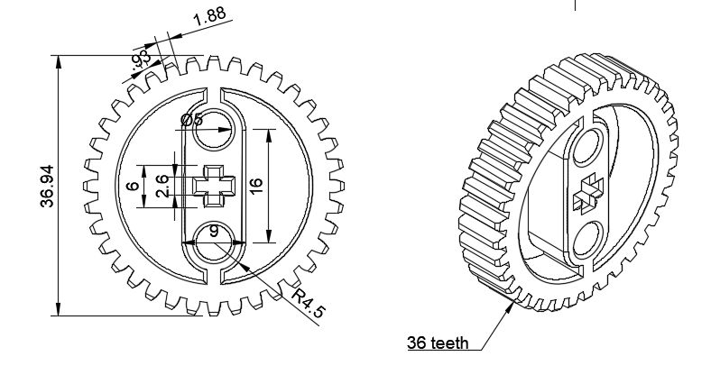
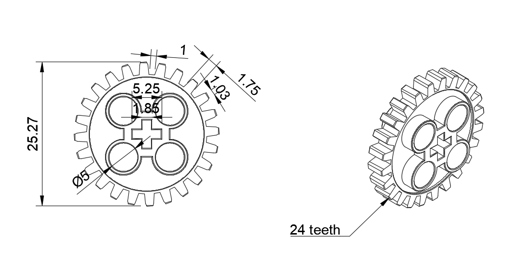
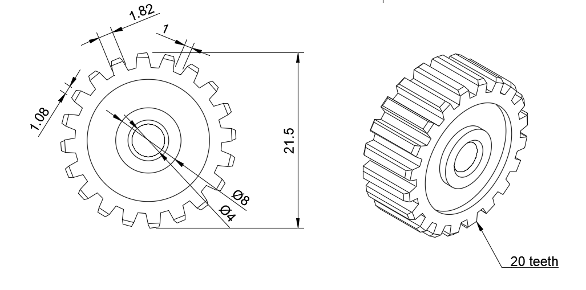
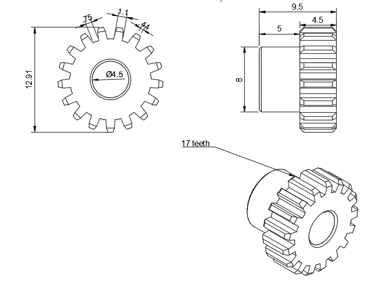
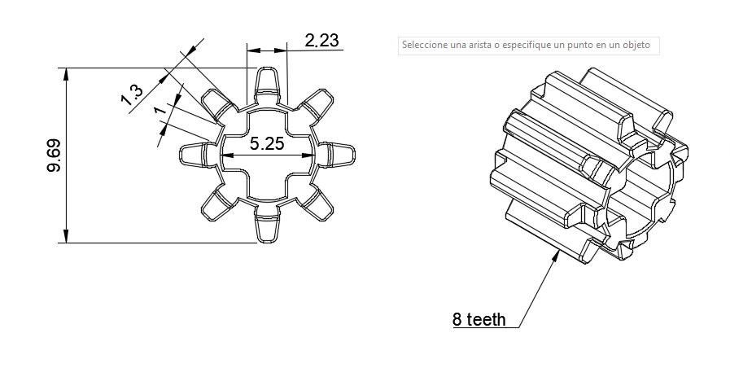

**Piñones/Engranajes:** Esta es la parte más importante de nuestro sistema, son los que hacen que el motor pierda velocidad, pero que a su vez, gane fuerza. Estos engranajes son sobrantes de kits, pero quisimos adecuarlos a nuestro sistema para que no fuesen desperdiciadas.

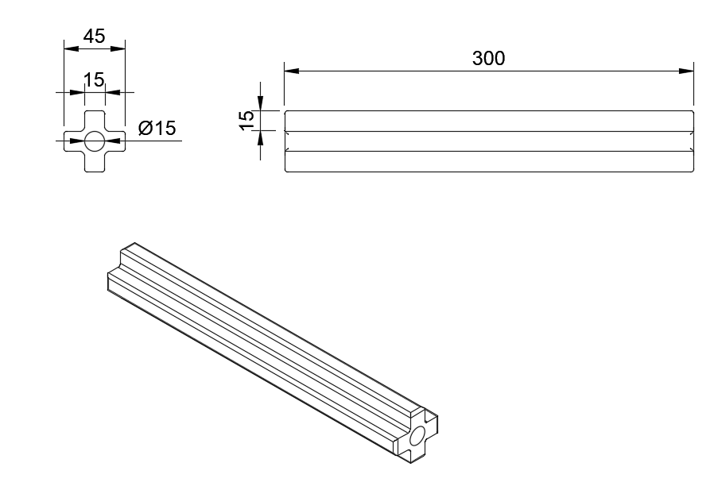

**Eje principal:** Usamos dos de estos ejes, funcionan sujetando los piñones a una altura fija. Esta pieza también es reutilizada.

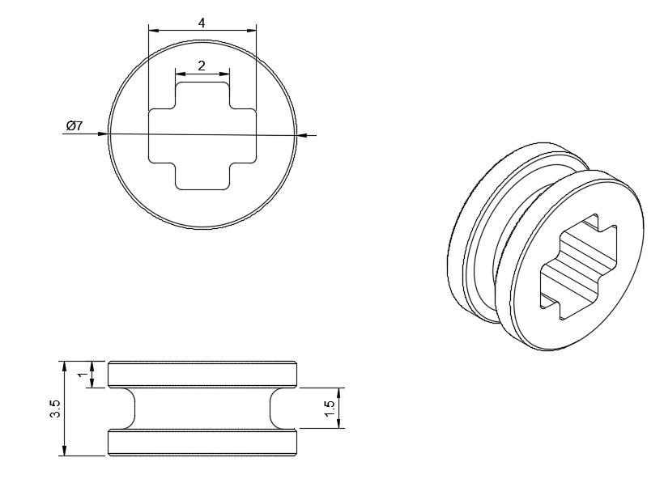

**Separadores:** Se encargan de mantener los engranajes en un mismo sitio para que estos coincidan en sus giros. Esta también es una pieza reutilizada. Usamos tres unidades

**Bujes:** Los bujes sostienen a los ejes y a su vez permiten el giro de los engranajes.

**Separador en froma de cruceta:** Se conecta con el buje que está detrás del piñón de 36 dientes. Este encaja con el buje y con uno de los ejes.

# Sistema Motriz

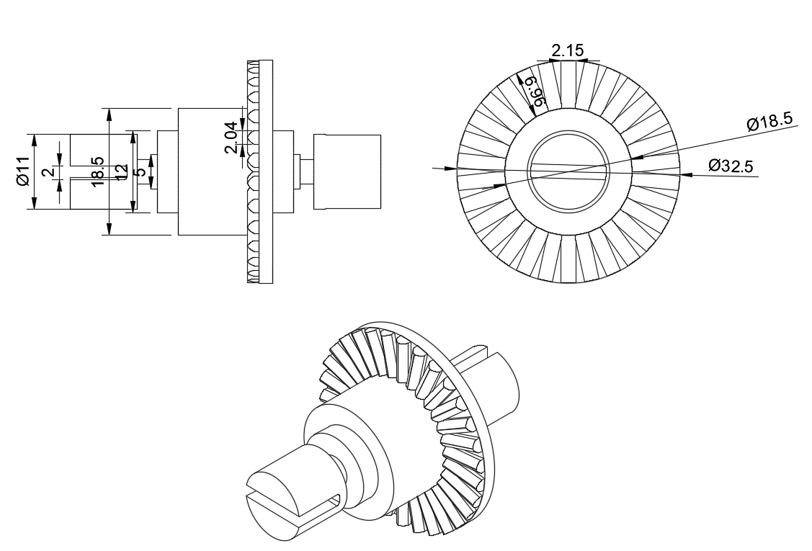

**Diferenciales:** Todo nuestro sistema motriz se basa en 2 diferenciales que hacen que las cuatro ruedas tengan tracción.

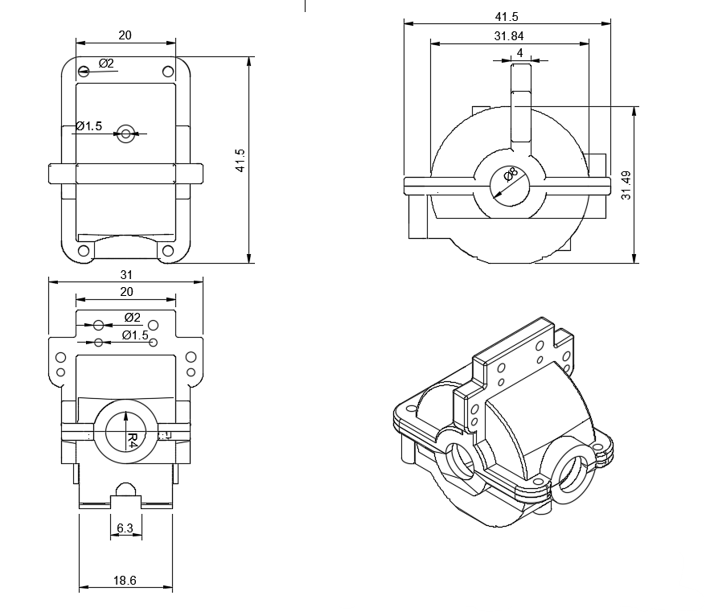

**Caja de diferencial:** Acá es dónde se guarda el diferencial y salen los componentes que permiten el giro de la rueda. 

**Eje transmisor:** Se encarga de conectar ambos diferenciales, para que las cuatro ruedas se muevan por igual.

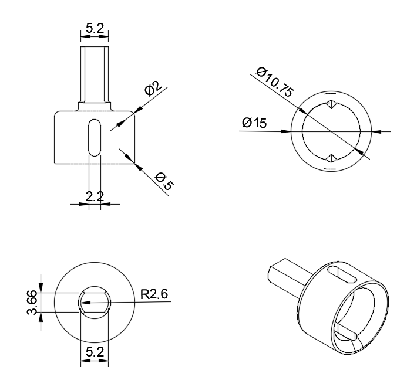

**Copa transmisora:** La usamos en el diferencial y en las ruedas, está diseñado para encajar con el semieje, haciendo que tras ruedas tengan movimiento.

**Semieje:**

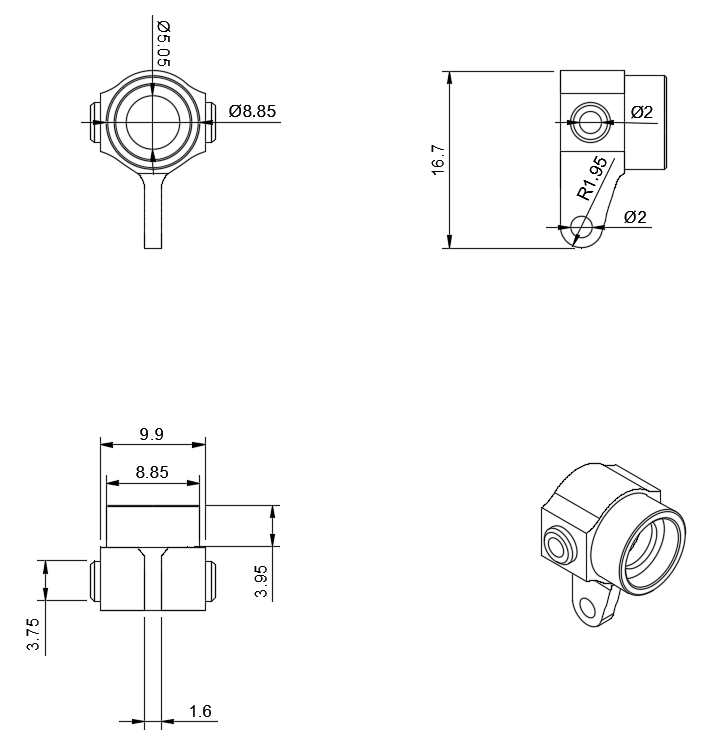

**Nudillo trasero:** Es la pieza que sostiene directamente la rueda, encaja con las copas transmisoras.

**Nudillo delantero:** También se encarga de conectarse con la rueda y con una copa transmisora, pero a diferencia del nudillo trasero este es un poco más alargado, para encajar con las barras del sistema Ackermann.

**Ruedas:** Usamos cuatro unidades de esta rueda, diseñadas por nosotros con un aspecto único.