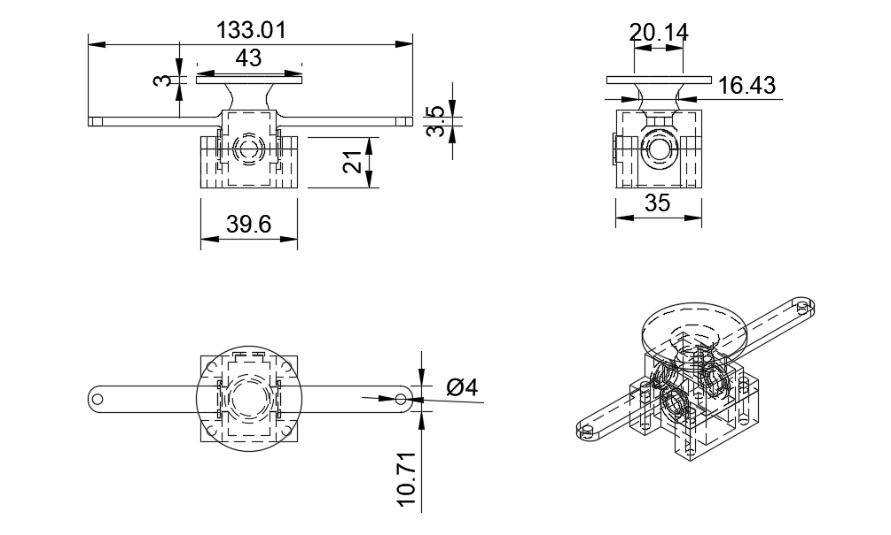
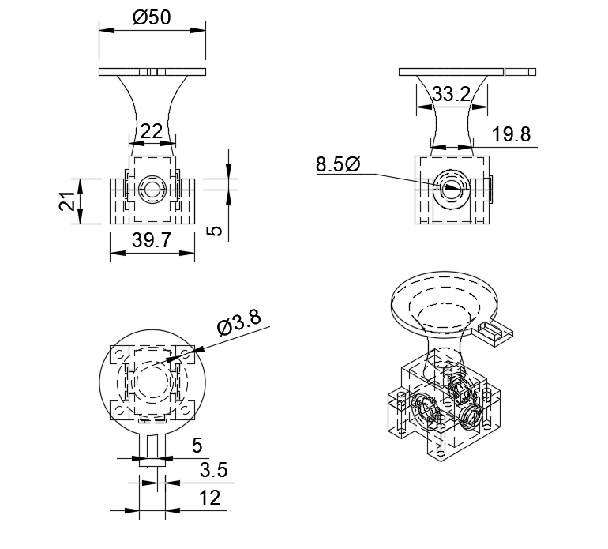
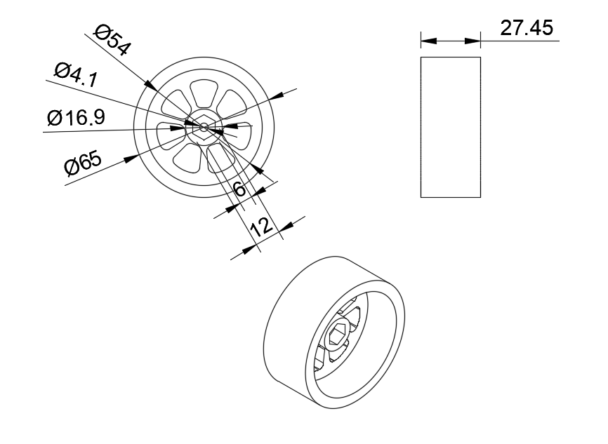
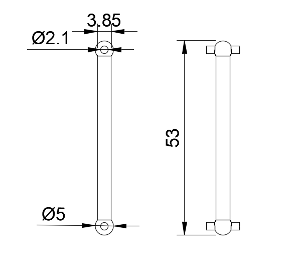

## Sistema Motriz {:#drivetrain-system}

### Diferenciales {:#differentials}

<!-- github-only-start -->

	
	 
	<i>Diferenciales</i>

<!-- github-only-end -->

<!-- mkdocs-only-start

	
	<i>Diferenciales</i>

mkdocs-only-end -->

Todo nuestro sistema motriz está basado en el uso de dos diferenciales, los cuales juegan un papel fundamental al permitir que las cuatro ruedas tengan tracción. Gracias a esta configuración, se logra una distribución perfecta de la fuerrza.

## Gearbox Frontal

<!-- github-only-start -->

	
	 
	<i>Caja Diferencial Frontal</i>

<!-- github-only-end -->

<!-- mkdocs-only-start

	
	<i>Caja Diferencial Frontal</i>

mkdocs-only-end -->

En esta nueva versión, la caja del diferencial no solo cumple su función principal de sostener el diferencial y conectarlo al eje de transmisión, sino que su diseño está hecho para tener más funciones de soporte, una de sus nuevas funciones es servir como soporte superior para la rueda. Este diseño asegura que la rueda quede firmemente ajustada, mejorando la estabilidad de la rueda.

Además, en la parte superior de la caja del diferencial, se ha incorporado una base para el RPLidar. Al ser este uno de los puntos más altos del robot, esta base estratégica le permite al sensor tener una visión de casi 360 grados, lo que le da un rango de detección de obstáculos mucho más amplio. 

## Gearbox Trasera

<!-- github-only-start -->

	
	 
	<i>Caja Diferencial Trasera</i>

<!-- github-only-end -->

<!-- mkdocs-only-start

	
	<i>Caja Diferencial Trasera</i>

mkdocs-only-end -->

Al igual que la caja de diferencial frontal, esta también tiene incorporada nuevas funciones de soporte, tiene una base elevada muy parecida a la parte de en frente, siendo esta más alta y esta vez sosteniendo nuestro PowerBank URGEEN de 12000mAh, a su vez esta base también cuenta con un pequeño orificio por donde pasan todos los cables, con el objetivo de hacer que Klevor tenga un diseño más estético y ordenado.

### Eje transmisor {:#transmission-shaft}

<!-- github-only-start -->

	
	 
	<i>Eje transmisor</i>

<!-- github-only-end -->

<!-- mkdocs-only-start

	
	<i>Eje transmisor</i>

mkdocs-only-end -->

Esta pieza cumple la función clave de conectar ambos diferenciales, permitiendo una sincronización entre ellos. Gracias a esta conexión, se asegura que las cuatro ruedas del robot se muevan de forma uniforme, distribuyendo el torque de manera equilibrada.

### Nudillos traseros {:#rear-knuckles}

<!-- github-only-start -->

	
	 
	<i>Nudillos traseros</i>

<!-- github-only-end -->

<!-- mkdocs-only-start

	
	<i>Nudillos traseros</i>

mkdocs-only-end -->

Es la pieza encargada de sostener directamente la rueda, funcionando como el punto de unión entre esta y el sistema de transmisión. Su diseño permite un encaje preciso con las copas transmisoras, asegurando así una conexión firme y eficiente para la movilidad del robot.

### Nudillos delanteros {:#front-knuckles}

<!-- github-only-start -->

	
	 
	<i>Nudillos delanteros</i>

<!-- github-only-end -->

<!-- mkdocs-only-start

	
	<i>Nudillos delanteros</i>

mkdocs-only-end -->

También se encarga de conectarse con la rueda y con una copa transmisora, pero a diferencia del nudillo trasero este es un poco más alargado, para encajar con las barras del sistema Ackermann.

### Ruedas

<!-- github-only-start -->

	
	 
	<i>Ruedas</i>

<!-- github-only-end -->

<!-- mkdocs-only-start

	
	<i>Ruedas</i>

mkdocs-only-end -->

Estas nuevas ruedas fueron una mejora en lo absoluto, ya que al estar hechas de aluminio, son más resistentes, esto evita que se desgasten rápido, además del acoplamiento entre la rueda y el brazo de dirección. La rueda cuenta con un orificio en forma de hexágono, que se une directamente al semieje del brazo. Esta conexión hexagonal asegura un mejor agarre, haciendo que la rueda no deslice o "patine".

### Semieje

<!-- github-only-start -->

	
	 
	<i>Semieje</i>

<!-- github-only-end -->

<!-- mkdocs-only-start

	
	<i>Semieje</i>

mkdocs-only-end -->

El semieje o palier es una pieza muy importante, conecta al diferencial con el muñón de agarre de la rueda, transmitiendo la potencia de giroque envía el diferencial.

## ¿Cómo funciona este sistema motriz?

Este sistema de transmisión 4x4 está compuesto por dos diferenciales metálicos, ubicados en ambos ejes. Estos diferenciales reciben el movimiento a través del eje principal que atraviesa el piñón de 40 dientes, el cual conecta directamente ambos diferenciales. Esto permite distribuir el torque generado por el motor de forma equilibrada entre el eje delantero y el trasero.

Desde cada diferencial se conectan los semiejes, elementos diseñados para transmitir el giro hacia las ruedas. Los semiejes se acoplan a la copa transmisora que está en el nudillo, que actúa como soporte de la rueda. Este nudillo no solo sostiene la rueda, sino que también permite su giro libre para la tracción y facilita el movimiento.

Gracias a esta configuración, el sistema puede mover todo el conjunto utilizando un solo motor, ya que la transmisión y la distribución adecuada del torque a través de los diferenciales y semiejes aseguran que las ruedas reciban la potencia necesaria.
