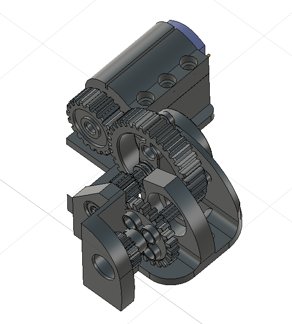
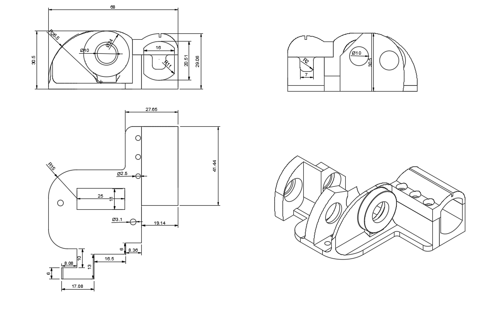
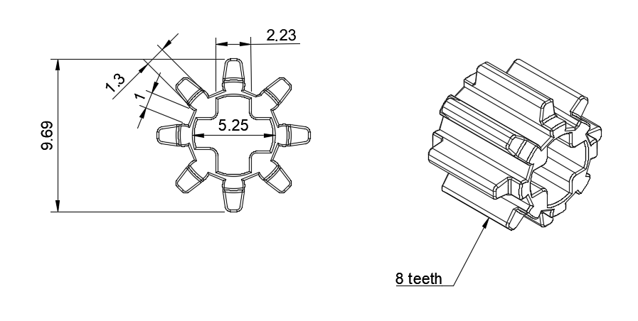
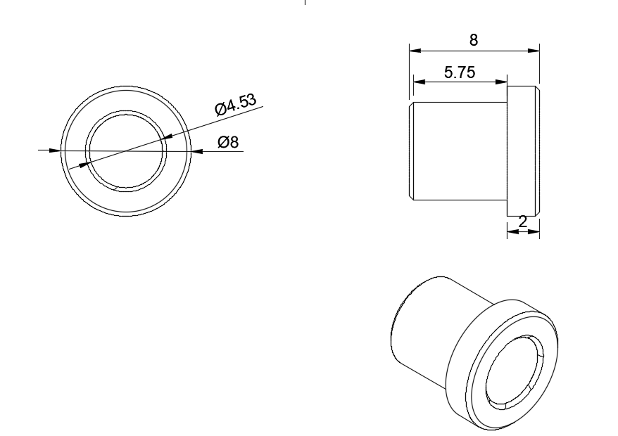
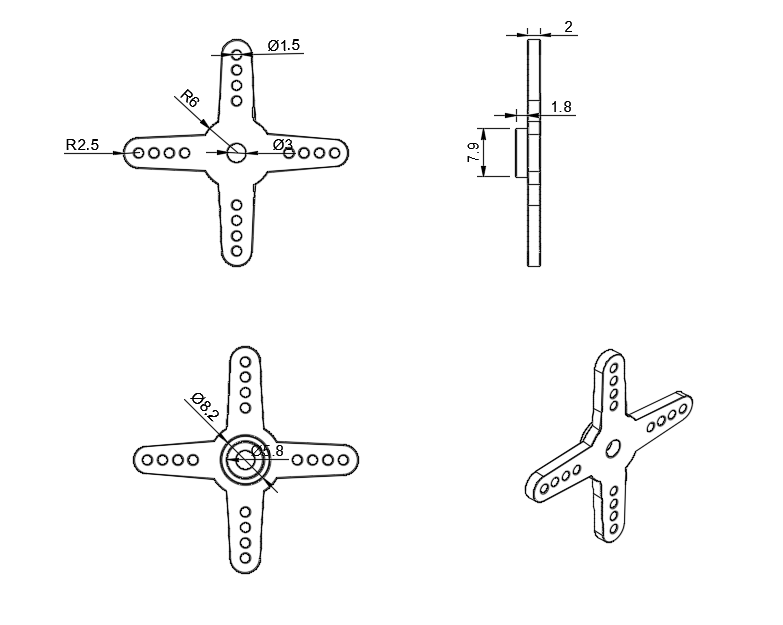
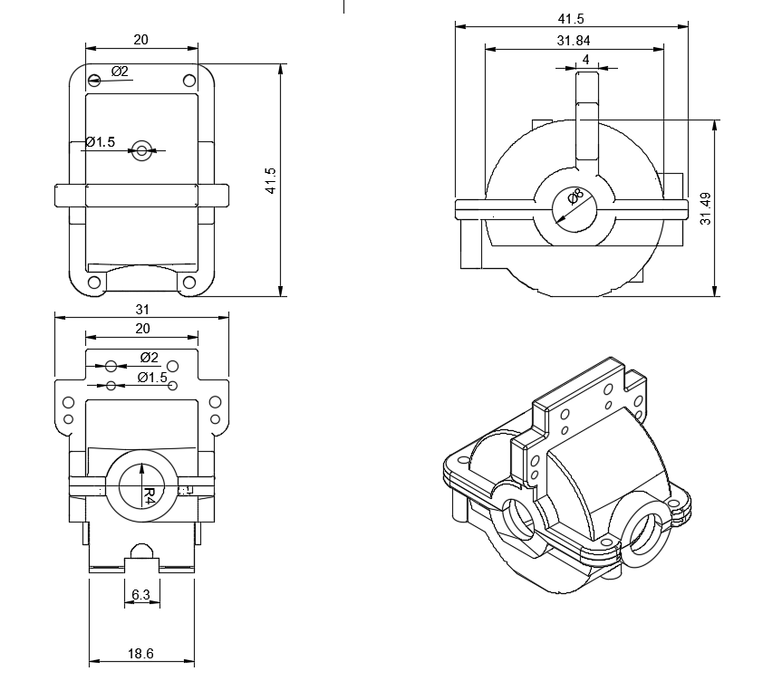
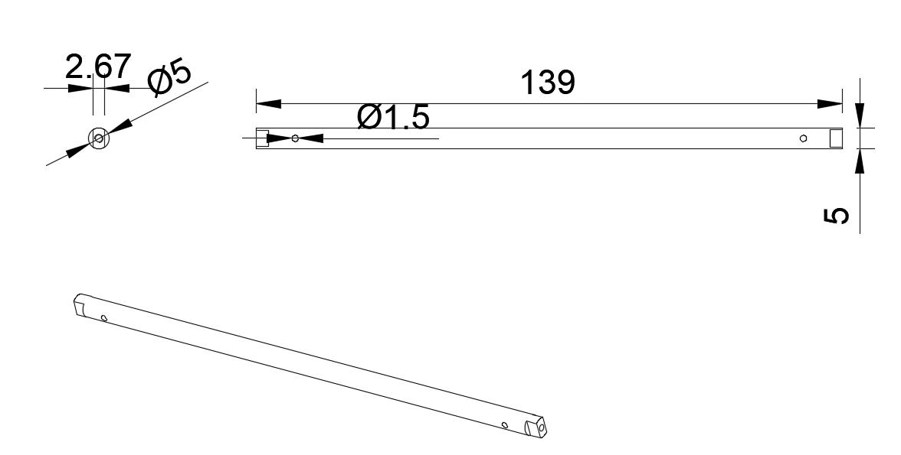
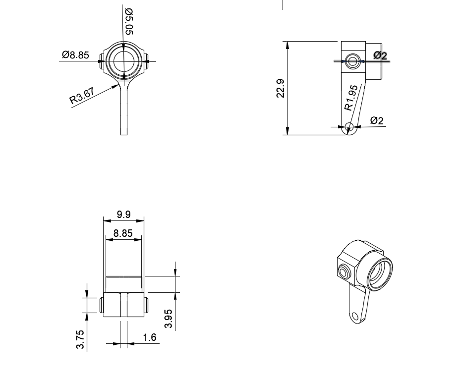
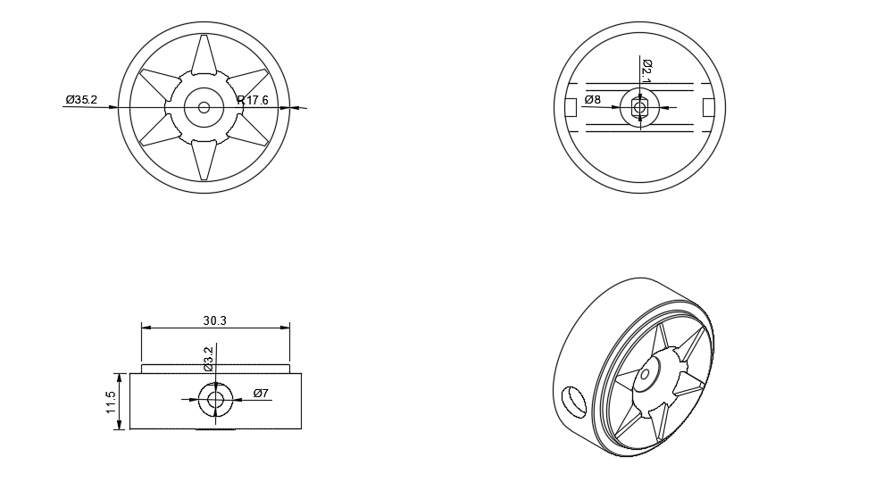

# Piezas Comunes {:#common-parts}

## Sistema reductor de RPM {:#rpm-reduction-system}

	
	<i>Sistema reductor de RPM</i>

En este modelo 3D podemos ver cómo está diseñado este sistema. Pasaremos a mostrar y explicar las piezas que lo conforman.

### Base del sistema {:#rpm-reduction-system-base}

	
	<i>Base del sistema reductor de RPM</i>

Es el cuerpo en el que se ensamblan todos los componentes de este sistema. Está diseñado para ocupar el menor espacio posible mientras cumple su función al 100%.

### Piñones {:#rpm-reduction-system-gears}

	

		
		<i>Piñón de 36 dientes</i>
	

	

		
		<i>Piñón de 24 dientes</i>
	

	

		
		<i>Piñón de 20 dientes</i>
	

	

		
		<i>Piñón metálico de 17 dientes</i>
	

	

		
		<i>Piñón de 8 dientes</i>
	

Esta es la parte más importante de nuestro sistema, son los que hacen que el motor pierda velocidad, pero que a su vez, gane fuerza. Estos engranajes son sobrantes de kits, pero quisimos adecuarlos a nuestro sistema para que no fuesen desperdiciadas.

### Eje principal {:#rpm-reduction-system-main-shaft}

	
	<i>Eje del sistema reductor de RPM</i>

Utilizamos dos unidades de este tipo de eje, cuya función principal es sujetar los piñones manteniéndolos a una altura fija y estable dentro del sistema. Gracias a su resistencia,esta pieza permite la alineación precisa de los engranajes.

### Separadores {:#rpm-reduction-system-separators}

	
	<i>Separadores del sistema reductor de RPM</i>

Se encargan de mantener los engranajes en un mismo sitio para que estos coincidan en sus giros. Esta también es una pieza reutilizada. Usamos tres unidades

### Bujes {:#rpm-reduction-system-bushings}

	
	<i>Bujes del sistema reductor de RPM</i>

Los bujes cumplen una función fundamental en nuestro sistema, ya que se encargan de sostener firmemente los ejes, también permiten el giro libre y eficiente de los engranajes. 

## Servo {:#servo}

### Separador en forma de cruceta {:#cross-shaped-separator}

	
	<i>Separador en forma de cruceta</i>

Esta pieza se conecta directamente con el buje que se encuentra justo detrás del piñón de 36 dientes. Aprovechamos su diseño, que permite que encaje tanto con el buje como con uno de los ejes, asegurando así una alineación precisa. Todo el sistema está pensado para que las piezas entren a presión, garantizando una unión firme.

## ¿Para qué sirve este sistema de engranajes en el robot?

El sistema está diseñado para convertir la alta velocidad del motor INJORA 48T (20,000 RPM) en un movimiento más lento pero con mayor torque. El sistema comienza con el piñón de 20 dientes en el eje del motor, este acciona un engranaje de 36 dientes. Que a su vez, está montado en el eje principal del sistema con el piñón de 8 dientes que impulsa al de 24. Finalmente, un piñón de 17 dientes mueve al engranaje de salida de 40 dientes, conectado al eje de transmisión. Cada engranaje aporta una reducción, y al combinarse todas se obtiene una relación total de aproximadamente 12.69, lo que significa que por cada 12.69 vueltas del motor, el eje de salida da una. Este diseño permite al robot aumentar su fuerza de empuje y tracción, sacrificando velocidad en favor de mayor potencia.

## Sistema Motriz {:#drivetrain-system}

### Diferenciales {:#differentials}

	
	<i>Diferenciales</i>

Todo nuestro sistema motriz está basado en el uso de dos diferenciales, los cuales juegan un papel fundamental al permitir que las cuatro ruedas tengan tracción. Gracias a esta configuración, se logra una distribución perfecta de la fuerrza.

### Caja de diferencial {:#gearbox}

	
	<i>Caja de diferencial</i>

Esta es la estructura donde está el diferencial, protegiéndolo y manteniéndolo en su lugar. Desde este punto, también salen los componentes que permiten el giro de la rueda. Su diseño asegura la estabilidad del diferencial así como su debido funcionamiento.

### Eje transmisor {:#transmission-shaft}

	
	<i>Eje transmisor</i>

Esta pieza cumple la función clave de conectar ambos diferenciales, permitiendo una sincronización entre ellos. Gracias a esta conexión, se asegura que las cuatro ruedas del robot se muevan de forma uniforme, distribuyendo el torque de manera equilibrada.

### Copas transmisoras {:#transmission-cups}

	
	<i>Copas transmisoras</i>

Esta pieza la utilizamos específicamente en el diferencial. Está diseñada con precisión para encajar perfectamente con el semieje, permitiendo así que las ruedas reciban el movimiento de manera eficiente. 

### Nudillos traseros {:#rear-knuckles}

	
	<i>Nudillos traseros</i>

Es la pieza encargada de sostener directamente la rueda, funcionando como el punto de unión entre esta y el sistema de transmisión. Su diseño permite un encaje preciso con las copas transmisoras, asegurando así una conexión firme y eficiente para la movilidad del robot.

### Nudillos delanteros {:#front-knuckles}

	
	<i>Nudillos delanteros</i>

También se encarga de conectarse con la rueda y con una copa transmisora, pero a diferencia del nudillo trasero este es un poco más alargado, para encajar con las barras del sistema Ackermann.

### Ruedas {:#wheels}

	
	<i>Ruedas</i>

Utilizamos un total de cuatro unidades de esta rueda, las cuales fueron diseñadas completamente por nosotros, cuidando cada detalle para lograr un aspecto único que refleje identidad visual en el diseño del robot.

## ¿Cómo funciona este sistema motriz?

Este sistema de transmisión 4x4 está compuesto por dos diferenciales metálicos, ubicados en ambos ejes. Estos diferenciales reciben el movimiento a través del eje principal que atraviesa el piñón de 40 dientes, el cual conecta directamente ambos diferenciales. Esto permite distribuir el torque generado por el motor de forma equilibrada entre el eje delantero y el trasero.

Desde cada diferencial se conectan los semiejes, elementos diseñados para transmitir el giro hacia las ruedas. Los semiejes se acoplan a la copa transmisora que está en el nudillo, que actúa como soporte de la rueda. Este nudillo no solo sostiene la rueda, sino que también permite su giro libre para la tracción y facilita el movimiento.

Gracias a esta configuración, el sistema puede mover todo el conjunto utilizando un solo motor, ya que la transmisión y la distribución adecuada del torque a través de los diferenciales y semiejes aseguran que las ruedas reciban la potencia necesaria.

