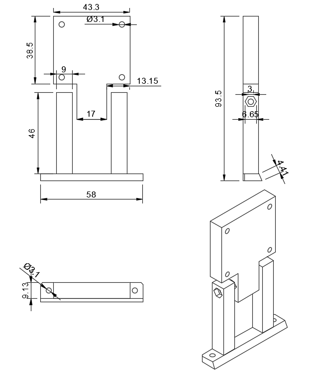
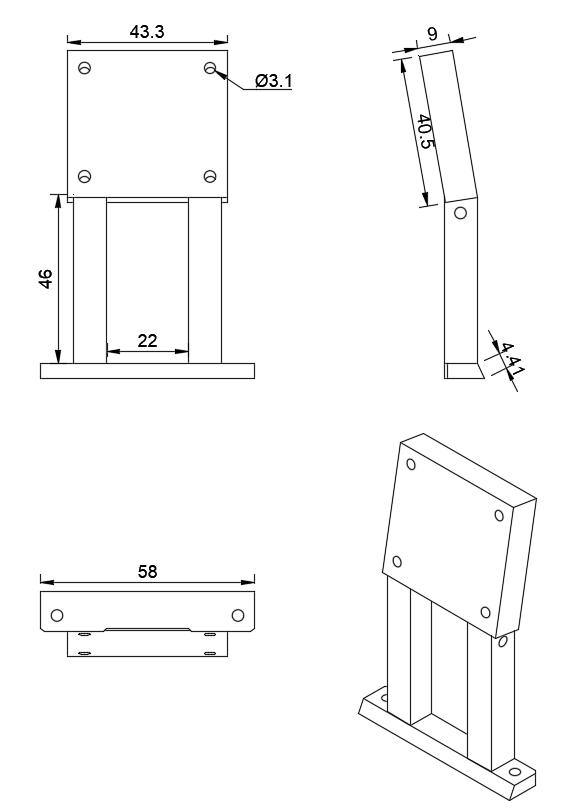

# Previous Common Parts

## Raspberry Pi Camera Module 3 Mounting

### Version 1

<!-- github-only-start -->

	
	 
	<i>Raspberry Pi Camera Module 3 Mouting Version 1</i>

<!-- github-only-end -->

<!-- mkdocs-only-start

	
	<i>Raspberry Pi Camera Module 3 Mounting Version 1</i>

mkdocs-only-end -->

We designed this part so the camera was tall enough and nothing obstructed its field of view, it is also divided in two parts, the upper part (where the camera is positioned) and the lower (pillars) were designed to have a modifiable. This was only made for testing purposes.

### Version 2

<!-- github-only-start -->

	
	 
	<i>Raspberry Pi Camera Module 3 Mounting Version 2</i>

<!-- github-only-end -->

<!-- mkdocs-only-start

	
	<i>VRaspberry Pi Camera Module 3 Mounting Version 2</i>

mkdocs-only-end -->

After some tests, we settled on a camera angle, so we simply unified both parts from the separate version with the ideal angle we found while testing.
