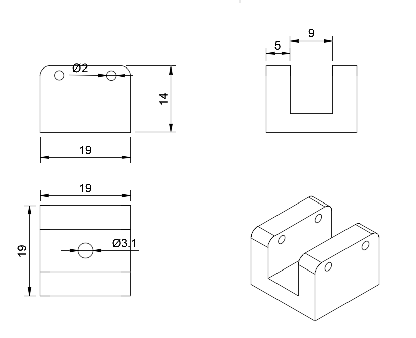
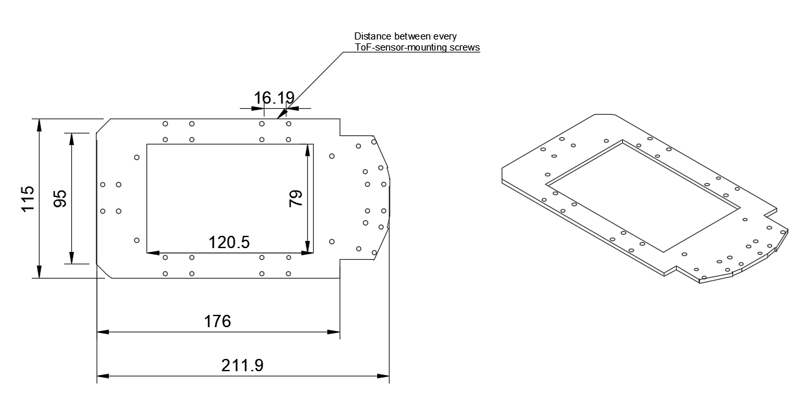
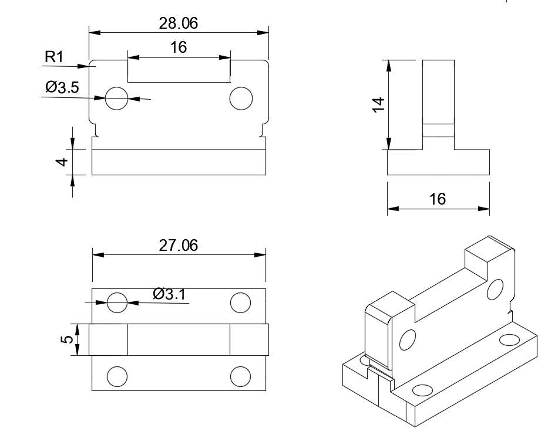
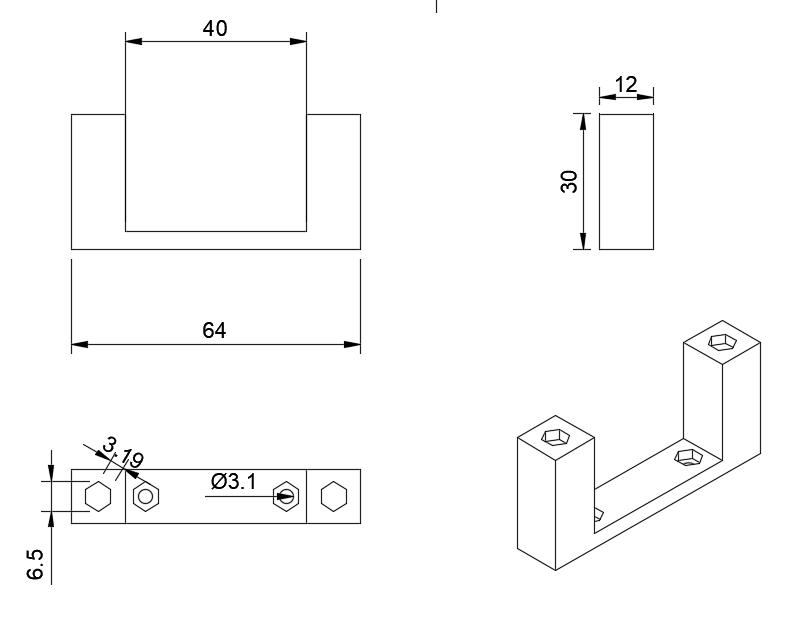
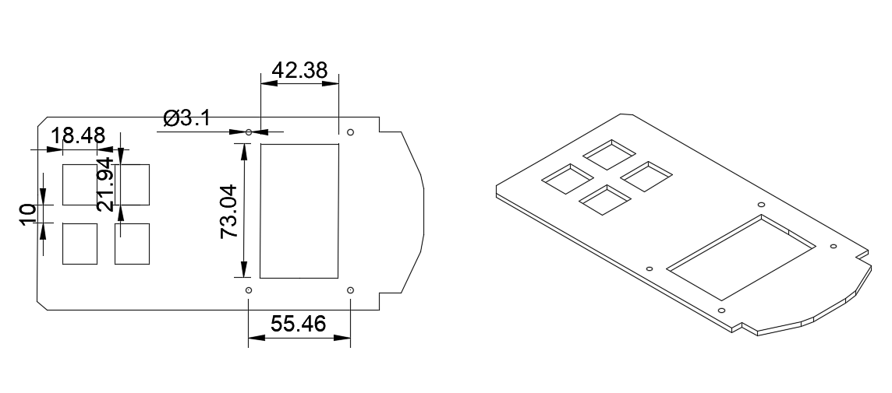

# Prototype 1

## Bottom Layer Mounting

<!-- github-only-start -->

	
	 
	<i>Bottom Layer Mounting</i>

<!-- github-only-end -->

<!-- mkdocs-only-start

	
	<i>Bottom Layer Mounting</i>

mkdocs-only-end -->

Klevor's bottom layer mounting, is designed specially to join and support all of the mechanical system. This main structure provides a firm support, allowing a custom assembly for each component.

## Differential Box Upper Mounting (Thin)

<!-- github-only-start -->

	
	 
	<i>Differential Box Upper Mounting (Thin)</i>

<!-- github-only-end -->

<!-- mkdocs-only-start

	
	<i>Differential Box Upper Mounting (Thin)</i>

mkdocs-only-end -->

This mounting is screwed onto the rear differential box to support the middle layer.

## Differential Box Upper Mounting (Wide)

<!-- github-only-start -->

	
	 
	<i>Differential Box Upper Mounting (Wide)</i>

<!-- github-only-end -->

<!-- mkdocs-only-start

	
	<i>Differential Box Upper Mounting (Wide)</i>

mkdocs-only-end -->

It's connected to the front differential box, the central hole is also larger because it also holds onto the upper grip of the front wheels.

## Middle Layer Mounting

<!-- github-only-start -->

	
	 
	<i>Middle Layer Mounting</i>

<!-- github-only-end -->

<!-- mkdocs-only-start

	
	<i>Middle Layer Mounting</i>

mkdocs-only-end -->

This layer is mainly designed to set the [ToF sensors](../../electronic/components/previous.en.md#hiletgo-time-of-flight-sensor-vl53l0x-used-in-prototype-1), ensuring its proper positioning and functioning, also, this layer includes a gap in the middle to place a power bank inside, which we use provisionally to power the robot. The layer's design facilitates an organized and safe assembly for each of these components.

## ToF Sensor Mounting

<!-- github-only-start -->

	
	 
	<i>ToF Sensor Mounting</i>

<!-- github-only-end -->

<!-- mkdocs-only-start

	
	<i>ToF Sensor Mounting</i>

mkdocs-only-end -->

This support is made for the [ToF sensors](../../electronic/components/previous.en.md#hiletgo-time-of-flight-sensor-vl53l0x-used-in-prototype-1) and is designed meticulously, with a specific angle that allows its proper functioning. This sensor is screwed onto the mounting. And each mounting is screwed directly into their corresponding holes.

## Top Layer Mounting Pillars

<!-- github-only-start -->

	
	 
	<i>Top Layer Mounting Pillars</i>

<!-- github-only-end -->

<!-- mkdocs-only-start

	
	<i>Top Layer Mounting Pillars</i>

mkdocs-only-end -->

These pillars were designed to hold the top layer and were made to be connected with the top layer with screws and nuts, to provide more resistance, because the components from this layer aren't lightweight.

## Top Layer Mounting

<!-- github-only-start -->

	
	 
	<i>Top Layer Mounting</i>

<!-- github-only-end -->

<!-- mkdocs-only-start

	
	<i>Top Layer Mounting</i>

mkdocs-only-end -->	

Designed specifically to place the microcontroller, the single-board computer, and our camera mounting, and placing some holes for the single-board computer to dissipate the heat properly.