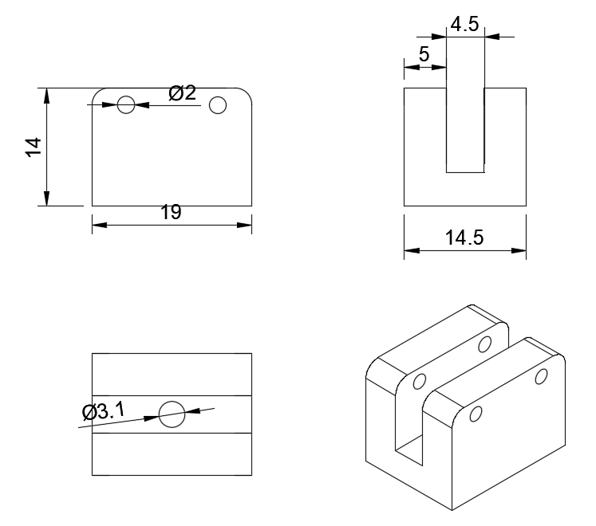

# Prototipo 1 {:#prototype1}

# Primer nivel

**Capa inferior:** La "base" de Klevor, hecha para ensamblar toda su parte mecánica.

**Soporte (delgado):** Este soporte se atornilla a la caja del diferencial trasera para sostener el segundo nivel

**Soporte (grueso):** Se conecta a la caja del diferencial frontal, el orificio central es más grande debido a que también se sostiene del agarre superior de las ruedas delanteras.

# Segundo Nivel 

**Segunda capa:** Diseñada para colocar los sensores ToF y un powerbank que usaremos de manera provisional.

**Soporte para sensor ToF:** El sensor ToF se atornilla de forma horizontal en esta base. La base se ensambla directamente a la capa.

**Soporte de la capa superior:** Sostienen la capa superior. Diseñados para ser ensamblados con tornillos y tuercas, esto le da más resistencia.

# Tercer Nivel

**Capa superior:** Hecha para colocar el microcontrolador y cámara.

**Soporte para cámara:** Fue diseñada para estar alta y que no fuese obstruida, además, está seccionada en dos partes, la superior (donde va la cámara) y la inferior (pilares) fue diseñada para que su ángulo de visión sea modificable. Esto solo mientras se hacen pruebas.SSSSSS