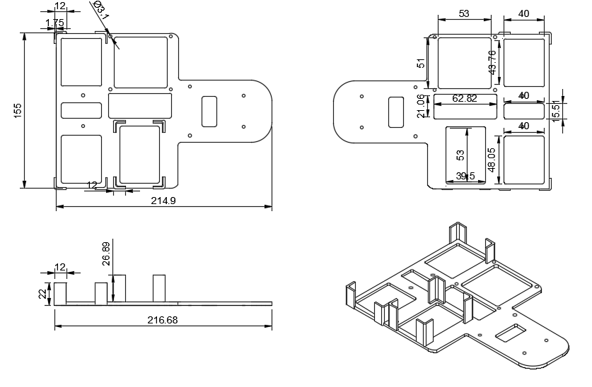

# Prototype 2

## Bottom Layer Mounting

<!-- github-only-start -->

	
	 
	<i>Bottom Layer Mounting</i>

<!-- github-only-end -->

<!-- mkdocs-only-start

	
	<i>Bottom Layer Mounting</i>

mkdocs-only-end -->

We made several changes from our previous version; amongst them, we added more holes strategically distributed to reduce the robot's weight and to make sure whe didn't go past the established regulatory limit.

## Top Layer Mounting

<!-- github-only-start -->

	
	 
	<i>Top Layer Mounting</i>

<!-- github-only-end -->

<!-- mkdocs-only-start

	
	<i>Top Layer Mounting</i>

mkdocs-only-end -->

In this version, we made several significative changes, mianly due to the incorporation of new components, such as the [Raspberry Pi 5](../../electronic/components/current.en.md#raspberry-pi-5-16gb-ram) and the [RPLiDAR C1](../../electronic/components/current.en.md#rplidar-c1). These additions forced us to change several aspects of the design and structure to properly place these components, ensuring their integration and proper fucntioning in Klevor.