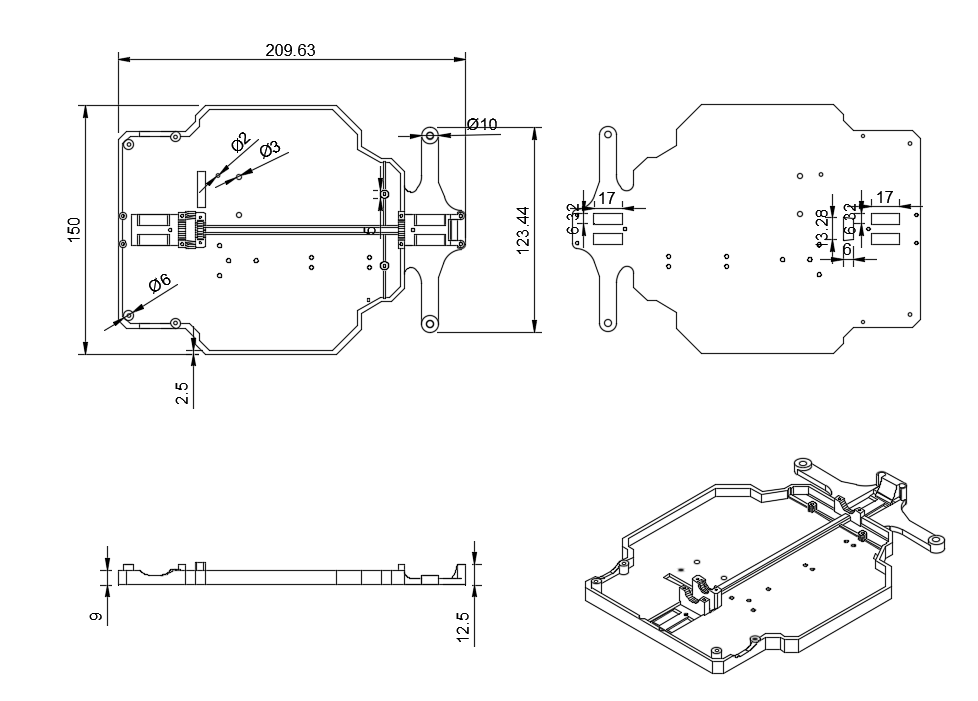
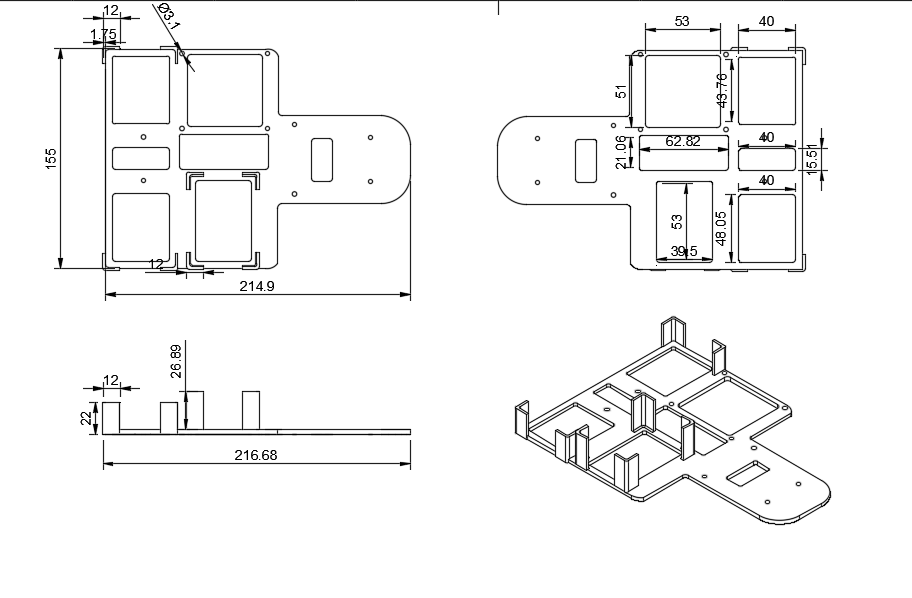
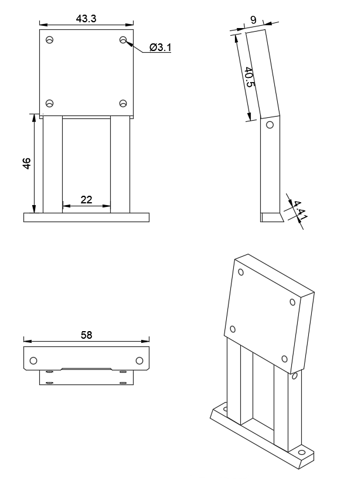

# Prototipo 2 {:#prototype2}

**Capa inferior:** Hicimos cambios respecto al prototipo 1, hicimos más orificios para no sobrepasar el peso reglamentario.

**Capa superior:** En esta hubo demasiados cambios debidos a la adición de nuevos componentes como la Raspberry PI 5 o el RPlidar.

**Soporte para cámara:** Luego de varias pruebas logramos determinar el ángulo ideal para la cámara, por eso unimos ambas piezas que anteriormente eran graduables.
