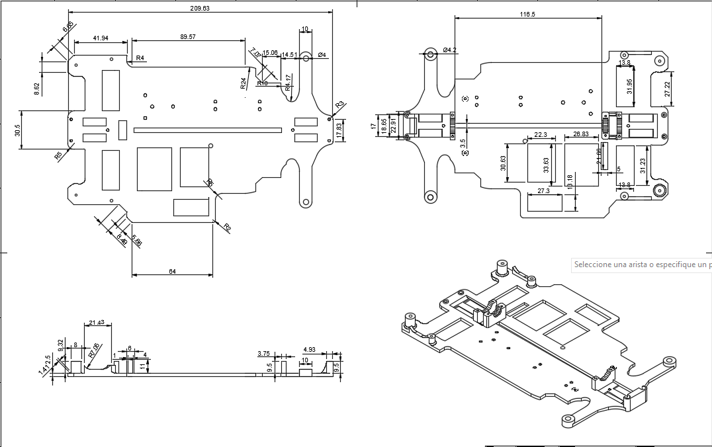
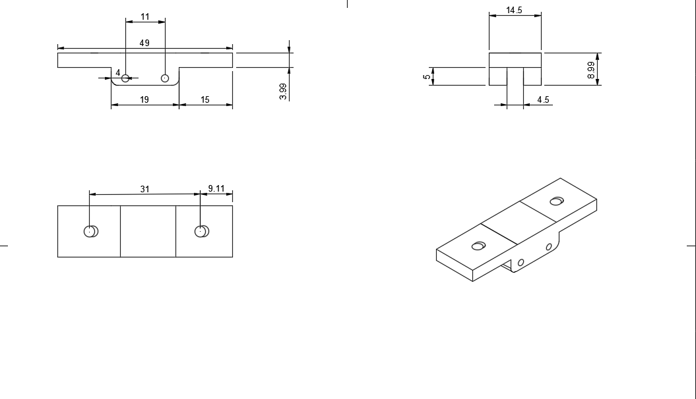
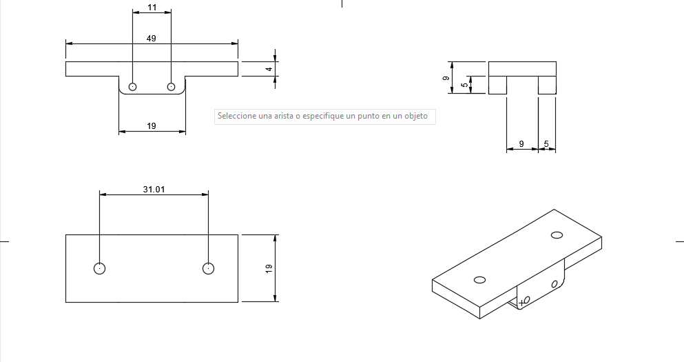
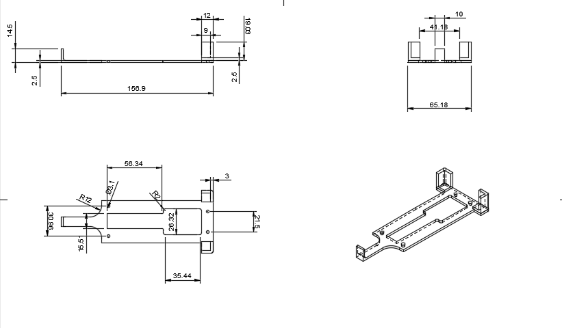

# Prototipo 3 {:#prototype3}

**Capa inferior:** Se hicieron cambios drásticos, principalmente modificando el grosor de la capa y añadiendo nuevos huecos, toda la base está hecha a medida de los componentes que estamos usando.

**Soporte para capa superior (delgado):** Hecho para sostener con total firmeza la capa superior, se ensambla en la caja del diferencial trasera.

**Soporte para RPLidar:** El hueco central es más ancho porque se ensambla en la caja del diferencial frontal y en el soporte superior de los nudillos a la vez. Encima de esta se ensambla nuestro RPLidar.

**Capa superior:** También ha sido demasiado cambiada respecto al prototipo 2, tuvimos que reducirlo para no sobrepasar el peso más alto permitido, encima de esta capa está ubicada la [Shargeek Storm 2](../../electronic/components/current.md#shargeek-storm-2) y la [Raspberry Pi 5](../../electronic/components/current.md#raspberry-pi-5).