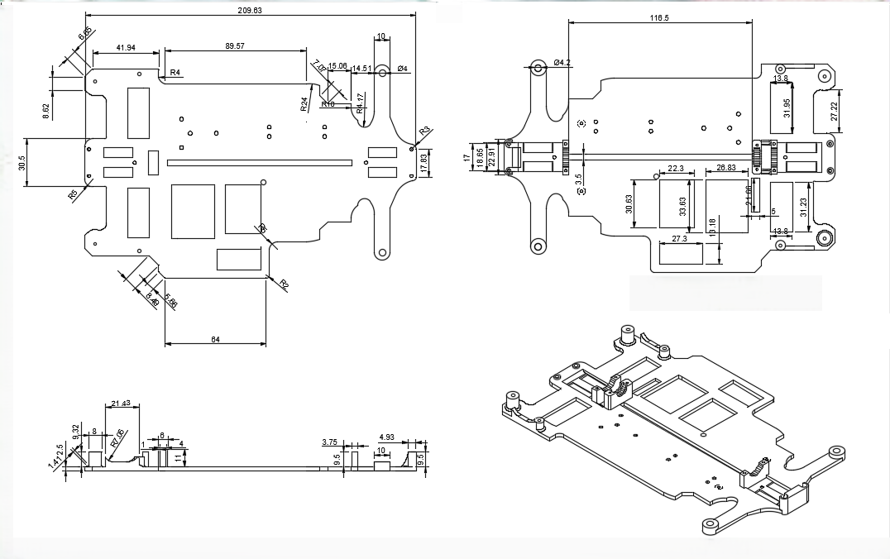
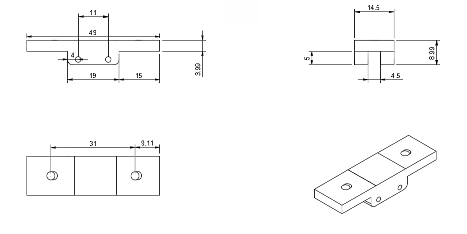
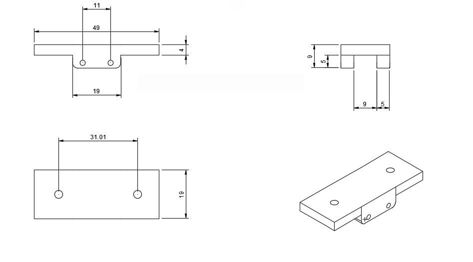
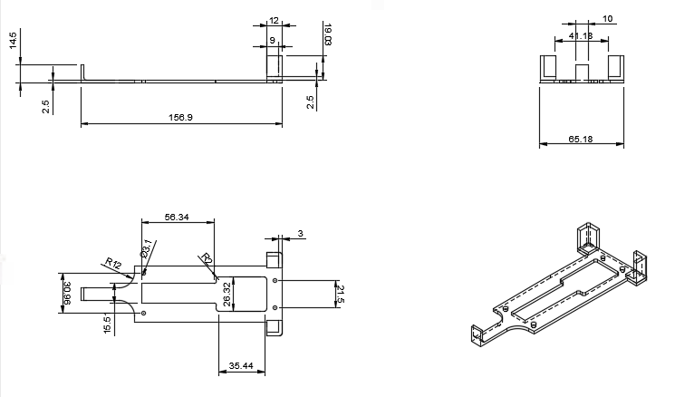

# Prototipo 3 {:#prototype3}

## Base de la Capa Inferior {:#bottom-layer-mounting}

	
	<i>Base de la Capa Inferior</i>

Se hicieron cambios drásticos, principalmente modificando el grosor de la capa y añadiendo nuevos huecos, toda la base está hecha a medida de los componentes que estamos usando.

## Soporte Superior de la Caja del Diferencial (Delgado) {:#differential-gearbox-upper-mounting--thin}

	
	<i>Soporte Superior de la Caja del Diferencial (Delgado)</i>

Realizado para sostener con total firmeza la capa superior, se ensambla en la caja del diferencial trasera.

## Soporte Superior de la Caja del Diferencial (Grueso) {:#differential-gearbox-upper-mounting--wide}

	
	<i>Soporte Superior de la Caja del Diferencial (Grueso)</i>

El espacio central es más ancho porque se ensambla en la caja del diferencial frontal con el soporte superior de los nudillos. Encima de esta, se ubica nuestro [RPLiDAR C1](../../electronic/components/current.md#rplidar-c1).

## Base de la Capa Superior {:#top-layer-mounting}

	
	<i>Base de la Capa Superior</i>

También ha tenido numerosos cambios con respecto al prototipo 2, tuvimos que reducirlo para no sobrepasar el peso máximo permitido, encima de esta capa está ubicada la [Shargeek Storm 2](../../electronic/components/current.md#shargeek-storm-2) y la [Raspberry Pi 5](../../electronic/components/current.md#raspberry-pi-5).