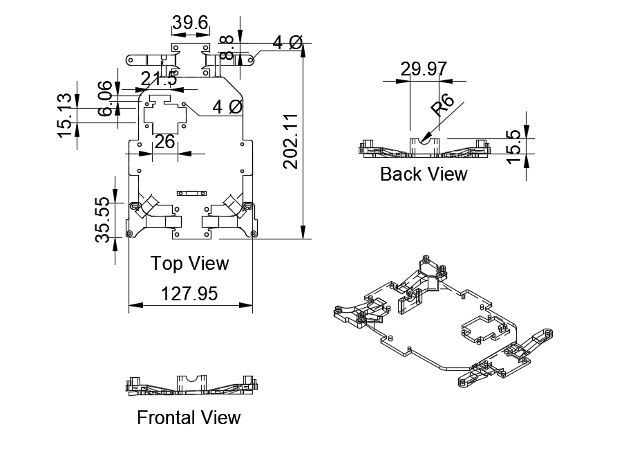
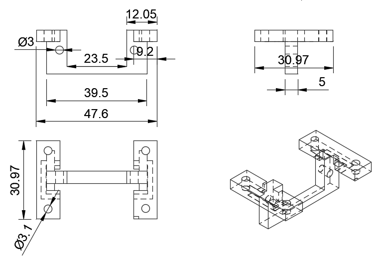

# Prototype 4 {:#prototype4}

## Chassis {:#Chassis}

<!-- github-only-start -->

	
	 
	<i>Chassis</i>

<!-- github-only-end -->

<!-- mkdocs-only-start

	
	<i>Chassis</i>

mkdocs-only-end -->

In this prototype, we decided to make just one layer that serves as a base for all the components. This change was possible because, unlike the previous prototypes, we didn't need the RPM Reduction System, which was a pretty big component.

The main objective for this chassis was to improve the functioning of the motor system. The new wheels are 30mm larger in diameter, which was a problem, if we just implemented them like that, the entire robot would rise. This was a big inconvenience for the RPLiDAR, because, if it was high enough, it couldn't detect the obstacles nor the walls, to avoid this problem, we designed the chassis so that it was a lowered base with 4 raised points in the corners. Thanks to these high points, we can connect the wheels in the higher corners, while the rest of the components, including the RPLiDAR are placed at a lower height.

Aside from solving the height problem, this chassis' special design has another key benefit, it allows that the wheels had a bigger turning angle. With this upgrade, the robot has an advantage against the other prototypes, which offers a great advantage in the game field.

## Servo base

<!-- github-only-start -->

	
	 
	<i>Servo base</i>

<!-- github-only-end -->

<!-- mkdocs-only-start

	
	<i>Servo base</i>

mkdocs-only-end -->

This part was designed to be mounted directly on the servomotor, and afterwards, be mounted onto the chassis, we built it like this because we needed the servomotor to be low, so that when turning the servo, it wouldn't crash with the transmission shaft, and it had enough space to use all of the turning angle that Klevor has.
