# Prototype 1

In this section we'll detail on the components and their respective functionality on each of the robot's layers. We'll also explain the purpose of every component and how each of them contributes to Klevor's general performance on the game field.

## First Layer

In this first layer we can find all of the robot's mechanical aspects.

<!-- github-only-start -->
<table>
    <tbody>
        <tr>
            <td>
                

                    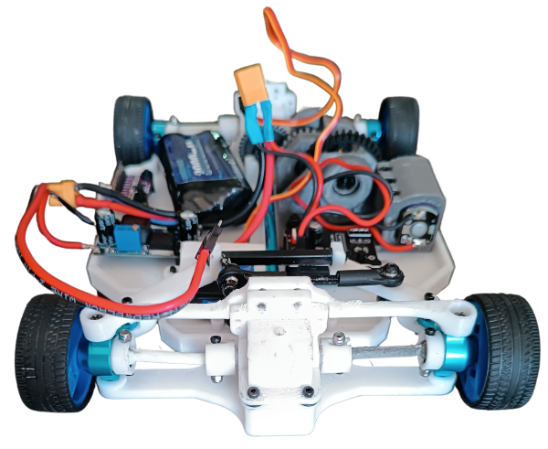
                     
                    <i>First layer, front view</i>
                
	
            </td>
            <td>
                

                    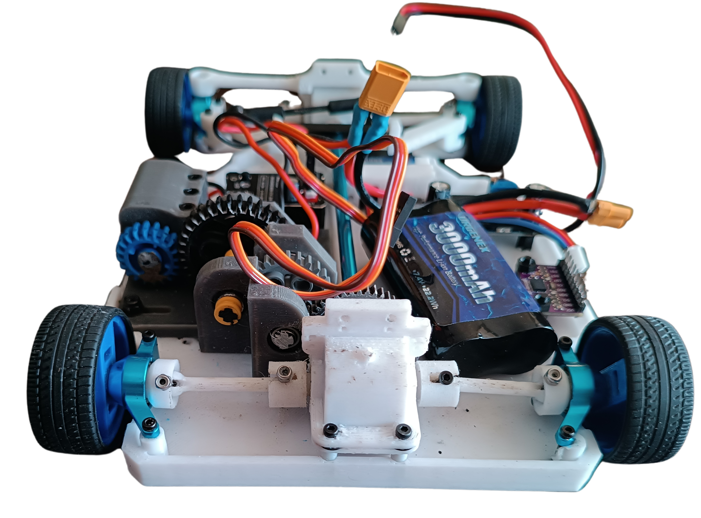
                     
                    <i>First layer, back view</i>
                
		
            </td>
        </tr>
        <tr>
            <td>
                

                    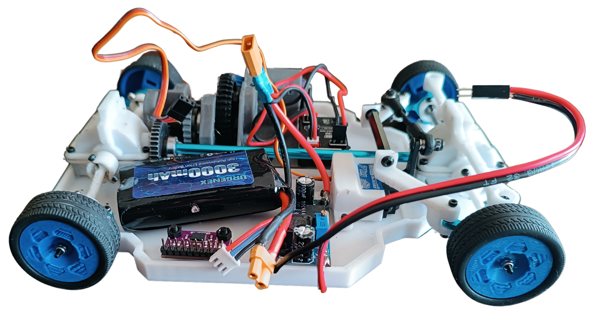
                     
                    <i>First layer, left view</i>
                

            </td>
            <td>
                

                    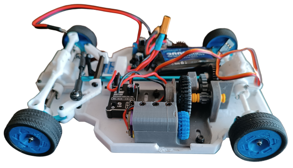
                     
                    <i>First layer, right view</i>
                
		
            </td>
        </tr>
        <tr>
            <td>
                

                    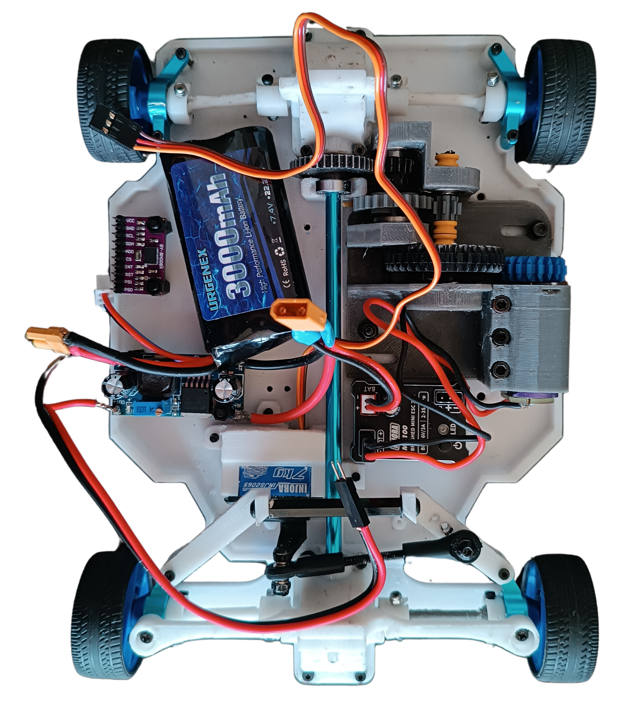
                     
                    <i>First layer, top view</i>
                
	
            </td>
        </tr>
    </tbody>
</table>
<!-- github-only-end -->

<!-- mkdocs-only-start

    

        
        <i>First layer, front view</i>
    

    

        
        <i>First layer, back view</i>
    
  
    

        
        <i>First layer, left view</i>
    

    

        
        <i>First layer, right view</i>
    

    

        
        <i>First layer, top view</i>
    

mkdocs-only-end -->

Next, We will explain how this drive system works. To achieve it, we decided to imitate the way a car works; its operation depends on a differential (a part made up of several gears covered by a housing) for the movement of two wheels, since we use four wheels, we use two differentials (one for the front, one for the rear) which are connected with a transmission shaft to make sure that the movement is uniform. These differentials move together through a gear that is connected to the transmission shaft. The transmission shaft only connects the two differentials together by means of a slot in them, and has the addition of a gear in the part where our motor goes ([INJORA 48T](../../electronic/components/current.en.md#injora-180-motor-48t)). Originally, we connected this motor directly to the transmission shaft's gear, however it didn't work since the motor didn't have enough torque to move Klevor. Due to this issue, we had to create a RPM reduction system.

## How does the RPM reduction system work?

<!-- github-only-start -->

    
     
    <i>RPM Reduction System</i>

<!-- github-only-end -->

<!-- mkdocs-only-start

    
    <i>RPM Reduction System</i>

mkdocs-only-end -->
 This system forces the motor, which was very fast but not strong enough, to apply more strength to move, which is something important for the challenges, which require traction and overcoming obstacles.

<!-- github-only-start -->
<table>
    <tbody>
        <tr>
            <td>
                

                    
                     
                    <i>36-tooth pinion</i>
                

            </td>
            <td>
                

                    
                     
                    <i>24-tooth pinion</i>
                

            </td>
        </tr>
        <tr>
            <td>
                

                    
                     
                    <i>20-tooth pinion</i>
                

            </td>
            <td>
                

                    
                     
                    <i>17-tooth metallic pinion</i>
                

            </td>
        </tr>
        <tr>
            <td>
                

                    
                     
                    <i>8-tooth pinion</i>
                

            </td>
        </tr>
    </tbody>
</table>
<!-- github-only-end -->

<!-- mkdocs-only-start

    

        
        <i>36-tooth pinion</i>
    

    

        
        <i>24-tooth pinion</i>
    

    

        
        <i>20-tooth pinion</i>
    

    

        
        <i>17-ttoth metallic pinion</i>
    

    

        
        <i>8-tooth pinion</i>
    

mkdocs-only-end -->

This reduction system features the aforementioned, [INJORA 48T](../../electronic/components/current.en.md#injora-180-motor-48t), with a 20000 RPM speed, with a 20-tooth pinion installed on its hub. And, the pinions, whose 2D designs are attached in this documentation, are 8, 17, 24, 36 and 40 tooth pinions; all from LEGO kits.

This system works in multiple layers, but basically, in each layer the pinions decrease the speed but increase the torque

Another fundamental part for our robot is its crossing system, which consists of a servomotor ([INJORA 7 kg 2065](../../electronic/components/current.en.md#injora-7-kg-2065-micro-servo)) which is connected to our "Ackermann" system that works by connecting both wheels to a steering or "trapezoid system". The servomotor moves some bars that are connected to the steering knuckles, thus allowing that one of the steering knuckles to be pushed to one side by the movement of the servomotor and in turn, pull the other wheel to the other side. Due to the angles of the trapezoid, this causes that the interior wheel to turn more than the outer one.

The motor moves a 36-tooth pinion, meshed with the 20-tooth pinion in the motor hub.

The 36-tooth pinion is mounted on a shaft that also rotates an 8-tooth pinion.

This 8-tooth pinion meshes with a 24-tooth pinion, to which a 17-tooth pinion is also attached.

This 17-tooth pinion meshes with a 40-tooth pinion, which is attached to the transmission shaft and transmits the movement to the robot's differentials.

Next, we will explain a few rules that are important to keep in mind:

- When a smaller pinion (driving) moves a bigger pinion (driven), **the speed is reduced and the torque is increased.**

- When a bigger pinion (driving) moves a smaller pinion (driven), **the speed is increased and the torque is reduced.**

The gear ratio or reduction ratio is calculated with the following formula:

<!-- github-only-start -->

    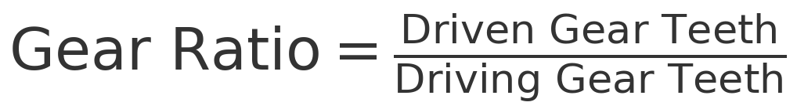
     
    <i>Gear ratio formula</i>

<!-- github-only-end -->

<!-- mkdocs-only-start

    
    <i>Gear ratio formula</i>

mkdocs-only-end -->

Having this in mind, we'll break down step by step how this applies to our system.

The 20-tooth pinion is directly on the motor hub.

This drives a 36-tooth pinion.

**Ratio = 36/20 = 1.8**

This means the motor must make 1.8 revolutions for the 36-tooth pinion to make 1 revolutions. Therefore, the speed is reduced and the torque is increased by 1.8.

The 36-tooth pinion is then attached to the same shaft with an 8-tooth pinion. 

This 8-tooth pinion meshes with a 24-tooth pinion.

**Ratio = 24/8 = 3**

The 8-tooth pinion must turn three times so that the 24-tooth pinion spins once, this triplicates the torque when this ocurrs.

Next, the 24-tooth pinion is attached to the same shaft as a 17-tooth pinion, which meshes with the last 40-tooth pinion (final drive).

**Ratio -= 40/17 = 2.35**

The 17-tooth pinion must make 2.35 revolutions spins once, The speed is reduced even further and the torque increases.

Since everything is connected in series (one after one), the ratios multiply together to find the total reduction ratio:

**Reduction ratio = 1.8 x 3 x 2.35 = 12.69**

This means that, for every 12.69 revolutions the motor makes, the last pinion makes only one, thereby increasing torque.

After this reduction, the motor has an output of 1576 RPM. However, it's worth noting that the wheel speed is also reduced, as the transmission shaft gears and differentials also reduce speed.

Some components that are also in this layer are: the gyroscope ([BNO08X](../../electronic/components/current.en.md#9-axis-imu-gyroscope-gy-bno085)), and a 7.4 V and 3000 mAh battery ([URGENEX 7.4 V](../../electronic/components/current.en.md#batería-urgenex-74-v)), and also the aforementioned, motor [INJORA 48T](../../electronic/components/current.en.md#injora-180-motor-48t) and servomotor [INJORA 7 kg 2065](../../electronic/components/current.en.md#injora-7-kg-2065-micro-servo).

### Why is this layer designed like this?

This layer is 100% designed and printed by us. By having multiple parts from kits that aren't modifiable (such as the differentials, the transmission shaft and the steering knuckles) we had to design the layer so that these pieces fit, and, at the same time, leave enough space for the other components. The wheel rims were designed by us, with custom-made slots from the aforementioned kits.

## Second Layer

<!-- github-only-start -->
<table>
    <tbody>
        <tr>
            <td>
                

                    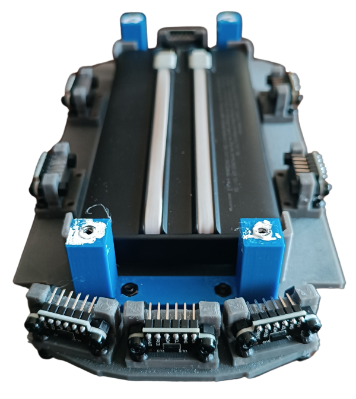
                     
                    <i>Second layer, front view</i>
                

            </td>
            <td>
                

                    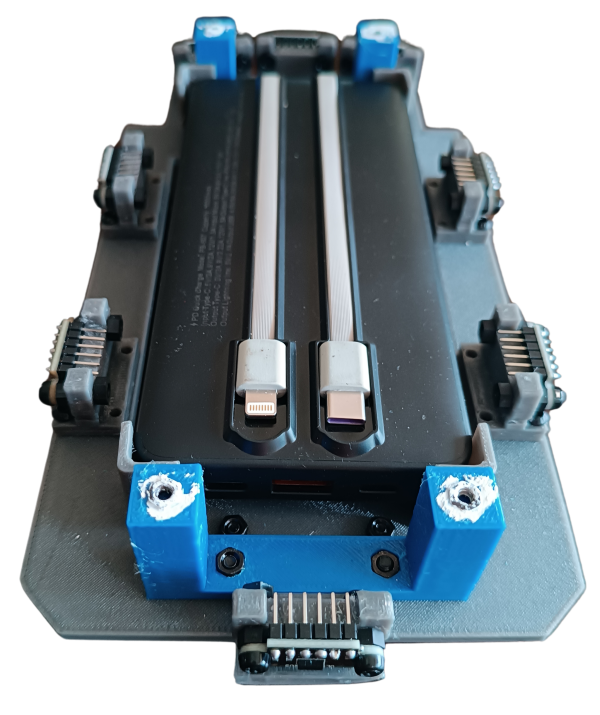
                     
                    <i>Second layer, back view</i>
                

            </td>
        </tr>
        <tr>
            <td>
                

                    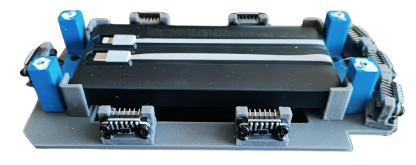
                     
                    <i>Second layer, left view</i>
                

            </td>
            <td>
                

                    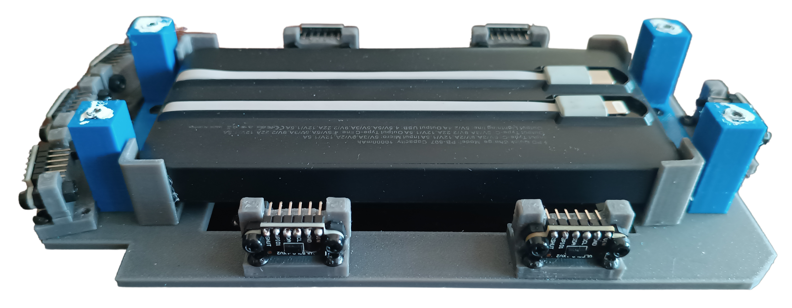
                     
                    <i>Second layer, right view</i>
                

            </td>
        </tr>
        <tr>
            <td>
                

                    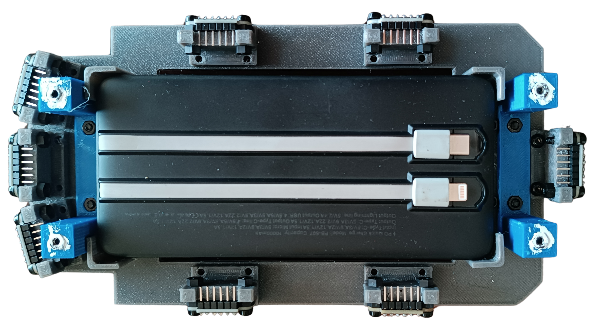
                     
                    <i>Second layer, top view</i>
                

            </td>
        </tr>
    </tbody>
</table>
<!-- github-only-end -->

<!-- mkdocs-only-start

    

        
        <i>Second layer, front view</i>
    

    

        
        <i>Second layer, back view</i>
    

    

        
        <i>Second layer, left view</i>
    

    

        
        <i>Second layer, right view</i>
    

    

        
        <i>Second layer, top view</i>
    

mkdocs-only-end -->

This second layer is dedicated to the robot's electronic wiring and the [ToF sensors](../../electronic/components/previous.en.md#hiletgo-time-of-flight-sensor-vl53l0x-used-in-prototype-1).

Klevor used eight sensors positioned strategically to measure the distance at different angles while it is moving, as you can see in the robot's photos, these sensors are fixed by supports that we designed and then, 3D printed. Klevor got 2 sensors from each side, 3 at the front (one placed horizontally, and the other 2 at the sides, with a 15 degree difference in comparison to the front sensor), and finally, one placed at the rear. All of these sensors are connected thanks to a protoboard in Klevor's upper part.

We have plans to integrate a [RPLidar C1](../../electronic/components/current.en.md#rplidar-c1), a 360 degree laser scanner, a component that widely improves the robot's functioning, not only due to its shorter response time, but also, due to its bigger field of view.

The electronic wiring section also has a power bank, thanks to it, the upper layer's components are supplied with electricity.

Our second layer was also 3D designed so that the power bank could have enough scape in the middle, also the [ToF sensors](../../electronic/components/previous.en.md#hiletgo-time-of-flight-sensor-vl53l0x-used-in-prototype-1) are fixed by a support that we also designed and printed. They are just the right size!

## Third Layer

<!-- github-only-start -->
<table>
    <tbody>
        <tr>
            <td>
                

                    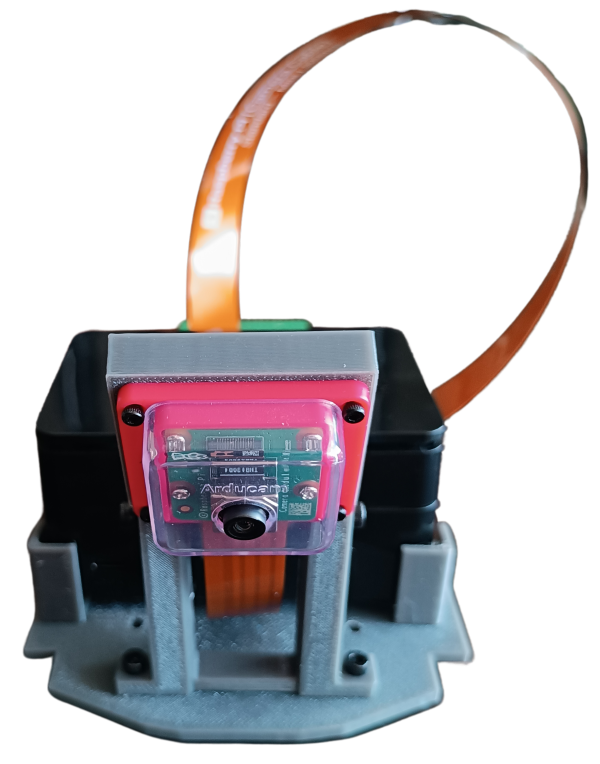
                     
                    <i>Third layer, front view</i>
                

            </td>
            <td>
                

                    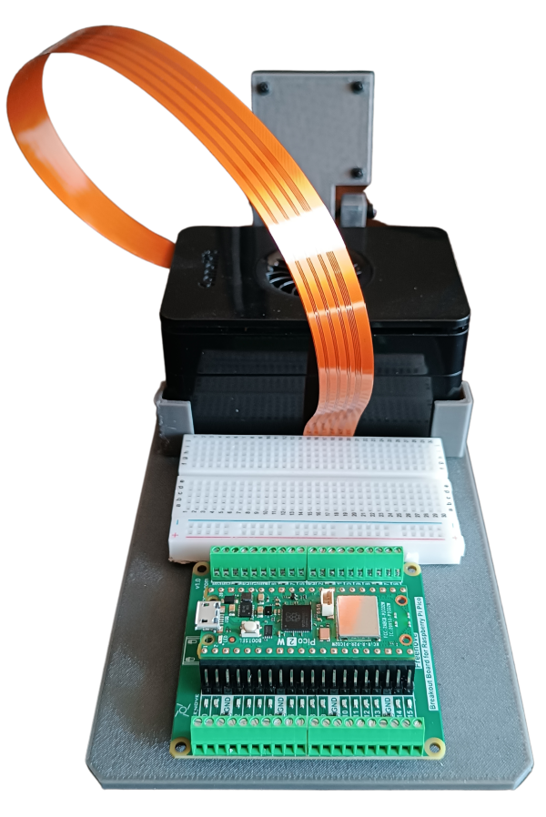
                     
                    <i>Third layer, back view</i>
                

            </td>
        </tr>
        <tr>
            <td>
                

                    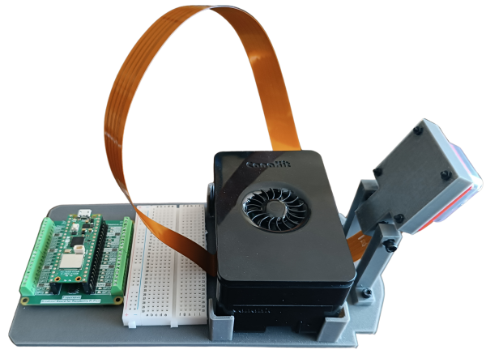
                     
                    <i>Third layer, left view</i>
                

            </td>
            <td>
                

                    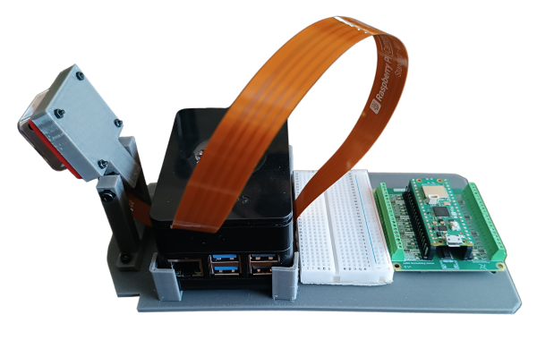
                     
                    <i>Third layer, right view</i>
                
		
            </td>
        </tr>
        <tr>
            <td>
                

                    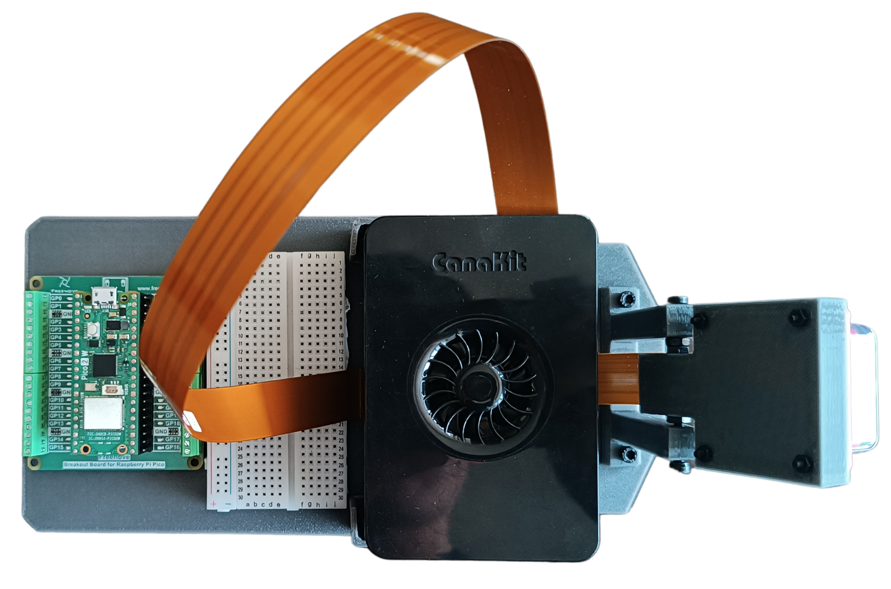
                     
                    <i>Third layer, top view</i>
                
	
            </td>
        </tr>
    </tbody>
</table>
<!-- github-only-end -->

<!-- mkdocs-only-start

    

        
        <i>Third layer, front view</i>
    

    

        
        <i>Third layer, back view</i>
    

    

        
        <i>Third layer, left view</i>
    

    

        
        <i>Third layer, right view</i>
    

    

        
        <i>Third layer, top view</i>
    

mkdocs-only-end -->

Klevor's third layer has all of the programmable parts, like the [Raspberry Pi 5](../../electronic/components/current.en.md#raspberry-pi-5-16gb-ram) and the [Raspberry Pi Pico 2 WH](../../electronic/components/current.en.md#raspberry-pi-pico-2-wh), the Raspberry Pi 5 is connected through USB-C to the PowerBank located in the second layer; the RPi 5 gives instructions to the [Raspberry Camera Module 3 Wide](../../electronic/components/current.en.md#raspberry-pi-camera-module-3-wide), and then later, feeding the images to a AI HAT+ that is connected to the RPi 5 in order to detect the obstacles in the Closed Challenge. 

Our aforementioned [Raspberry Pi Pico 2 WH](../../electronic/components/current.en.md#raspberry-pi-pico-2-wh) is in charge of giving orders to the [ToF sensors](../../electronic/components/previous.en.md#hiletgo-time-of-flight-sensor-vl53l0x-used-in-prototype-1), located in the second layer, while, at the same time, comunicatin with our [gyroscope](../../electronic/components/current.en.md#9-axis-imu-gyroscope-gy-bno085); the [INJORA 48T](../../electronic/components/current.en.md#injora-180-motor-48t) and the servomotor [INJORA 7 kg 2065](../../electronic/components/current.en.md#injora-7-kg-2065-micro-servo), all of these, located in the first layer. This is supplied by the 7.4 V and 3000mAh battery (which is also, you guessed it, located in the first layer). It is worth mentioning that, since the [Raspberry Pi Pico 2 WH](../../electronic/components/current.en.md#raspberry-pi-pico-2-wh) can't handle more than 5.5 V, and our battery supplies 7.4 V, we had to use a "Step-Down" module (more specifically the LM2596) to decrease the voltage to roughly 5 V, which is the recommended voltage to supply. Both our [Raspberry Pi 5](../../electronic/components/current.en.md#raspberry-pi-5-16gb-ram) and [Raspberry Pi Pico 2 WH](../../electronic/components/current.en.md#raspberry-pi-pico-2-wh) are connected together with an USB-C cable.

This layer was also designed and printed by ourselves, mainly focused in reducing the weight, and also, making a support for our camera that allows the camera to rotate its tilt angle using two screws. We did this to decide which tilt would work best with the camera and avoid any further issues.

## Bill of Materials

| Component                                                                                      | Unit   | Cost per Unit ($)    | Total ($)           |
|------------------------------------------------------------------------------------------------|--------|----------------------|---------------------|
| [Raspberry Pi 5](https://www.canakit.com/raspberry-pi-5-16gb.html)                             | 1      | 120.00               | 120.00              |
| [Micro SD 512GB](https://www.amazon.com/dp/B0C1Q79X3P)                                         | 1      | 54.99                | 54.99               |
| [Raspberry Pi Camera Module 3 Wide](https://www.canakit.com/raspberry-pi-camera-module-3.html) | 1      | 37.95                | 37.95               |
| [Raspberry Pi Pico 2WH](https://www.amazon.com/dp/B0F4W9J5CC)                                  | 1      | 14.99                | 14.99               |
| [Raspberry Pi Pico 2WH Breakout Board](https://www.amazon.com/dp/B0BFB53Y2N)                   | 1      | 11.95                | 11.95               |
| [Raspberry Pi Camera Module 3 Case        ](https://www.amazon.com/dp/B09TNG4V55)              | 1      | 5.99                 | 5.99                |
| [50cm Raspberry Pi Camera Module 3 Cable          ](https://www.amazon.com/dp/B0D3YWTNF8)      | 1      | 9.79                 | 9.79                |
| [URGENEX 3000mAh Battery](https://www.amazon.com/dp/B0CYNVSN7W)                                | 1      | 26.99                | 26.99               |
| [Gyroscope BNO085](https://www.amazon.com/dp/B0CDGZMLPP)                                       | 1      | 18.59                | 18.59               |
| [Step-Down LM2596](https://www.amazon.com/dp/B0D7ZWVSFW)                                       | 1      | 4.99                 | 4.99                |
| [INJORA 7Kg 2065 Servo](https://www.amazon.com/dp/B0BLBMVYCW)                                  | 1      | 17.98                | 17.98               |
| [INJORA MB100 20A Brushed Mini ESC](https://www.amazon.com/dp/B0CXT74XV6)                      | 1      | 32.99                | 32.99               |
| [INJORA 180 48T Motor PRO](https://www.amazon.com/es/dp/B0BZ7D63YW/)                           | 1      | 13.98                | 13.98               |
| [Half-Size Breadboard](https://www.amazon.com/dp/B01EV640I6)                                   | 1      | 5.98                 | 5.98                |
| [4pcs ToF Laser Range Finder for Arduino](https://www.amazon.com/dp/B0C6WZFZSX)                | 2      | 12.99                | 25.98               |
| [Harvic Power Bank PB-607](https://nebulixcolombia.com/products/power-bank-harvic)             | 1      | 17.50 [[1](#note1)]  | 17.50 [[1](#note1)] |
| [Aluminium Alloy Front & Rear Steering Knuckle Hub Base](https://www.amazon.com/dp/B09XW246FQ) | 1      | 17.99                | 17.99               |
| [RC Car Metal Differential Kit 1/18](https://www.amazon.com/dp/B08GHC4D5M)                     | 1      | 21.98                | 21.98               |
| [10PCS Toy Car Wheels 35mm](https://www.amazon.com/dp/B0DQ96VJGL)                              | 1      | 7.99                 | 7.99                |
| [20 MR128-2RS Ball Bearings](https://www.amazon.com/dp/B09P1QV29K)                             | 1      | 9.29                 | 9.29                |

**Total Component Cost: $477.89**

1. This product is listed at $70,000.00 COP which is roughly equivalent to $17,50 american dollars. 