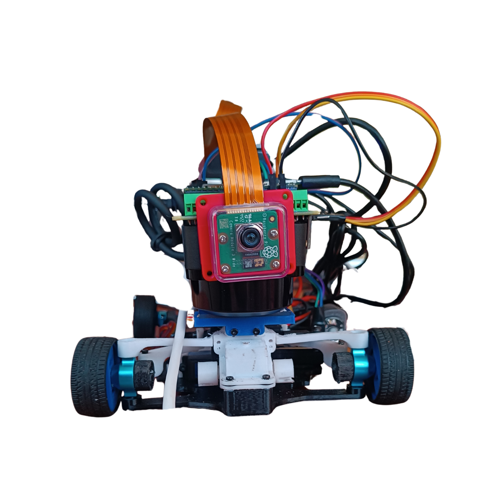
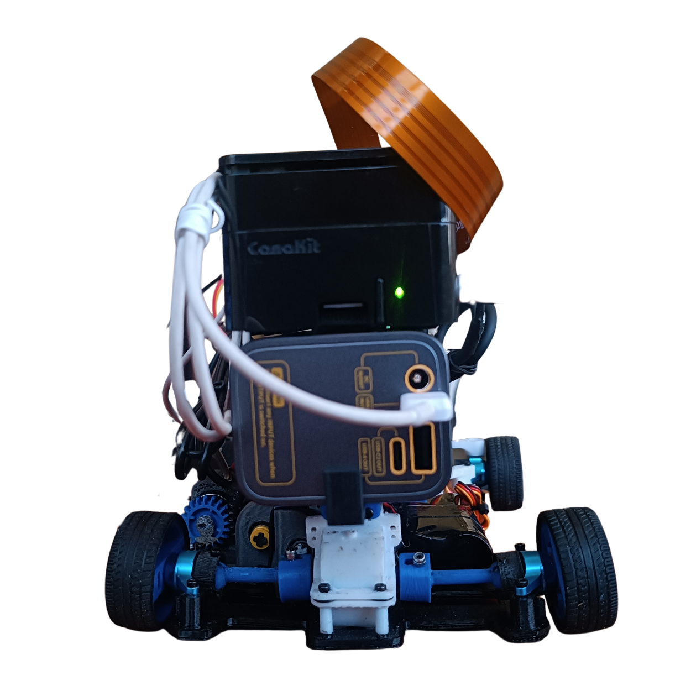
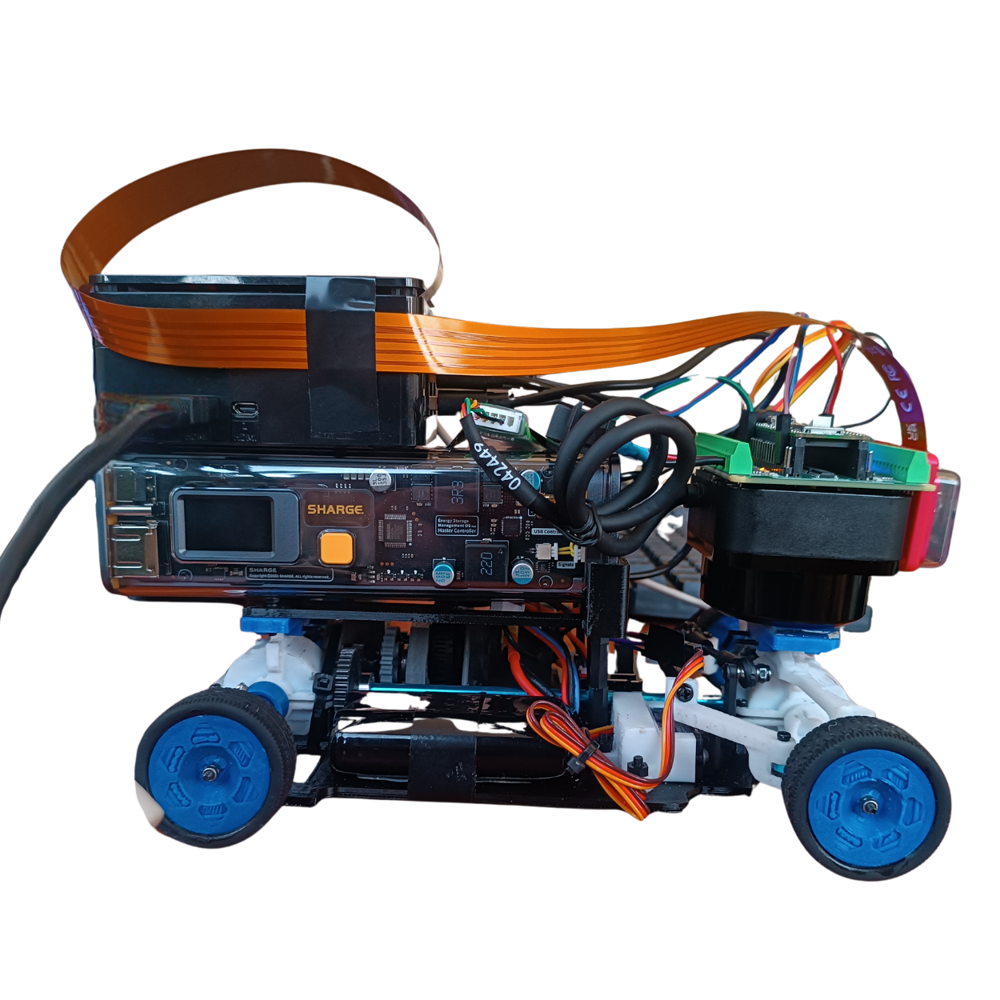
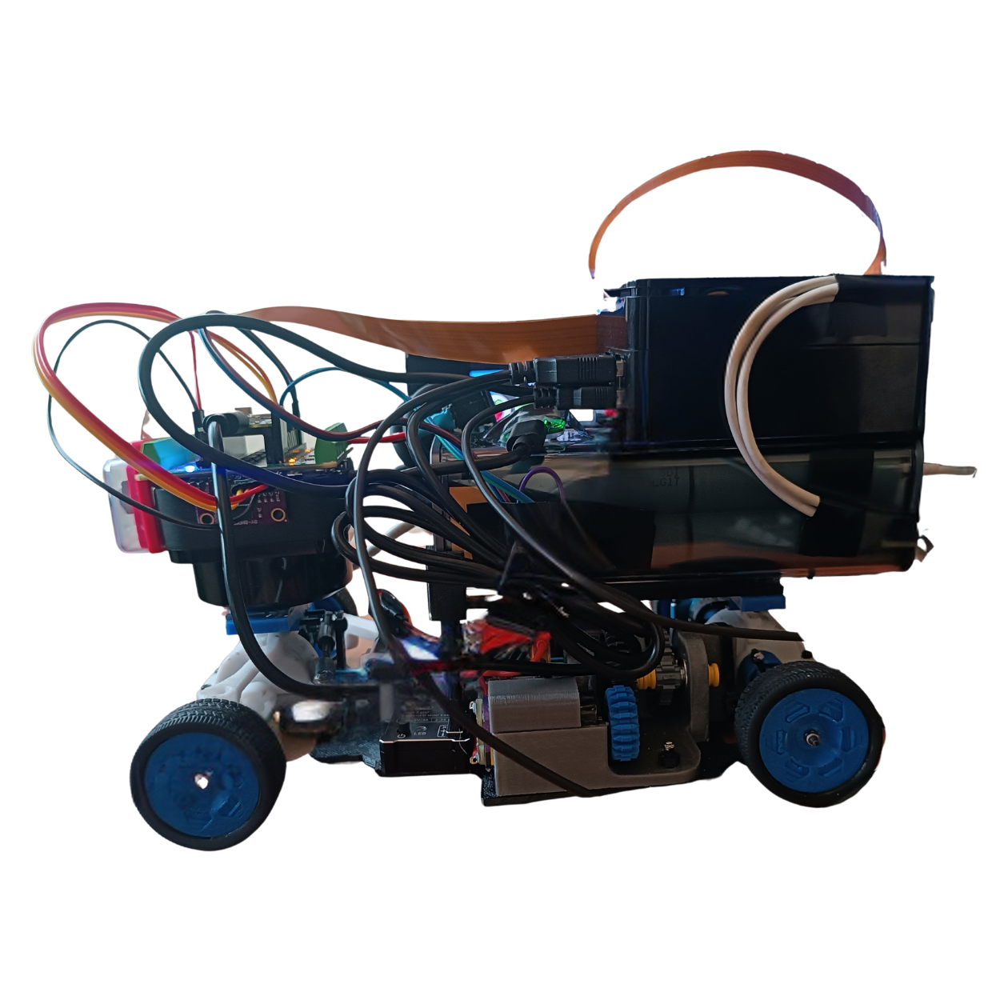
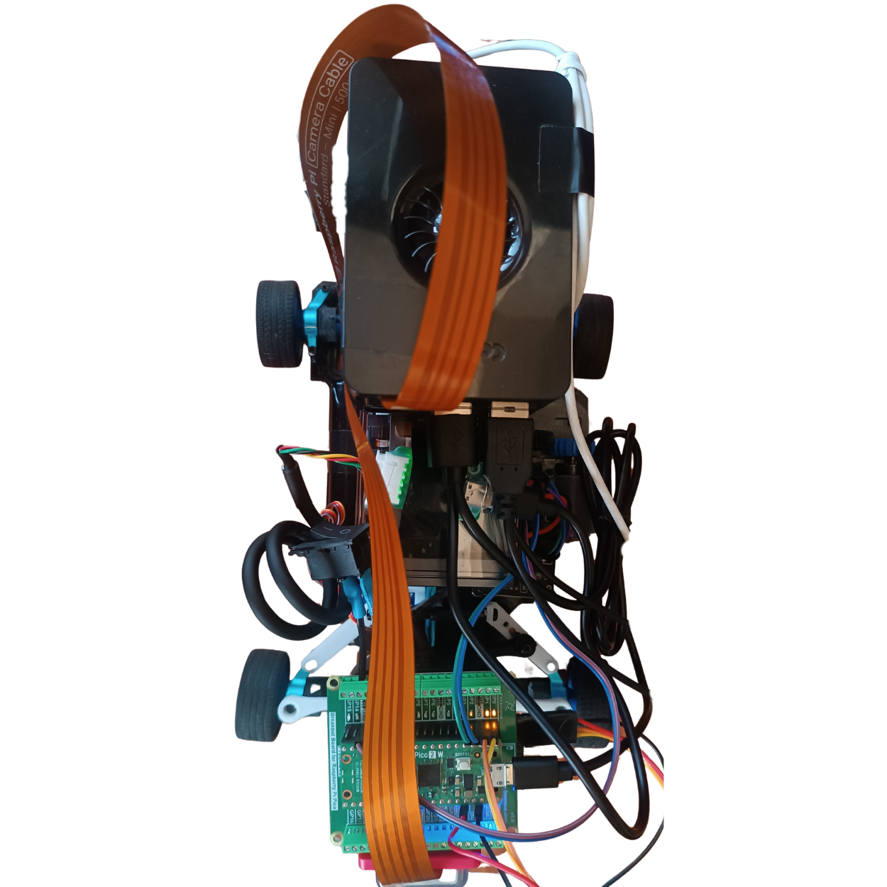
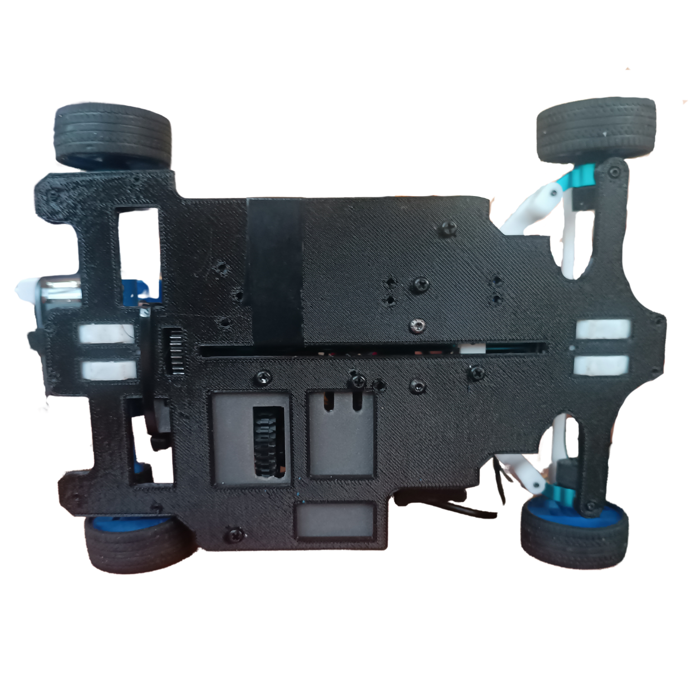

# Prototipo 3 {:#prototype3}

A continuación, explicaremos minuciosamente el cómo y el porqué hicimos un
tercer prototipo de Klevor, detallando los componentes agregados y los que
fueron removidos.

    

        
        <i>Vista delantera</i>
    

    

        
        <i>Vista trasera</i>
    

    

        
        <i>Vista derecha</i>
    

    

        
        <i>Vista izquierda</i>
    

    

        
        <i>Vista superior</i>
    

    

        
        <i>Vista inferior</i>
    

## Actualizaciones {:#updates}

- Implementación de la [Shargeek Storm 2](../../electronic/components/current.md#shargeek-storm-2)
- Rediseño de la capa inferior
- Rediseño de la capa superior

## Primera Capa {:#first-layer}

A este primer nivel del robot únicamente se le hicieron modificaciones en cuanto 
a pesaje. Lo que significa que su sistema motriz continúa exactamente igual al
del prototipo anterior ([Prototipo 2](prototype2.md#first-layer)).

Redujimos significativamente el tamaño de esta capa, ajustándola a los 
componentes. Esto nos permitió reducir 10 gramos su peso, un avance crucial. 
Gracias a esto, ahora Klevor cumple con el peso reglamentario, ya que en pruebas
anteriores excedió los 1500 g.

## Segunda Capa {:#second-layer}

Se puede apreciar con claridad el drástico cambio que tuvo la parte superior de
Klevor, donde reemplazamos la capa anterior por un soporte nuevo, hecho
específicamente para que se acople la Shargeek Storm 2, sobre esta misma base, y
encima de este power bank, se colocó estratégicamente la
[Raspberry Pi 5](../../electronic/components/current.md#raspberry-pi-5).

Adicionalmente, aprovechamos la estructura y ubicación del
[RPLidar C1](../../electronic/components/current.md#rplidar-c1) para usarlo de 
soporte sin interferir en su función, al este estar colocado al revés, nos 
permite colocar en la parte superior la
[Raspberry Pi Pico 2 WH](../../electronic/components/current.md#raspberry-pi-pico-2-wh),
y en la parte posterior de este la
[Raspberry Camera Module 3 Wide](../../electronic/components/current.md#raspberry-pi-camera-module-3-wide).

Esto ayudó enormemente a solucionar nuestro problema con el peso, ya que esta
modificación nos ahorró el soporte impreso de todos los componentes antes 
mencionados. En total, pudimos pasar de tener una capa de 42 g a una de tan solo
18 g, lo que se traduce en un Klevor que cumple con el peso reglamentario,
alcanzando un peso total de 1470 g aproximadamente.