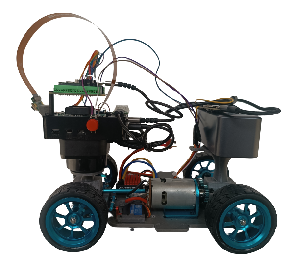
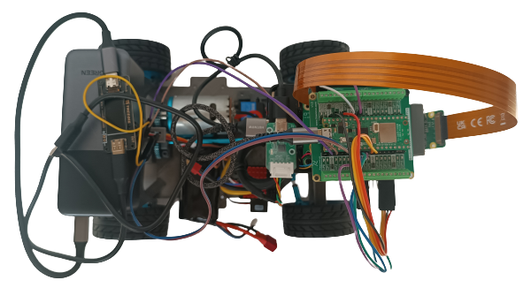
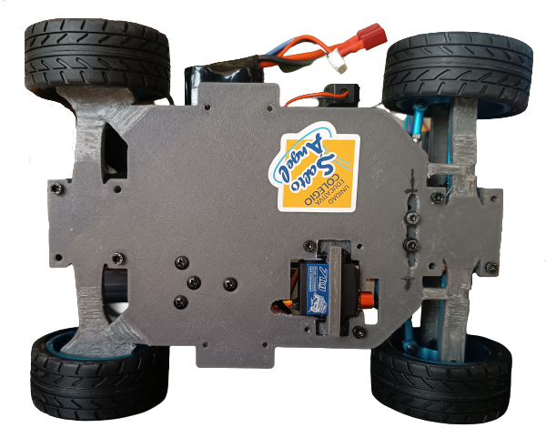

# Prototype 4

## Vehicle Photos

<!-- github-only-start -->
<table>
	<tbody>
		<tr>
			<td>
				

					
					 
					<i>Front View</i>
				

			</td>
			<td>
				

					
					 
					<i>Back View</i>
				

			</td>
		</tr>
		<tr>
			<td>
				

					
					 
					<i>Right View</i>
				

			</td>
			<td>
				

					
					 
					<i>Left View</i>
				

			</td>
		</tr>
		<tr>
			<td>
				

					
					 
					<i>Top View</i>
				

			</td>
			<td>
				

					
					 
					<i>Bottom View</i>
				

			</td>
		</tr>
	</tbody>
</table>
<!-- github-only-end -->

<!-- mkdocs-only-start

    

        
        <i>Front View</i>
    

    

        
        <i>Back View</i>
    

    

        
        <i>Right View</i>
    
 
    

        
        <i>Left View</i>
    

    

        
        <i>Top View</i>
    

    

        
        <i>Bottom View</i>
    

mkdocs-only-end -->

## Introduction

This Klevor prototype is the fruit of labor focused on improving its efficiency to complete the challenges that this WRO edition provides. Across these upgrades, we prioritized the mechanical engineering to overcome the limitations from previous prototypes and optimized its performance.

From the very first concept, Klevor was born with a clear idea. It was established that its main processor would be a Raspberry Pi 5, a decision that made us able to add Artificial Intelligence capabilities with an AI HAT+ and a Raspberry Pi Cam 3 to detect precisely the object. For the navigation, we used the RPLiDAR C1 sensor, which provides a detection from multiple angles.

Klevor uses a 4x4 traction system to maximize the strength and control. Also, we implemented a Ackermann steering system, which optimizes the wheels' turning angle. This system, known for its use in automobiles, aligns the turning wheels in a way that all of them turn around a common point, which mainly improves the stability during the turns.

To build our robot's unique parts, such as the bases and supports, we used a design program named Fusion360. With this program we were able to create every single piece from scratch and then 3D print them. Thanks to this, we could have less margin for errors, or correct quicker, achieving a more optimal design.

Thorought this prototype's explanation, we will detail in Klevor's trayectory, starting from the component's first ideas to the creation of solutions that helped with our problems related to power, traction and weight.

Another fundamental part for our robot is its crossing system, which consists of a servomotor ([INJORA 7 kg 2065](../../electronic/components/current.en.md#injora-7-kg-2065-micro-servo)) which is connected to our "Ackermann" system that works by connecting both wheels to a steering or "trapezoid system". The servomotor moves some bars that are connected to the steering knuckles, thus allowing that one of the steering knuckles to be pushed to one side by the movement of the servomotor and in turn, pull the other wheel to the other side. Due to the angles of the trapezoid, this causes that the interior wheel to turn more than the outer one.

To operate, the wheels are connected to a steering knuckle, then to a "shaft" or "half-shaft" that passes through the knuckle and joins the wheel so that it turns; the shaft turns while it is next to the differential.

<!-- github-only-start -->

    
     
    <i>Ackermann System</i>

<!-- github-only-end -->

<!-- mkdocs-only-start

    
    <i>Ackermann System</i>

mkdocs-only-end -->

This diagram provides a clearer example on how this system works. We'll describe the meaning of each term below:

- **ICR** (Instantaneous Center of Rotation): It's the point around which the front axle is rotating.

- **R**: It's the vehicle's turning radius, measured from the ICR to the center of the rear axle.

- **L**: It's the distance between the front and rear axle, or, the transmission shaft's length.

- **B**: It's the distance between the sterring knuckles (The piece on which the wheel goes and is connected to the steering).

- **a(i)**: Is the turning angle of our inner wheel compared to the curve.

- **a(o)**: Is the angle of our outer wheel with respect to the turn.

This ilustrates better the steering geometry that allows for the front wheels to turn in different angles and, at the same time, achieving a more efficient turning.

## Changes

To improve Klevor's performance and efficiency, we implemented multiple changes in its design. These upgrades are focused in upgrading aspects such as traction, motor power and weight distribution.

- New chassis and wheels

Klevor's new chassis was designed specifically to integrate the new components, assuring that each of them has the adequate space for its proper functioning. The main reason for this redesign was the incorporation for new aluminum wheels. Unlike previous prototypes, these wheels have a larger diameter and are wider, their tire rubber is also thicker and smoother. This design provides a better grip on flat surfaces, correcting traction problems that we had previously.

- Bigger torque and motor efficiency

We replaced the previous motor (INJORA 48T) with another motor that has more torque. This change allows us to use the motor's speed to its fullest, which is worth noting, since it can go above the 20,000 RPM, without the need of a system to reduce the revolutions per minute (RPM).

- Weight reduction

Another significant change is that we substituted the power supply. In previous prototypes, we used a power bank and weighted almost 600g (Shargeek Storm 2), which limitated our ability to modify the design. Now, with a new power bank weighing just 350g, we have achieved a considerable weight reduction. This upgrade allows us to have more freedom to optimize the chassis without having to worry about the robot's weight.

## How did we design Klevor?

First of all, we think, "What do we need to get an efficient robot?" Starting from there, we established a clear idea, a robot programmed with a Raspberry Pi 5, which would allow us to use a Raspberry Pi AI HAT+ and train our Raspberry Pi Cam 3 through artificial intelligence, which would definitely help us have a better performance in the Closed Challenge, and, to make sure Klevor detects the objects surrounding it, capable to detect with a wide range, we decided to use the RPLiDAR C1 since our second prototype. Mechanically wise, we always wanted to use a 4x4 traction system and Ackermann's steering geometry.

To make everything work, we thought about every component we wanted to use, to build mountings and supports for them, we decided that it was a good idea to 3D print these supports, more specifically, we used PETG filament, which is very resistant, affordable and easy to come by, which would allow us to make multiple tests.

All of our 3D printed parts were created from scratch, designed in a program called Fusion360, this same program was a huge help in multiple aspects, for example, we could simulate the dimensions from each component in the program and then afterwards create multiple designs for the chassis.

## Problems and solutions during developmennt

Even though we had a solid idea as to how we wanted to shape Klevor, we had a few inconveniences during the building process, for Klevor's first 3 prototypes we decided to use a Motor Injora 48T, which we thought it could move the whole robot, even thought it was a 20000 RPM motor, it didn't have enough torque to move Klevor, so we created a RPM reduction system, according to these principles:

**When a smaller pinion (impulsor) moves a bigger pinion (impulsed), the speed decreases and the torque increases.**

**When a bigger pinion (impulsor) moves a smaller pinion (impulsed), the torque decreases and the speed increases.**

**The reduction ratio or transmission ratio can be calculated with the following formula:**

<!-- github-only-start -->

	
	 
	<i>Gear Ratio Formula</i>

<!-- github-only-end -->

<!-- mkdocs-only-start

	
	<i>Gear Ratio Formula</i>

mkdocs-only-end -->

This means that, in order to increase the torque, we have to arrange the system in a way that, pinions with less teeth are the ones that move pinions with more teeth, this was the solution to our torque problem.

Afterwards, we had to make Klevor lighter, the reason for this change, were the previously mentioned, new wheels, because the old wheels' rims were 3D printed, which in turn, wore them down quickly. The newer wheels had an aluminum rim and a thicker rubber, which in tunr, would make Kleovr exceed the reglamentary weight limit established by the WRO, what we did to solve this problem and to make the robot faster as well, was to change the motor, with one that had 20000 RPM, but with enough torque, which made the RPM reduction system obsolete.

Another issue that was present during Klevor's development was its limited turning angle, which supposed a huge challenge in the game field. To correct it, we modified the shape of the Ackermann steering system, which is composed of two direction knuckles and the shaft that unifies them, by adjusting the position and angle of these components, we increased Klevor's turning angle significantly.

## Bill Of Materials

| Component                                                                                                            |  Unit  |   Cost per Unit ($)  | Total ($) |
|----------------------------------------------------------------------------------------------------------------------|--------|----------------------|-----------|
| [Raspberry Pi 5](https://www.canakit.com/raspberry-pi-5-16gb.html)                                                   | 1      | 120.00               | 120.00    |
| [Raspberry Pi AI HAT+](https://www.canakit.com/raspberry-pi-ai-hat-with-case.html)                                   | 1      | 139.95               | 139.95    |
| [Micro SD 512GB](https://www.amazon.com/dp/B0C1Q79X3P)                                                               | 1      | 54.99                | 54.99     |
| [RPLiDAR C1](https://www.amazon.com/dp/B0CNXLJJ61)                                                                   | 1      | 75.90                | 75.90     |
| [Raspberry Pi Camera Module 3 Wide](https://www.canakit.com/raspberry-pi-camera-module-3.html)                       | 1      | 37.95                | 37.95     |
| [Case para la Raspberry Pi Camera Module 3](https://www.amazon.com/dp/B09TNG4V55)                                    | 1      | 5.99                 | 5.99      |
| [Cable para la cámara de la Raspberry Pi 5 de 50cm](https://www.amazon.com/dp/B0D3YWTNF8)                            | 1      | 9.79                 | 9.79      |
| [Raspberry Pi Pico 2WH](https://www.amazon.com/dp/B0F4W9J5CC)                                                        | 1      | 14.99                | 14.99     |
| [Raspberry Pi Pico 2WH Breakout Board](https://www.amazon.com/dp/B0BFB53Y2N)                                         | 1      | 11.95                | 11.95     |
| [URGENEX 3000mAh Battery](https://www.amazon.com/dp/B0CYNVSN7W)                                                      | 1      | 26.99                | 26.99     |
| [Giroscopio BNO085](https://www.amazon.com/dp/B0CDGZMLPP)                                                            | 1      | 18.59                | 18.59     |
| [INJORA 7Kg 2065 Servo](https://www.amazon.com/dp/B0BLBMVYCW)                                                        | 1      | 17.98                | 17.98     |
| [60A Brushed ESC para 2-3s LiPo y motor 540](https://www.amazon.com/dp/B0F9Y6CMC8)                                   | 1      | 15.98                | 15.98     |
| [Motor 540 y disipador de calor de aluminio](https://www.amazon.com/dp/B0995W966Z)                                   | 1      | 19.39                | 19.39     |
| [UGREEN Power Bank 12000mAh 100W PD PPS](https://www.amazon.com/dp/B0CXJ1F1M7)                                       | 1      | 49.99                | 49.99     |
| [Aluminium Alloy Front & Rear Steering Knuckle Hub Base](https://www.amazon.com/dp/B09XW246FQ)                       | 1      | 17.99                | 17.99     |
| [RC Car Metal Differential Kit 1/18](https://www.amazon.com/dp/B08GHC4D5M)                                           | 1      | 21.98                | 21.98     |
| [USB-C QC PD3.0 Trigger Board Module Type-C](https://www.amazon.com/dp/B0DRJWBG7G)                                   | 1      | 16.99                | 16.99     |
| [Llantas de metal con buje de metal de 0.472 pulg](https://www.amazon.com/dp/B0BP2W7W59)                             | 1      | 20.99                | 20.99     |
| [Copa diferencial de aleación de aluminio y junta de eje de transmisión](https://www.amazon.com/dp/B09P1QV29K)       | 1      | 10.99                | 10.99     |
| [20 rodamientos de bolas MR128-2RS](https://www.amazon.com/dp/B09P1QV29K)                                            | 1      | 9.29                 | 9.29      |
| [Uxcell 0.276 in I.D. Rodamientos de bolas en miniatura](https://www.amazon.com/dp/B07XYPLPFL)                       | 1      | 8.49                 | 8.49      |
| [Smays Cable USB C de 240 W, cable corto de 1 pie C a C](https://www.amazon.com/dp/B0CYT6KQTR)                       | 1      | 7.99                 | 7.99      |
| [Hobbypark Adaptador hexagonal de rueda de aluminio](https://www.amazon.com/dp/B07D67VMDN)                           | 1      | 9.97                 | 9.97      |
| [6 piezas ajustables de aluminio Hobbypark enlace servo](https://www.amazon.com/dp/B01MQOA4CH)                       | 1      | 15.95                | 15.95     |
| [6 HobbyPark Metal Diff diferencial engranaje principal 42T y piñón motor 27T](https://www.amazon.com/dp/B07FS5RGLS) | 1      | 11.98                | 11.98     |
| [Cable micro USB corto de 1 pie [paquete de 3]](https://www.amazon.com/dp/B07FS5RGLS)                                | 1      | 6.99                 | 6.99      |

**Component Cost Total: $780.03**