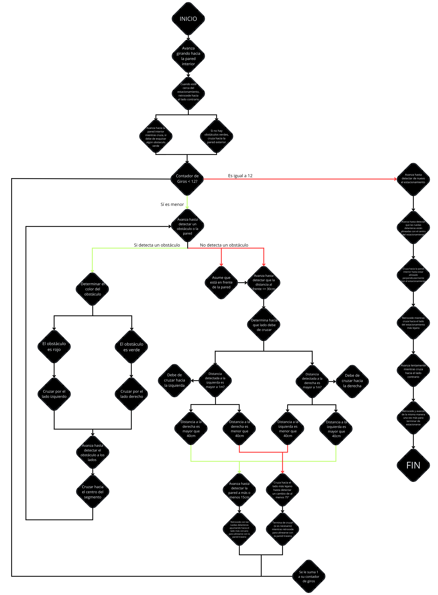

# Flowcharts

## Open Challenge

### Version 1: Used on Prototype 1, 2 and 3

<!-- github-only-start -->

	
	 
	<i>Open Challenge Flowchart Version 1</i>

<!-- github-only-end -->

<!-- mkdocs-only-start

    
    <i>Versión 1 del diagrama de Flujo del Desafío sin Obstáculos</i>

mkdocs-only-end -->

As you can see, Klevor always a determined set of sets: 

- At the start of the round, Klevor drives forward, until it detects that the front wall is close enough (usually at around 60cm of distance between Klevor and the wall), once Klevor detects the wall, it compares the average distance from both the left and right side (so, Klevor takes 5 or 10 measures from each side, averages them, and compares it to the other side) to know which side to turn to.
- While it is turning, it starts to pay close attention to the gyroscope data, and once it detects a 90 degree difference on its yaw axis since it started turning, it adds 1 to the turns counter, if the difference is not bigger than 90, it simply keeps turning.
- After the 12 turns are done, Klevor goes forward, until it detects the front wall at around 1.25m away, once it does so, it simply stops.

### Version 2: Used on Prototype 3 and 4

<!-- github-only-start -->

	
	 
	<i>Open Challenge Flowchart Version 2</i>

<!-- github-only-end -->

<!-- mkdocs-only-start

    
    <i>Versión 2 del diagrama de Flujo del Desafío sin Obstáculos</i>

mkdocs-only-end -->

## Closed Challenge

### Version 1: Used on Protoype 1, 2, and 3

<!-- github-only-start -->

	
	 
	<i>Closed Challenge Flowchart Version 1</i>

<!-- github-only-end -->

<!-- mkdocs-only-start

    
    <i>Versión 1 del diagrama de Flujo del Desafío con Obstáculos</i>

mkdocs-only-end -->