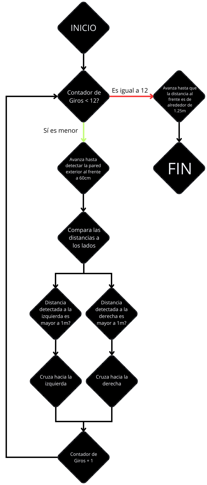

# Diagramas de Flujo {:#flowcharts}

## Desafío sin Obstáculos {:#without-obstacles-challenge}

    
    <i>Diagrama de Flujo del Desafío sin Obstáculos</i>

## Desafío con Obstáculos {:#obstacles-challenge}

    
    <i>Diagrama de Flujo del Desafío con Obstáculos</i>

