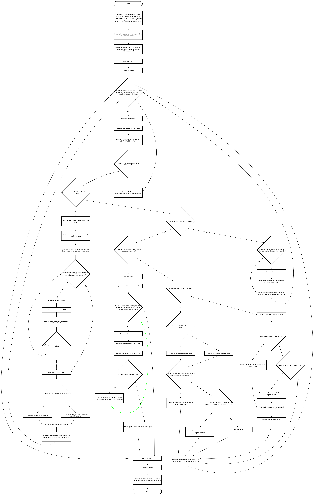

# Diagramas de Flujo {:#flowcharts}

## Desafío sin Obstáculos {:#without-obstacles-challenge}

### Versión 1: Empleada en el Prototipo 1, 2 y 3 {:#without-obstacles-challenge-version1}

    
    <i>Versión 1 del diagrama de Flujo del Desafío sin Obstáculos</i>

Como se puede apreciar, Klevor siempre intenta cumplir una serie de pasos:

- Al iniciar la ronda, Klevor avanza hasta que detecte que la pared esté a 60 cm de distancia o menos al frente, para poder empezar a girar asi que, empieza a comparar con el [RPLiDAR C1](../../electronic/components/current.md#rplidar-c1) con los ángulos que están a su izquierda y su derecha (por ejemplo un promedio de los ángulos de 175° a 185° para saber la distancia por la cual está separado por la pared a la izquierda) para saber hacia dónde girar.
- Mientras está girando, empieza a leer los datos del giroscopio, cuando detecte que su orientación ha cambiado al menos 90° con respecto a como inició a girar, empieza a avanzar hacia adelante, sumándole 1 a su contador de giros, en caso contrario, es decir, que no ha girado 90°, simplemente sigue girando.
- Tras completar los 12 giros, Klevor simplemente avanza hasta que detecte que la distancia al frente sea de alrededor de 1.25 m, tras esto simplemente para.

### Versión 2: Empleada en el Prototipo 3 y 4 {:#without-obstacles-challenge-version2}

    
    <i>Versión 2 del diagrama de Flujo del Desafío sin Obstáculos</i>

## Desafío con Obstáculos {:#obstacles-challenge}

### Versión 1: Empleada en el Prototipo 1, 2 y 3 {:#obstacles-challenge-version1}

    
    <i>Versión 1 del diagrama de Flujo del Desafío con Obstáculos</i>

