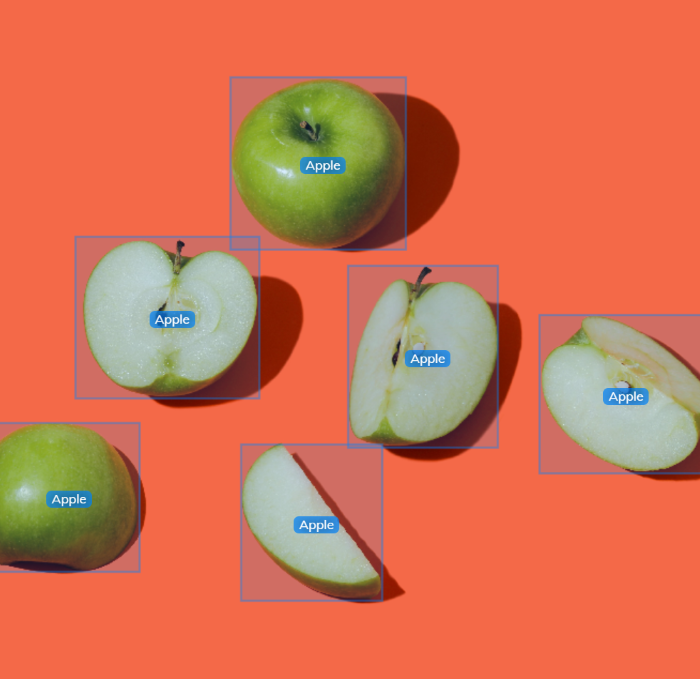

# Glossary of Terms

## Machine Learning

<!-- github-only-start -->

	
	 
	<i>PyTorch's Logo</i>

<!-- github-only-end -->

<!-- mkdocs-only-start

    
    <i>PyTorch's Logo</i>

mkdocs-only-end -->

The Machine Learning (ML) is a branch or field of study from Artificial Intelligence, its main objective is to imitate the way think and learn, in a computer, to perform tasks autonomously, and improve the performance and accuracy as it is exposed to a larger set of data [[1](#machine-learning-ibm)].

Usually, the Machine Learning's algorithm system is separated onto 3 different parts:

1. **Decision-making**: In general, Machine Learning algorithms are used to predicting or sorting, through some input data, which can be labeled or unlabeled, which produces an estimated pattern of said data set.

2. **Loss function**: A loss function assesses how accurate a model's predictions are. It works by comparing the model's output to the true results from a dataset.

3. **Model Optimization Process**:  If the model can better fit into the training data set, the weights are adjusted to reduce the difference between the estimations and the known results. This iterative evaluation and optimization process, is repeated autonomously until the weights are updated to an acceptable threshold.

## Object Detection

For this competition, we needed to detect multiple prisms with different colors to be able to solve the Closed Challenge, so we opted to use an Object Detection Model.

This object detection, is a computer vision task that uses neural networks to be able to identify and pinpoint objects in images and videos by marking them with bounding boxes and assigning them labels.

Through this technique, we are able to index and pinpoint different objects in a single image. It is also considered a branch of Artificial Intelligence, as it allows machines to interpret and understand the visual content on a similar way as humans do.

### How Object Detection Works

First, we have to comprehend various concepts related to object detection, like image pre-processing, the model's architecture, and the metrics used to evaluate within the object detection. These concepts are presented below:

#### Image Pre-Processing

In Computer Vision, images are expressed as continuous functions on a 2D coordinate plane represented as f(x, y). When these images are digitalized, they go through two main processes called sampling and quantization, which, basically converts the image's function into a discrete grid of elements that represents pixels [[2](#object-detection-ibm)].

<!-- github-only-start -->

	
	 
	<i>Image with different annotations of apples</i>

<!-- github-only-end -->

<!-- mkdocs-only-start

   
   <i>Image with different annotations of apples</i>

mkdocs-only-end -->

Once the image is annotated, the object detection model can recognize regiones with similar characteristics as the ones defined in the training data set with the same object. The object detection models don't recognize objects per se, but rather, aggregates of properties like shape, size, color, etc... and classify regions based on visual patters inferred from manually annotated training data [[2](#object-detection-ibm)].

#### Model Architecture

The object detection models follow a similar structure that includes a backbone, neck and head model [[2](#object-detection-ibm)].

The backbone model extracts characteristics from an input image. Frequently, the backbone model is derived from part of a 
pre-trained classification model. The characteristics' extraction produces a myriad of characteristics maps of different resolutions that the backbone model sends to the neck. This last part of the structure concatenates these characteristics maps for each image. Later, the architecture sends these characteristics maps in layers to the head, which predicts bounding boxes and classification scores for each characteristics set [[2](#object-detection-ibm)].

#### How Metrics Evaluation Works

The metrics evaluation is a crucial step in the object detection, because this allows to measure the precision and effectivity of the model. There are multiple metrics used to evaluate object detection models, mentioned below:

- **Precision**: Measures the proportion between True Positives (TP) and the total Positive Predictions (TP + FP). Basically, it measures how many of the model's predictions are correct.

- **Recall**: Measures the proportion between True Positives (TP) and the total amount of True Positives (TP + FN). That is, how many of the objects actually present in the image were detected by the model.

- **F1 Score**: Is the harmonic mean of precision and recall. This metric is used to evaluate a model's performance in situations where there is an imbalance between classes.

- **Mean Average Precision (mAP)**: It's a metric that combines both precision and recall in a single value. It is calculated by averaging the precision with different recall levels. The mAP is commonly used to evaluate object detection models, because it is a more complete metric about an object detection model's performance.

## You Only Look Once (YOLO)

<!-- github-only-start -->

	
	 
	<i>Ultralytics' Logo</i>

<!-- github-only-end -->

<!-- mkdocs-only-start

   
   <i>Ultralytics' Logo</i>

mkdocs-only-end -->

YOLO, or "You Only Look Once", is a family of single-stage, real-time, object detection models, maintained by Ultralytics [[3](#models-ultralytics)]. Unlike other object detection models that use a two-stage approach, YOLO divides the image into a grid and simultaneously predicts the bounding boxes and class probabilities for each grid cell. This allows YOLO to be really fast and efficient [[2](#object-detection-ibm)]

In Klevor, its object detection is based on YOLOv11; the latest YOLO version [[3](#models-ultralytics)].

## Neural Processing Unit (NPU)

A neuronal processing unit (NPU) is a microprocessor specialized and designed to imitate the workings of a real human brain. The NPUs are optimized for AI tasks, neuronal networks, deep learning and automatic learning [[4](#npu-ibm)].

<!-- github-only-start -->

	
	 
	<i>Raspberry Pi AI HAT+ 26 TOPS</i>

<!-- github-only-end -->

<!-- mkdocs-only-start

    
    <i>Raspberry Pi AI HAT+ 26 TOPS</i>

mkdocs-only-end -->

Unlike graphic processing units (GPU) and the central processing units (CPU), which are processors designed for a more general purpose, the NPUs are designed exclusively to perform and optimize AI tasks, like computing neural network layers composed of scalar, vector and tensor math. [[4](#npu-ibm)].

### Key Aspects of a NPU 

NPUs are designed to perform tasks that require a low latency and a high performance in parallel, which makes them extremely useful on AI tasks. These tasks include, but are not limited to, processing deep learning algorithms, voice recognition, natural language processing, photo and video processing and object detection [[4](#npu-ibm)].

Key aspects of a NPU include:

- **Parallel processing**: NPUs are designed to perform multiple calculations in parallel, which allows them to compute multiple tasks simultaneously. This is specially useful for deep learning processes, where large amounts of computation on matrices and tensors are required.

- **Low arithmetic precision**: NPUs often support- 8-bit (or lower) operations to reduce the computational complexity and increase the energetic efficiency

- **Bandwidth Memory**: Many NPUs feature on-chip bandwidth memory to effectively execute processing AI tasks that require large data sets.

- **Hardware Acceleration**: Advances in the NPU's design have led to the incorporation of certain hardware acceleration techniques, like the systolic array architecture or enhanced tensor processing to optimize the performance for AI workloads

## Docker {:#docker}

    
    <i>Docker's Logo</i>

Docker is an open-source platform, that allows you to package an application and all its dependencies into a container
[[5](#what-is-docker)]. These containers are lightweight, making them portable. Also, these containers are completely isolated from the infrastructure on which they are running, and therefore the container image can be run as a container in any operative system that Docker is installed [[5](#what-is-docker)].

If you are using Windows, you can install Docker Desktop from Microsoft Store.

### Dockerfile

Docker uses files, these files are denominated as *Dockerfile*, these use DSL (Domain Specific Language) to describe all the necessary instructions to quickly create a Docker image [[5](#what-is-docker)].

### Docker Image

This is a files composed of multiple layers, used to execute a Docker container [[5](#what-is-docker)]. It is an executable software package that contains everything needed to run the application. This image informs how a container should be initialized, determimining which software needs to be executed and how it needs to.

### Docker Container

A Docker container is a runtime instance of a Docker image [[5](#what-is-docker)]. It contains the kit require for a certain application, and it can be run in isolation.

## Multiprocessing

The multiprocessing is a technique that allows the usage of two or more Central Processing Units (CPU) in a single computer system to execute multiple processes simultaneously [[6](#what-is-multiprocessing)]. This technique is specially useful for systems that require a high performance and efficiency on their tasks, because, this technique allows to divide workload into multiple CPUs, upgrading the responde time and the processing capacity.

# References

1. *What is machine learning?*. (22 de septiembre de 2021). IBM. <a id="machine-learning-ibm" href="https://www.ibm.com/think/topics/machine-learning">https://www.ibm.com/think/topics/machine-learning</a>

2. Murel, J., Kavlakoglu, E. *What is object detection?*. (3 de enero de 2024). IBM. <a id="object-detection-ibm" href="https://www.ibm.com/topics/object-detection">https://www.ibm.com/topics/object-detection</a>

3. *Models*. (2025). Ultralytics. <a id="models-ultralytics" href="https://docs.ultralytics.com/models/">https://docs.ultralytics.com/models/</a>

4. Schneider, J., Smalley, I. *What is neural processing unit (NPU)?*. (27 de septiembre de 2024). IBM. <a id="npu-ibm" href="https://www.ibm.com/topics/neural-processing-unit">https://www.ibm.com/topics/neural-processing-unit</a>

5. *What is Docker?*. (22 de abril de 2025). Geeks for Geeks. <a id="what-is-docker" href="https://www.geeksforgeeks.org/introduction-to-docker/">https://www.geeksforgeeks.org/introduction-to-docker/</a>

6. Yasar, K. (23 de junio de 2023). *What is multiprocessing?*. TechTarget. <a id="what-is-multiprocessing" href="https://www.techtarget.com/searchdatacenter/definition/multiprocessing">https://www.techtarget.com/searchdatacenter/definition/multiprocessing</a>