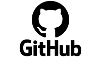
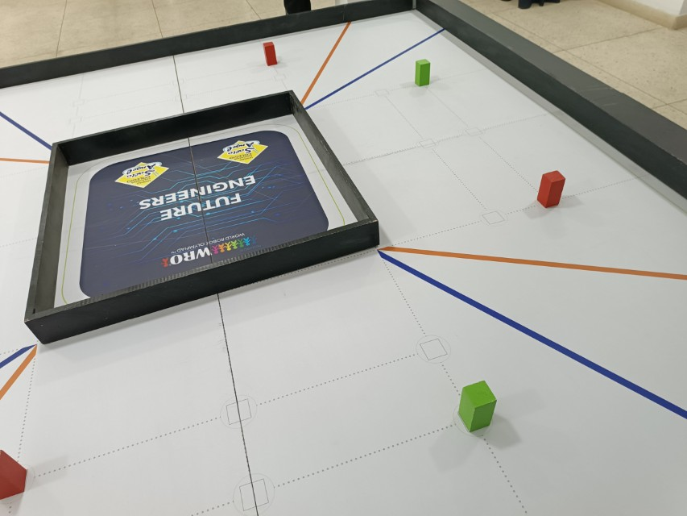
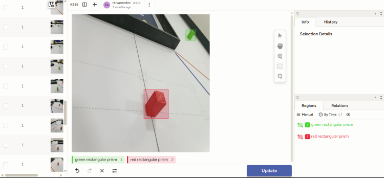
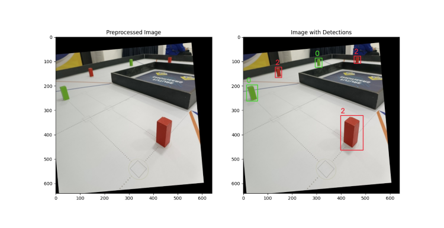
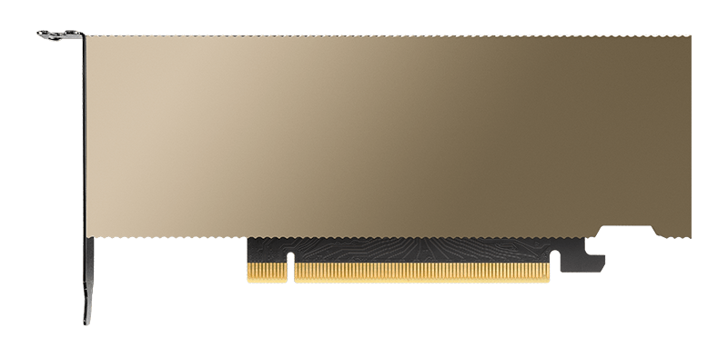

# Detección de Objetos {:#object-detection}

## Creación del Modelo {:#model-creation}

<div class="center">
    
    <i>Logo de GitHub</i>
</div>

Para empezar, debemos descargamos nuestro repositorio de GitHub, donde se encuentra el código del modelo de detección de objetos, así como los scripts necesarios para su entrenamiento y conversión a un formato compatible con el Hailo 8. Para ello, recomendamos dirigirse a la siguiente sección de la documentación [```GitHub```](../../github.md#repository), donde se explican las distintas formas de descargar el repositorio, ya sea mediante la descarga del archivo comprimido o mediante la clonación del repositorio con Git. 

Después de haber descargado el repositorio, debemos dirigirnos a la carpeta `devices/raspberry-pi-5/src`, donde se encuentra todo el código empleado por la Raspberry Pi 5, puede realizarse con el siguiente comando:
```bash
cd devices/raspberry-pi-5/src
```

> [!WARNING]
> Para que dicho comando funcione correctamente, la ruta debe ser relativa a la carpeta donde se encuentra el repositorio clonado. En caso de no estar en la carpeta raíz del repositorio, se debe modificar la ruta acorde a la ubicación del mismo.

Posteriormente, nos movemos a la carpeta `yolo/scripts`:
```bash
cd yolo/scripts
```

Creamos un entorno virtual de Python con los siguientes comandos:

- Si el sistema operativo es Windows:
    ```cmd
    python -m venv .venv
    ./.venv/Scripts/activate
    pip install -r requirements.txt
    ```
- Si el sistema operativo es Linux:
    ```bash
    python -m venv .venv
    source .venv/bin/activate
    pip install -r requirements.txt
    ```

Para la creación del conjunto de datos, tomamos imágenes de los prismas que se utilizarán en la competencia. Estas imágenes fueron tomadas con los distintos dispositivos de nuestro equipo, en distintas condiciones de luz y ángulos, y las cuales guardamos en la carpeta `yolo/dataset/general/original/to_process`.

Luego, ejecutamos el script `yolo/scripts/resize.py` para redimensionar las imágenes a un tamaño de 640 × 640 píxeles, que es el tamaño de entrada del modelo YOLOv11. Este script utiliza la biblioteca OpenCV para redimensionar las imágenes y guardarlas en la carpeta `yolo/dataset/general/resized/to_process`.

<div class="center image-comparison-container">
    <div class="center">
       
       <i>Imagen sin redimensionar del conjunto de datos</i>
    </div>
    <div class="center">
       
       <i>Imagen redimensionada del conjunto de datos</i>
    </div>
</div>

Posteriormente, se realizó la anotación de las imágenes, donde se etiquetaron los prismas con sus respectivos colores. Para ello, se utilizó la herramienta [Label Studio](https://labelstud.io/), una herramienta de etiquetado de datos de código abierto que permite crear conjuntos de datos personalizados para el entrenamiento de modelos de aprendizaje automático.

> [!WARNING]
> Si el número de imágenes por anotar es muy grande, notaremos que la herramienta Label Studio arrojará un error `The number of files exceeded settings.DATA_UPLOAD_MAX_NUMBER_FILES`. Para solucionarlo, si Label Studio fue instalado como un paquete de Python, se puede modificar el archivo `settings.py` que se encuentra en la carpeta `label_studio/core/settings.py`, donde se debe cambiar el valor de `DATA_UPLOAD_MAX_NUMBER_FILES` a un número mayor al número de imágenes por anotar o `None` si se desea un número ilimitado. En caso de no encontrar este archivo, se puede buscar en la carpeta `site-packages/label_studio/core/settings.py` dentro del entorno virtual de Python donde fue instalado Label Studio.

<div class="center">
   
   <i>Anotación de imágenes con Label Studio</i>
</div>

Durante el proceso, manejamos conjunto de datos de 1 (**G**, **M**, **R**), 2 (**GR**), 3 (**GMR**), 4 (**BGOR**) clases, las cuales fuimos variando a lo largo del desarrollo del proyecto, donde **M** proviene de `magenta rectangular prism`, **G** de `green rectangular prism`, **R** de `red rectangular prism`, **B** de `blue line` y **O** de `orange line`. Primeramente, desarrollamos un modelo de 4 clases, sin embargo, no logró un buen rendimiento para todas las clases, ya que incluía, además del prisma rojo y verde, la línea naranja y la línea azul, que finalmente, debido a nuestros componentes, se podían inferir mediante el RPLIDAR C1. Posteriormente, se decidió omitir las clases relacionadas con las líneas de la pista, las cuales no eran necesarias para la detección de los prismas. Luego, se optó por un modelo de 2 clases, el cual fue capaz de detectar los prismas rojo y verde. Seguidamente, se optó por un conjunto de datos de 3 clases, ya que añadimos una clase adicional, el prisma magenta, para poder realizar la detección del estacionamiento. Después, se optó por dos modelos, uno con dos clases (**GR**), para poder detectar los obstáculos de la pista, y otro de una sola clase (**M**) para la detección del estacionamiento después de haber recorrido toda la pista. Finalmente, debido a ciertas complicaciones por la optimización de los modelos para el NPU Hailo 8, se optó por tres modelos de 1 clase (**G**, **M**, **R**), donde cada uno de estos modelos fue capaz de detectar los prismas de un color específico, acorde a lo requerido en la pista.

Ahora, vamos a explicar los pasos necesarios para continuar con el montaje del modelo de detección de objetos, donde se utilizará como ejemplo el modelo de 1 clase (**G**). Sin embargo, los pasos son los mismos para los demás modelos, donde solo se debe cambiar la ruta de las imágenes y el número de clases.

Cabe destacar que, así como variamos el número de clases, también variamos el número de imágenes por clase, desde un dataset de alrededor de 350 imágenes antes de realizar el *data augmentation*, hasta un dataset de alrededor de 1300 imágenes antes de realizar el *data augmentation*, donde cada una fue anotada por algún integrante del equipo de forma manual para entrenar el modelo de la forma más precisa posible.

Después de haber anotado las imágenes con la plataforma Label Studio, se exportaron las anotaciones en formato YOLO y se guardaron en la carpeta `yolo/dataset/g/labeled/to_process`. Posteriormente, se ejecutó el script `yolo/scripts/augment.py` para generar alrededor de 10 imágenes por cada imagen del conjunto de datos, utilizando la biblioteca OpenCV. Este script aplica distintas transformaciones a las imágenes, como rotación, escalado, traslación y cambio de brillo y contraste, para aumentar la variabilidad del conjunto de datos y mejorar el rendimiento del modelo. Las imágenes generadas se guardaron en la carpeta `yolo/dataset/g/augmented`. Finalmente, ejecutamos el script `yolo/scripts/after_labeling.py` para mover las imágenes de la carpeta `yolo/dataset/g/labeled/to_process` a la carpeta `yolo/dataset/g/labeled/processed`.

Luego, se ejecutó el script `yolo/scripts/split.py` para dividir el conjunto de datos en un conjunto de entrenamiento `yolo/dataset/g/organized/train`, un conjunto de validación `yolo/dataset/g/organized/val` y un conjunto de testing `yolo/dataset/g/organized/test`, con una distribución del 70%, 20% y 10%, respectivamente. Este script utiliza la biblioteca `os` para crear las carpetas necesarias y mover las imágenes a las carpetas correspondientes. Además, este script eliminará las imágenes de la carpeta `yolo/dataset/g/augmented`, mas no modificará o eliminará las carpetas `yolo/dataset/g/labeled/to_process` y `yolo/dataset/g/labeled/processed`.

> [!INFO]
> Se puede observar, que en cada una de las rutas, se encuentra la carpeta `to_process`, la cual es una carpeta temporal, que se utiliza para guardar las imágenes que se están procesando. Una vez que se han procesado las imágenes, los archivos dentro de las mismas se mueven a una carpeta `processed` correspondiente, la cual se encuentra en la misma ruta. De esta forma, se evita que las imágenes procesadas se mezclen con las imágenes por procesar, así como permite a futuro seguir entrenando el mismo modelo, sin necesidad de volver a procesar las mismas imágenes. Así mismo, se puede observar que tanto para `augmented` y `organized`, no existe la carpeta `to_process`, ya que, después de ser procesadas estas imágenes, son eliminadas debido al gran número de estas al momento de realizar el `data augmentation`.

## Entrenamiento del Modelo {:#model-training}

<div class="center">
   
   <i>Imagen con distintas inferencias realizadas (modelo GMR)</i>
</div>

Primeramente, dependiendo del modelo y la forma en la que se vaya a entrenar el mismo, se debe modificar un archivo `.yaml`, los cuales se encuentran dentro de la carpeta `yolo/data`, donde se debe modificar la ruta de las imágenes y las etiquetas a las rutas correspondientes. En este caso, se debe modificar el archivo `g.yaml` para el modelo de 1 clase, cuya carpeta padre variará entre `colab` y `local` dependiendo del entorno.

> [!NOTE]
> Al momento de clonar este repositorio, se suministran archivos plantilla para los `.yaml`, los cuales terminan en `.yaml.example`. A los cuales posterior a su modificación, se les debe cambiar la extensión a `.yaml`.

Existen dos maneras de entrenar el modelo dependiendo del equipo disponible en el momento:

1. **Entrenamiento de forma local**: Para ello, se debe contar con una GPU dedicada para el entrenamiento.
    1. En este caso, debemos ejecutar el script `yolo/scripts/train.py` para entrenar el modelo YOLOv11. Este script utiliza la librería [Ultralytics](../libraries/python.md#ultralytics-yolo) para realizar el entrenamiento del modelo y guardar los pesos en la carpeta `yolo/v11/runs/g`.
2. **Entrenamiento de forma remota**: Para ello, se puede utilizar [Google Colab](https://colab.research.google.com/), donde se puede utilizar una GPU de forma gratuita o de paga, dependiendo del tiempo requerido para el entrenamiento y la velocidad en la que se quiere completar dicho entrenamiento.
    1. En este caso, debemos ejecutar primero el script `yolo/scripts/zip_to_train.py`, el cual se encargará de crear un archivo comprimido con el conjunto de datos, el cual se guardará en la carpeta `yolo/v11/zip`.
    2. Luego, subimos el archivo a Google Drive, le cambiamos la visibilidad a`Anyone with the link can view` y copiamos el ID del archivo comprimido, el cual se encuentra en la URL del mismo. Este enlace lo pegamos en la sección correspondiente del Jupyter Notebook `yolo/v11/notebooks/colab/g_train.ipynb` para poder descargar el archivo comprimido en Google Colab.
    3. Seleccionamos el entorno de ejecución acorde a nuestra disponibilidad. Puedes utilizar de forma gratuita una GPU Tesla T4 de NVIDIA por alrededor de 5 h diarias, o comprar 100 créditos (que cuestan $10 al momento de redactar esta guía) de la plataforma para poder usarlo por más tiempo y/o utilizar mejores GPU. En nuestro caso, empleamos una GPU Tesla L4 de NVIDIA, la cual consumió alrededor de 6 créditos por entrenar un modelo completo.
    4. Ejecutamos las secciones del Jupyter Notebook `yolo/v11/notebooks/colab/g_train.ipynb`, omitiendo la sección antes mencionada relacionada con la descompresión del archivo comprimido. Este Jupyter Notebook utiliza la librería [Ultralytics](../libraries/python.md#ultralytics-yolo) para realizar el entrenamiento del modelo y guarda los pesos en la carpeta `yolo/v11/runs/g`.
    5. Una vez finalizado el entrenamiento, se puede descargar el archivo comprimido con los pesos del modelo desde Google Drive y descomprimirlo en la carpeta `yolo/v11/runs/g` de forma local.
3. **Inferencia**: Ejecutamos el script `yolo/scripts/test.py` para realizar la inferencia del modelo entrenado y evaluar el rendimiento del modelo con imágenes que no ha visualizado con anterioridad. Este script genera imágenes con las inferencias realizadas por el modelo, donde se muestran los cuadros delimitadores y las etiquetas de los objetos detectados.
4. **ONNX**: Ejecutamos el script `yolo/scripts/export.py`, y pasamos como formato del modelo `onnx`, el cual es un formato abierto empleado para representar modelos de Machine Learning de forma interoperable entre distintos frameworks, herramientas, entre otros [[2](#onnx)].
5. **Limpieza**: Finalmente, ejecutamos el script `yolo/scripts/after_training.py` para eliminar la carpeta `yolo/dataset/g/organized/val`, ya que esta no serán necesaria para los próximos pasos. Además, moverá el contenido de la carpeta `yolo/dataset/g/organized/train/images` al subdirectorio en `hailo/suite/train`, para posteriormente ser eliminada la primera. Así mismo, para que el modelo pueda ser convertido a un formato compatible con el Hailo 8, moverá los pesos de formato `ONNX` con mejor resultado correspondiente al modelo.

> [!TIP]
> En el caso de emplear Google Colab y que se desconecte la sesión del entorno de ejecución durante el entrenamiento del modelo, se puede retomar el mismo, al modificar la ruta del modelo o el nombre del modelo a emplear en la función `train_model` del Notebook, por la ruta donde se guardó los mejores pesos del entrenamiento, en nuestro caso: `g_to_train/yolo/v11/runs/m/weights/best.pt`.

<div class="center">
   
    <i>Vista frontal de la GPU Tesla L4 de NVIDIA</i>
</div>

> [!IMPORTANT]
> Durante esta sección se menciona la versión 11 de YOLO, pero, de la misma forma que se menciona el dataset **G** a fines didácticos, se puede utilizar cualquier versión de YOLO, así como cualquier dataset, ya que el proceso es el mismo. Sin embargo, se recomienda utilizar la versión 11 de YOLO, debido a que es la más reciente y cuenta con mejoras significativas en comparación con versiones anteriores.

## Conversión del Modelo {:#model-conversion}

Para la conversión del modelo a un formato compatible con el Hailo 8, requerimos de Docker (mas no es imprescindible), para crear un contenedor con todos los paquetes necesarios para su correcto funcionamiento.

<div class="center">
    
    <i>Logo de Docker</i>
</div>

Al momento de la instalación de la AI HAT+, ejecutamos el comando `hailortcli fw-control identify`, donde pudimos notar la siguiente línea:
```
Firmware Version: 4.20.0 (release,app,extended context switch buffer)
```

Como podemos observar, en nuestro caso, la versión del firmware es 4.20.0, por lo que debemos asegurarnos de que el Dataflow Compiler, sea compatible con esta versión. Por ejemplo, debido a un cambio en el Dataflow Compiler para la versión 3.31.0, donde se emplean mecanismos distintos para la detección del error de forma predeterminada, las versiones viejas (previas a la 4.21.0) del HailoRT no serán capaces de ejecutar archivos HEF compilados por la nueva versión del DataFlow Compiler [[3](#2025-04-hailo)]. Recomendamos revisar la [Tabla de Compatibilidad](https://hailo.ai/developer-zone/documentation/hailo-sw-suite-2025-04/?sp_referrer=suite/versions_compatibility.html), para así poder tener conocimiento de las versiones de los paquetes que debemos instalar para que todos sean compatibles entre sí.

Primeramente, visitamos la página oficial de Hailo, en el cual debemos crearnos una cuenta, iniciar sesión y luego nos dirigimos al apartado de desarrolladores. Dentro de esta sección, seleccionamos el apartado de descargas de software, y descargamos los siguientes paquetes necesarios [[1](#custom-dataset-medium)]:

- HailoRT, para la arquitectura donde está siendo ejecutado el Docker (en nuestro caso, `amd64`). Versión recomendada: 4.20.0.
- Paquete de Python (whl) de HailoRT, para la arquitectura donde está siendo ejecutado el Docker (en nuestro caso, x86_64), y la versión de Python del contenedor (de no ser modificado, debe ser la versión 3.10). Versión recomendada: 4.20.0.
- Hailo Dataflow Compiler, para la arquitectura donde está siendo ejecutado el Docker (en nuestro caso, `x86_64`). Versión recomendada: 3.30.0.

> [!IMPORTANT]
> En el caso de emplear una GPU NVIDIA para la optimización del formato `.har`, también debemos instalar el [NVIDIA Container Toolkit](https://docs.nvidia.com/datacenter/cloud-native/container-toolkit/install-guide.html)

> [!IMPORTANT]
> En el caso de no conseguir uno de los paquetes, en el portal para descargar software de Hailo, se tienen dos formas para buscar los paquetes: `Latest releases` (o últimas versiones), y `Archive` (o archivados); el primero de ellos es el predeterminado. De no conseguir el respectivo paquete en `Latest releases`, este probablemente esté en `Archive`.

Posteriormente, cambiamos de nuevo el directorio actual:

- Si contamos con GPU, al directorio `hailo/suite/dockerfiles/gpu`, con el comando:
    ```bash
    cd hailo/suite/dockerfiles/gpu
    ```
- En el caso de no contar con GPU, al directorio `hailo/suite/dockerfiles/no-gpu`.
    ```bash
    cd hailo/suite/dockerfiles/no-gpu
    ```

En ambos casos, debe existir un archivo `Dockerfile`, indiferentemente de la carpeta en la que nos encontramos.

Para crear la imagen de Docker, ejecutamos el siguiente comando:
```bash
docker build -t hailo_compiler:v0 .
```

Esperamos a que se instalen todas las dependencias necesarias y la imagen del contenedor Docker esté lista.

Posteriormente, inicializamos el contenedor Docker:

- En el caso de contar con GPU:
    ```bash
    docker run -it --name compile_onnx_file --gpus all --ipc=host -v {path}:/home/hailo/shared hailo_compiler:v0
    ```

- En el caso de no contar con GPU:
    ```bash
    docker run -it --name compile_onnx_file --ipc=host -v {path}:/home/hailo/shared hailo_compiler:v0
    ```

> [!NOTE]
> Sustituimos `path` por la ruta absoluta de la carpeta `hailo/suite`.

Dentro del contenedor, nos movemos al directorio `/home/hailo/shared/libs`:
```bash
cd /home/hailo/shared/libs
```

En el mismo terminal, creamos un entorno virtual para Python:
```bash
python -m venv .venv
source .venv/bin/activate
```

Ahora instalamos los paquetes anteriormente descargados, que actualmente se encuentran en la carpeta `hailo/suite/libs`. Para la versión que descargamos, ejecutamos el siguiente comando:
```bash
dpkg -i hailort_4.20.0_amd64.deb
pip install  hailort-4.20.0-cp310-cp310-linux_x86_64.whl
pip install hailo_dataflow_compiler-3.30.0-py3-none-linux_x86_64.whl
```

Realizamos un clone del siguiente repositorio de GitHub que contiene todo lo necesario para la conversión del modelo de formato `ONNX` a `HEF`:
```bash
git clone https://github.com/hailo-ai/hailo_model_zoo.git
```

Sin embargo, en nuestro caso, como requerimos de la versión v2.14, el comando sería el siguiente:
```bash
git clone -b v2.14 https://github.com/hailo-ai/hailo_model_zoo.git
```

Ahora nos movemos del directorio actual al correspondiente del repositorio `hailo-model-zoo`:
```bash
cd hailo_model_zoo
```

Instalamos todas las dependencias requeridas: 
```bash
pip install -e .
```

> [!WARNING]
> En el caso de obtener un error similar a:
> ```bash
> ERROR: pip's dependency resolver does not currently take into account all the packages that are installed. This behaviour is the source of the following dependency conflicts.
> tensorflow 2.12.0 requires numpy<1.24,>=1.22, but you have numpy 2.2.6 
> which is incompatible.
> hailo-dataflow-compiler 3.30.0 requires numpy==1.23.3, but you have numpy 2.
> 2.6 which is incompatible.
> ```
> Debemos modificar el archivo `setup.py` que se encuentra dentro del repositorio, y en la línea 44, dentro de la función `main`, sustituimos `"numpy"` por `"numpy==1.23.3"`, así como en la línea 46, sustituimos `"scipy"` por`"scipy==1.9.3"`. Reintentamos el comando: 
> ```bash
> pip install -e .
> ```

Evaluamos si los paquetes se han instalado correctamente con el siguiente comando: 
```bash
hailomz --version
```

Ahora modificamos el archivo de configuración del modelo, en el campo`classes`, estableciendo el número de clases con el que se ha entrenado el mismo (para el modelo **G** sería 1):
```bash
sudo nano hailo_model_zoo/cfg/postprocess_config/yolov11n_nms_config.json
```

Establecemos la variable de entorno `USER` como Hailo:
```bash
export USER=hailo
```

Ahora, para convertir el modelo a un formato compatible con el Hailo 8, ejecutamos los siguientes comandos:

- Primero, parseamos el modelo:
    ```bash
    hailomz parse --ckpt ~hailo/shared/v11/g/best.onnx --hw-arch hailo8 yolov11n
    mv yolov11n.har g_parsed.har
    ```

- Segundo, optimizamos el modelo:
    ```bash
    hailomz optimize --har g_parsed.har --classes 2 --calib-path ~hailo/shared/train --hw-arch hailo8 yolov11n
    mv yolov11n.har g_optimized.har
    ```

- Finalmente, compilamos el modelo:
    ```bash
    hailomz compile --har g_optimized.har --hw-arch hailo8 yolov11n
    mv yolov11n.hef g_compiled.hef
    ```

Esperamos a que se complete el anterior paso, y ya tendríamos nuestro modelo personalizado y compatible con el Hailo 8.

Para mover todos los archivos generados en el directorio `hailo/suite/libs/hailo_model_zoo` a la carpeta con los pesos del modelo correspondiente, ejecutamos el script `yolo/scripts/after_hailo_compilation.py`.

Por último, para salir del contenedor Docker, ejecutamos el siguiente comando:
```bash
exit
```

## Prueba del Modelo {:#model-testing}

Después de haber completado todos los pasos anteriores, nos movemos a la
carpeta `hailo/suite/libs`, y clonamos el siguiente repositorio:
```bash
git clone https://github.com/hailo-ai/hailo-rpi5-examples.git
```

Nos cambiamos de nuevo de carpeta, ahora a `hailo-rpi5-examples`, con el siguiente comando:
```bash
cd hailo-rpi5-examples
```

Ejecutamos el siguiente comando para instalar todas las dependencias necesarias:
```bash
./install.sh
```

Ahora, cada vez que abramos un nuevo terminal, ejecutamos el siguiente comando:
```bash
source setup_env.sh
```

En este momento, ya podemos probar tanto que todo esté funcionando correctamente, como la precisión del modelo:

- Si contamos con una cámara con puerto CSI compatible con la Raspberry Pi, después de conectarlo, ejecutamos el siguiente comando:
    ```bash
    python basic_pipelines/detection.py --input rpi --labels-json ../labels/g.json --hef-path ../../v11/runs/g/weights/compiled.hef
    ```

- Si no contamos con una cámara, podemos utilizar el siguiente comando para probar el modelo con una imagen de prueba:
    ```bash
    python basic_pipelines/detection.py --input {imagen} --labels-json ../labels/g.json --hef-path ../../v11/runs/g/weights/compiled.hef
    ```

> [!NOTE]
> Sustituimos `imagen` por la ruta de la imagen a probar.

Esto abrirá una ventana con la cámara, donde se mostrarán los cuadros delimitadores y las etiquetas de los objetos detectados. Si todo está funcionando correctamente, deberíamos ver los objetos detectados en tiempo real.

# Referencias Bibliográficas

1. d'Oleron, L. (23 de abril de 2025). *Custom dataset with Hailo AI Hat, Yolo, Raspberry PI 5, and Docker*. Medium. <a id="custom-dataset-medium" href="https://pub.towardsai.net/custom-dataset-with-hailo-ai-hat-yolo-raspberry-pi-5-and-docker-0d88ef5eb70f">https://pub.towardsai.net/custom-dataset-with-hailo-ai-hat-yolo-raspberry-pi-5-and-docker-0d88ef5eb70f</a>

2. *ONNX*. (2025). ONNX. <a id="onnx" href="https://onnx.ai/">https://onnx.ai/</a>

3. *2025-04 | Hailo*. (2025). Hailo. <a id="2025-04-hailo" href="https://hailo.ai/developer-zone/documentation/hailo-sw-suite-2025-04/?sp_referrer=suite/suite_changelog.html">https://hailo.ai/developer-zone/documentation/hailo-sw-suite-2025-04/?sp_referrer=suite/suite_changelog.html</a>