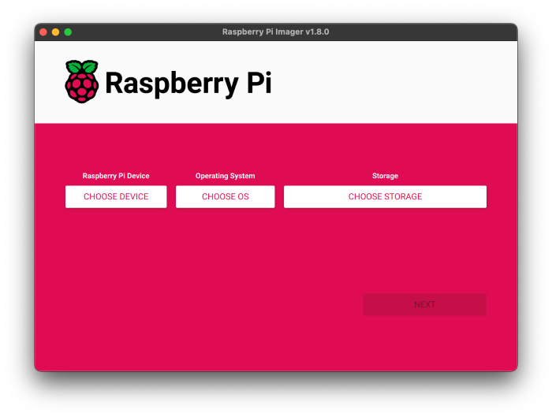

# Raspberry Pi {:#raspberry-pi}

## Instalación de Raspberry Pi OS {:#raspberry-pi-os-installation}

<div class="center">
    
    <i>Raspberry Pi 5</i>
</div>

Raspberry Pi OS es el sistema operativo oficial para las Raspberry Pi, basado en Debian Linux, y es ampliamente utilizado para proyectos de programación y robótica debido a su facilidad de uso y amplia comunidad de soporte [[1](#raspberry-pi-os)]. A continuación, se detallan los pasos para instalarlo en una Raspberry Pi:

1. Descargar la imagen de Raspberry Pi OS desde el sitio oficial: [Raspberry Pi OS](https://www.raspberrypi.com/software/).
2. Grabar la imagen en una tarjeta microSD utilizando un software como Balena Etcher o Raspberry Pi Imager.
3. Insertar la tarjeta microSD en la Raspberry Pi y encenderla.
4. Configurar la Raspberry Pi siguiendo las instrucciones en pantalla, incluyendo la conexión a una red wifi y la creación de un usuario.
5. Actualizar el sistema operativo ejecutando los siguientes comandos en la terminal:
   ```bash 
   sudo apt update
   sudo apt upgrade
   ```

<div class="center">
    
    <i>Raspberry Pi Imager</i>
</div>

> [!IMPORTANT]
> Por experiencia propia, recomendamos la configuración de la aplicación oficial de Raspberry Pi para conexión remota, Raspberry Pi Connect, que permite acceder a la Raspberry Pi desde cualquier lugar y sin necesidad de estar conectado a la misma red wifi [[2](#raspberry-pi-connect)]. En nuestro caso, en reiteradas ocasiones nos permitió de forma remota, a través del modo Remote Shell, eliminar procesos que han producido un crash o han limitado la repuesta de la Raspberry Pi.

## Instalación de la Cámara {:#camera-installation}

<div class="center">
    
    <i>Raspberry Pi Camera Module 3</i>
</div>

Para instalar la cámara en la Raspberry Pi, se debe seguir los siguientes pasos. Cabe destacar que la cámara utilizada en este proyecto es la [Raspberry Pi Camera Module 3 Wide](../../electronic/components/current.md#raspberry-pi-camera-module-3-wide), que es compatible con la Raspberry Pi 5 y permite capturar imágenes y videos de alta calidad [[3](#camera-docs)].

1. Conectar la cámara a la Raspberry Pi utilizando el conector CSI.
2. Probar el correcto funcionamiento de la cámara ejecutando el siguiente comando en la terminal:
   ```bash
   libcamera-hello
   ```
3. Si la cámara funciona correctamente, se mostrará una vista previa de la cámara en la pantalla por unos segundos.

> [!IMPORTANT]
> En caso de estar interesado en adquirir algún tipo de Raspberry Pi Camera, se debe comprar un cable aparte dependiendo del proveedor, ya que normalmente estas vienen con el cable para la Raspberry Pi 4, el cual no es el mismo.

## Instalación de Raspberry Pi AI HAT+ {:#raspberry-pi-ai-hat-plus-installation}

<div class="center">
   
   <i>Raspberry Pi AI HAT+ 26 TOPS</i>
</div>

Para la instalación, empleamos las dos guías de la documentación oficial de Raspberry Pi, donde se explica cómo instalar el Hailo AI HAT+ [[4](#getting-started-raspberry-pi)] y cómo instalar el software necesario para su funcionamiento [[5](#ai-hat-plus-raspberry-pi)].

1. Verificamos que la Raspberry Pi 5 esté actualizada, sino la actualizamos con el siguiente comando:
    ```bash
    sudo apt update && sudo apt full-upgade
    ```
2. Revisamos la versión actual del firmware instalado en la Raspberry Pi con el siguiente comando:
    ```bash
    sudo rpi-eeprom-update
    ```
    1. Si dicho comando imprime una fecha anterior al 6 de diciembre de 2023, entonces debemos actualizar el firmware de la Raspberry Pi 5. Para ello, ejecutamos el siguiente comando:
        ```bash
        sudo raspi-config
        ```
    2. En el menú de configuración, seleccionamos la opción `Advanced Options` y luego `Bootloader Version`. Elegimos la opción `Latest` y salimos del menú de configuración.
3. Ejecutamos el siguiente comando para actualizar el firmware:
    ```bash
    sudo rpi-eeprom-update -a
    ```
4. Reiniciamos la Raspberry Pi 5 con el siguiente comando:
    ```bash
    sudo reboot
    ```
5. Desconectamos la Raspberry Pi 5 de la corriente y desconectamos todos los dispositivos conectados a ella.
6. Instalamos los espaciadores de la Raspberry Pi 5 utilizando los cuatro tornillos proporcionados. Presionamos firmemente el conector GPIO apilado sobre los pines GPIO de la Raspberry Pi. Desconectamos el cable plano de la AI HAT+ y conectamos el otro extremo al puerto PCIe de la Raspberry Pi. Levantamos el soporte del cable plano desde ambos lados, luego insertamos el cable con los puntos de contacto de cobre hacia adentro, hacia los puertos USB. Con el cable plano completamente insertado en el puerto PCIe, empujamos el soporte del cable hacia abajo desde ambos lados para asegurar el cable plano firmemente en su lugar.
7. Colocamos la AI HAT+ sobre los espaciadores y utilizamos los cuatro tornillos restantes para asegurarla en su lugar.
8. Conectamos el cable plano a la AI HAT+ y lo aseguramos en su lugar. Para ello, levantamos el soporte del cable plano desde ambos lados, luego insertamos el cable con los puntos de contacto de cobre hacia arriba. Con el cable plano completamente insertado en el puerto PCIe, empujamos el soporte del cable hacia abajo desde ambos lados para asegurar el cable plano firmemente en su lugar.
9. Conectamos la Raspberry Pi 5 a la corriente y encendemos el dispositivo.
10. Para habilitar velocidades PCIe Gen 3.0 [[6](#computers-raspberry-pi)], ejecutamos el siguiente comando:
    ```bash
    sudo raspi-config
    ```
    1. En el menú de configuración, seleccionamos la opción
       `Advanced Options` y luego `PCIe Speed`. Elegimos la opción
       `Yes` para habilitar el modo PCIe Gen 3.0.
    2. Reiniciamos la Raspberry Pi 5.
11. Instalamos las dependencias requeridas para usar el NPU. Ejecutamos el siguiente comando desde una ventana de terminal: 
    ```bash
    sudo apt install hailo-all
    ```
    Cabe destacar que, debido a que la última actualización (4.21.0) es muy reciente, recomendamos instalar la versión anterior que es con la que hemos podido trabajar y comprobar su correcto funcionamiento, para lo cual, en vez del anterior comando, sería: 
    ```bash
    sudo apt install hailo-all=4.20.0
    ```
    Esto instalará las siguientes dependencias:
    - Controlador de dispositivo del kernel Hailo y firmware
    - Software de middleware HailoRT
    - Bibliotecas de post-procesamiento central Tappas de Hailo
    - Etapas de software de demostración de post-procesamiento rpicam-apps Hailo
12. Finalmente, reiniciamos la Raspberry Pi de nuevo para que estos ajustes tengan efecto.
13. Para verificar que el NPU está correctamente instalado y funcionando, ejecutamos el siguiente comando:
    ```bash
    hailortcli fw-control identify
    ```
    Si el NPU está correctamente instalado, deberíamos ver un mensaje similar al siguiente:
    ```bash
    Executing on device: 0001:01:00.0
    Identifying board
    Control Protocol Version: 2
    Firmware Version: 4.20.0 (release,app,extended context switch buffer)
    Logger Version: 0
    Board Name: Hailo-8
    Device Architecture: HAILO8
    Serial Number: <N/A>
    Part Number: <N/A>
    Product Name: <N/A>
    ```

# Referencias Bibliográficas

1. *Raspberry Pi OS*. (2025). Raspberry Pi. <a id="raspberry-pi-os" href="https://www.raspberrypi.com/software/">https://www.raspberrypi.com/software/</a>

2. *Raspberry Pi Connect*. (2025). Raspberry Pi. <a id="raspberry-pi-connect" href="https://www.raspberrypi.com/documentation/remote-access/raspberry-pi-connect.html">https://www.raspberrypi.com/documentation/remote-access/raspberry-pi-connect.html</a>

3. *Camera*. (2025). Raspberry Pi. <a id="camera-docs" href="https://www.raspberrypi.com/documentation/computers/camera.html">https://www.raspberrypi.com/documentation/computers/camera.html</a>

4. *AI Kit and AI HAT+ software*. (2025). Raspberry Pi. <a id="getting-started-raspberry-pi" href="https://www.raspberrypi.com/documentation/computers/ai.html#getting-started">https://www.raspberrypi.com/documentation/computers/ai.html#getting-started</a>

5. *AI Hat+*. (2025). Raspberry Pi. <a id="ai-hat-plus-raspberry-pi" href="https://www.raspberrypi.com/documentation/accessories/ai-hat-plus.html#ai-hat-plus">https://www.raspberrypi.com/documentation/accessories/ai-hat-plus.html#ai-hat-plus</a>

6. *Raspberry Pi*. (2025). Raspberry Pi. <a id="computers-raspberry-pi" href="https://www.raspberrypi.com/documentation/computers/raspberry-pi.html">https://www.raspberrypi.com/documentation/computers/raspberry-pi.html</a>