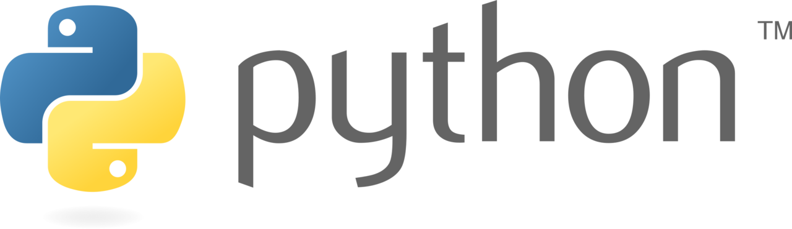
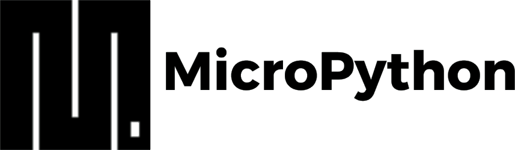
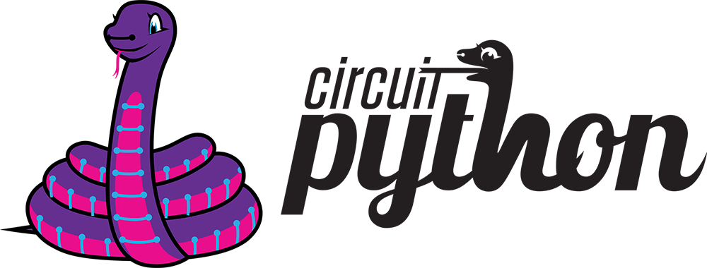

# Lenguajes de Programación {#programming-languages}

Muchos robots autónomos, si no es que todos, necesitan de un lenguaje de 
programación para poder llevar a cabo tareas complejas. En el caso de Klevor,
utilizamos un lenguaje principal: Python, y una implementación para la
Raspberry Pi Pico 2 WH: CircuitPython.

## Python {#python}

    
    <i>Logo de Python</i>

Python es un lenguaje de programación de alto nivel, este lenguaje cumple
muchísimas funciones en general y es uno de los más versátiles.
Klevor utiliza Python como lenguaje de programación para tareas como la
detección de los obstáculos y el estacionamiento, escaneo 2D de los datos del
RPLidar C1 y el control de los dos motores [[1](#python-docs)]. Debido a su
sencillez y facilidad de uso, permite a los desarrolladores centrarse en
la lógica del programa en lugar de preocuparse por la sintaxis compleja de otros
lenguajes. 

Python es un lenguaje interpretado, lo que significa que el código se
ejecuta línea por línea. Además, Python cuenta con una amplia gama de bibliotecas y
módulos que permiten realizar tareas específicas sin necesidad de escribir código
desde cero, lo que acelera el proceso de desarrollo.

Cabe destacar que, a pesar de su sencillez, Python es un lenguaje
potente y versátil, con soporte a clases, abstracción, herencia, polimorfismo,
funciones, módulos, multiprocesamiento, multihilo, programación
asíncrona, function overloading, decoradores, y mucho más.

La ventaja principal de Python es la versatilidad, pues no necesitamos
administrar cada tarea en un lenguaje de programación distinto, sino que
podemos utilizar Python para todo, desde la detección de obstáculos hasta el
control de los motores, lo que simplifica el proceso de desarrollo y reduce la
complejidad del código.

## MicroPython {#micro-python}

    
    <i>Logo de MicroPython</i>

MicroPython es una implementación de Python en microcontroladores, a pesar de
estar escrito en el lenguaje de programación C, este replica todas las funciones
de Python en microcontroladores como la ESP32 y ESP8266.

En el caso de Klevor, utilizamos MicroPython en la Raspberry Pi Pico 2 WH, para
permitir una comunicación más eficiente entre la Raspberry Pi 5 y la Raspberry
Pi Pico 2 WH [[2](#micro-python-docs)], sin embargo, posteriormente decidimos
utilizar CircuitPython debido a problemas de compatibilidad con la librería del
giroscopio GY-BNO085 de Adafruit, ya que esta estaba diseñada para ser utilizada
con CircuitPython, lo que nos llevó a cambiar a CircuitPython para evitar estos
problemas de compatibilidad y no tener que modificar la librería casi en su
totalidad.

## CircuitPython {#circuit-python}

    
    <i>Logo de CircuitPython</i>

CircuitPython es una ramificación de MicroPython diseñada para ser compatibles
con microcontroladores pequeños y baratos [[3](#circuit-python-docs)]. Al 
igual que MicroPython, CircuitPython es una implementación de Python en
microcontroladores, pero está optimizada para ser utilizada en dispositivos con 
recursos limitados, como la Raspberry Pi Pico 2 WH.

# Referencias Bibliográficas

1. *El tutorial de Python*. (2025). Python Software
    Foundation. <a id="python-docs" href="https://docs.python.org/es/3/tutorial/">https://docs.python.org/es/3/tutorial/</a>

2. *Qué es MicroPython, el lenguaje de programación que ya puedes usar en tu
    Arduino.* (2022). GenBeta. <a id="micro-python-docs" href="https://www.genbeta.com/desarrollo/que-micropython-lenguaje-programacion-que-puedes-usar-tu-arduino-probar-tu-navegador">https://www.genbeta.com/desarrollo/que-micropython-lenguaje-programacion-que-puedes-usar-tu-arduino-probar-tu-navegador</a>

3. *CircuitPython*. (2025).
    CircuitPython. <a id="circuit-python-docs" href="https://docs.circuitpython.org/en/latest/README.html">https://docs.circuitpython.org/en/latest/README.html</a>