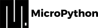
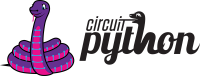

# Lenguajes de Programación {:#programming-languages}

Muchos robots autónomos, si no es que todos, necesitan de un lenguaje de programación para poder llevar a cabo tareas complejas. En el caso de Klevor, utilizamos un lenguaje principal: Python, y una implementación para la Raspberry Pi Pico 2 WH: CircuitPython.

## Python {:#python}

    
    <i>Logo de Python</i>

Python fue creado por **Guido van Rossum**, un programador holandés que comenzó a trabajar en Python a finales de la década de 1980. La primera versión pública de Python (versión 0.9.0) fue lanzada en febrero de 1991.

Además de esto, Guido mantuvo la autoridad final sobre el desarrollo de Python hasta que se retiró de ese rol en 2018.

Guido concibió Python con varios propósitos clave en mente, influenciado por su experiencia con otros lenguajes como **ABC** y **Modula-3**, principalmente, se enfocaba en crear un lenguaje que fuese tan fácil de entender como el pseudocódigo, para que fuese más accesible para principiantes y además fuese más fácil de mantener para los equipos. Además de esto, Guido diseñó Python de manera que, este fuese un lenguaje bastante versátil, que no estuviese restringido a una sóla rama, sino que pueda ser utilizado en una gran variedad, como:

- Scripting y automatización de tareas.

- Análisis de datos y ciencia de datos.

- Inteligencia Artificial y Machine Learning.

- Desarrollo de software de escritorio.

Python es un lenguaje de programación de alto nivel, este lenguaje cumple muchísimas funciones en general y es uno de los más versátiles. Klevor utiliza Python como lenguaje de programación para tareas como la detección de los obstáculos y el estacionamiento, escaneo 2D de los datos del RPLidar C1 y el control de los dos motores [[1](#python-docs)]. Debido a su sencillez y facilidad de uso, permite a los desarrolladores centrarse en la lógica del programa en lugar de preocuparse por la sintaxis compleja de otros lenguajes.

Python es un lenguaje interpretado, lo que significa que el código se ejecuta línea por línea. Además, Python cuenta con una amplia gama de bibliotecas y módulos que permiten realizar tareas específicas sin necesidad de escribir código desde cero, lo que acelera el proceso de desarrollo.

Cabe destacar que, a pesar de su sencillez, Python es un lenguaje potente y versátil, con soporte a clases, abstracción, herencia, polimorfismo, funciones, módulos, multiprocesamiento, multihilo, programación asíncrona, function overloading, decoradores, y mucho más.

La ventaja principal de Python es la versatilidad, pues no necesitamos administrar cada tarea en un lenguaje de programación distinto, sino que podemos utilizar Python para todo, desde la detección de obstáculos hasta el control de los motores, lo que simplifica el proceso de desarrollo y reduce la complejidad del código.

## MicroPython {:#micro-python}

    
    <i>Logo de MicroPython</i>

MicroPython fue creado por **Damien George**, un ingeniero de software australiano. Damien comenzó a trabajar en MicroPython en 2013. La primera versión pública fue lanzada en 2014.

MicroPython es una implementación de Python en microcontroladores, a pesar de estar escrito en el lenguaje de programación C, este replica todas las funciones de Python en microcontroladores como la ESP32 y ESP8266.

El propósito principal de MicroPython fue proporcionar una implementación completa del lenguaje de programación Python 3, optimizada para ejecutarse en microcontroladores. Antes de MicroPython, la programación de estos dispositivos de recursos limitados se realizaba principalmente con lenguajes de bajo nivel como C o Assembly.

En el caso de Klevor, utilizamos MicroPython en la Raspberry Pi Pico 2 WH, para permitir una comunicación más eficiente entre la Raspberry Pi 5 y la Raspberry Pi Pico 2 WH [[2](#micro-python-docs)], sin embargo, posteriormente decidimos utilizar CircuitPython debido a problemas de compatibilidad con la librería del giroscopio GY-BNO085 de Adafruit, ya que esta estaba diseñada para ser utilizada con CircuitPython, lo que nos llevó a cambiar a CircuitPython para evitar estos problemas de compatibilidad y no tener que modificar la librería casi en su totalidad.

## CircuitPython {:#circuit-python}

    
    <i>Logo de CircuitPython</i>

CircuitPython es una bifurcación de MicroPython, y fue desarrollado principalmente por **Adafruit Industries**, una empresa líder en hardware de código abierto y educación electrónica. Si bien no hay un único creador individual como en Python o MicroPython, **Limor Fried (Ladyada)**, la fundadora de Adafruit, y su equipo han sido los principales impulsores y desarrolladores de CircuitPython.

CircuitPython fue lanzado en 2017. Nació de la necesidad de tener una versión de Python para microcontroladores que estuviera aún más orientada a la educación y la facilidad de uso para principiantes, CircuitPython fue diseñado con un enfoque muy específico en la educación, la experimentación rápida y la facilidad de uso para personas que se inician en la programación de microcontroladores y la electrónica.

Dado que el código reside en una unidad de disco accesible por USB, es muy fácil editar y actualizar el código sin necesidad de herramientas de desarrollo complejas, a diferencia de MicroPython, que es más genérico, CircuitPython se enfoca en proporcionar soporte directo y robusto para una amplia gama de sensores, actuadores y componentes externos, especialmente los vendidos por Adafruit y sus socios. Esto se logra a través de una extensa colección de librerías y controladores pre-escritos.

Al igual que MicroPython, CircuitPython es una implementación de Python en microcontroladores, pero está optimizada para ser utilizada en dispositivos con recursos limitados, como la Raspberry Pi Pico 2 WH [[3](#circuit-python-docs)].

# Referencias Bibliográficas

1. *El tutorial de Python*. (2025). Python Software Foundation. <a id="python-docs" href="https://docs.python.org/es/3/tutorial/">https://docs.python.org/es/3/tutorial/</a>

2. *Qué es MicroPython, el lenguaje de programación que ya puedes usar en tu Arduino.* (2022). GenBeta. <a id="micro-python-docs" href="https://www.genbeta.com/desarrollo/que-micropython-lenguaje-programacion-que-puedes-usar-tu-arduino-probar-tu-navegador">https://www.genbeta.com/desarrollo/que-micropython-lenguaje-programacion-que-puedes-usar-tu-arduino-probar-tu-navegador</a>

3. *CircuitPython*. (2025). CircuitPython. <a id="circuit-python-docs" href="https://docs.circuitpython.org/en/latest/README.html">https://docs.circuitpython.org/en/latest/README.html</a>