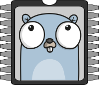

# Current Programming Languages

A lot of autonomous robots, if not all, need a programming language to be able to process complex tasks. In Klevor, we used one main language: Python, and a Python implementation for the Raspberry Pi Pico 2 WH: CircuitPython.

## Python

<!-- github-only-start -->

	
	 
	<i>Python's Logo</i>

<!-- github-only-end -->

<!-- mkdocs-only-start

    
    <i>Python's Logo</i>

mkdocs-only-end -->

Python was created by **Guido van Rossum**, a dutch programmer that started to work on Python in the late 80's. The first public version (version 0.9.0) was launched in February 1991.

Also, Guido kept the final decision on Python's development until he retired in 2018.

Guido created Python with a lot of different purposes in mind, inspired by his experience on other languages like **ABC** and **Modula-3**, mainly, he focused in creating a language that as easy to understand as pseudocode, to make it accessible for beginners and easy to maintain for computers. Aside from this, Guido designed Python, in a way that it's a versatile language, and not stuck with a single niche use, some of its intended uses are:

- Scripting and task automation.

- Data analysis and data science.

- Artificial Intelligence and Machine Learning.

- Desktop software development.

Python is a high-level programming language, this language has a lot of general functions, and is one of the most versatile. Klevor uses Python as its main language for certain tasks like obstacle detection and parking, 2D scanning from the RPLiDAR C1 data and controlling the motors [[1](#python-docs)]. Due to its simplicity and ease of use, it allows programmers to focus entirely on the programs' logic instead of worrying about the complex sintaxis from other languages.

Python is an interpreted language, which means, that the code is run line by line. Also, Python has a lot of different libraries and modules that allow to execute specific tasks without the need of writing code by scratch, which accelerates the development process.

It is worth mentioning that, aside from its simplicity, Python is still a very powerful and versatile language, supporting classes, 

Python's main advantage is, again, its versatility, since we don't need to run every task in a different programming language for each of them, since we can just use Python from everything, like object detection and controlling the motors, which simplifies the developing and reduces the code's complexity.

## Go {:#go}

<!-- github-only-start -->

	
	 
	<i>Go's Logo</i>

<!-- github-only-end -->

<!-- mkdocs-only-start

    
    <i>Go's Logo</i>

mkdocs-only-end -->

Go, also known as GoLang, is a statically tiped and compiled programming language, designed by Robert Griesemer, Rob Pike, and Ken Thompson in Google in 2009. Their main goal was to create a programming language that could solve the problems of other modern languages in an era of multi-core processors, large-scale systems and networks.

Key characteristics:

- Simplicity and Readability: Go's sintaxis is intentionally minimal and easy to learn. It avoids complex features present in languages like C++ or Java (such as class inheritance or complex generics), resulting in clean, readeable and easy to maintain code. The language's opinionated nature (for example, specific formatting rules enforced by gofmt) ensures code consistency across different teams.

- Concurrency: This is one of the most powerful and definitive Go's characteristics. It has built-in primitives for concurrency:

	1. Goroutines: These are lightweight, inexpensive threads managed by the Go runtime, not by the operating system. You can have thousands if not millions of these running at the same time.

	2. Channels: A way for Goroutines to communicate and synchronize. The philosophy is "don't communicate by sharing memory, share memory by communicating". This prevents common concurrency issues.

- Fast compiling: Go compiles extremely fast. This provides a developing experience similar to interpreted languages, where you can make changes and see results almost instantly.

Aside from this, Go's design makes it well-suited for:

- Web services and APIs: It's incredible networking capabilities and support for concurrency make it a top choice to build web high-performance, scalable, web servers and microservices.

- Command-Line Tools: Its fast compilation and static binaries make it ideal for creating powerful command-line applications that can be distributed easily.

- Cloud Computing: A lot of cloud infrastructure tools, such as Dooker and Kubernetes, are written in Go.

In conclusion, Go is a programming language that priorizes efficency, scalability, and ease of use, which makes it a popular choice for developers who build the backend systems that power the modern web and cloud.

## TinyGo {:#tinygo}

<!-- github-only-start -->

	
	 
	<i>TinyGo's Logo</i>

<!-- github-only-end -->

<!-- mkdocs-only-start

    
    <i>TinyGo's Logo</i>

mkdocs-only-end -->

TinyGo is a Go implementation for microcontrollers, like, for example, the Raspberry Pi Pico 2 W H, TinyGo is very similar to Go, however, unlike Go, which has its unique compiler infraestructure, TinyGo is built over the LLVM (Low Level Virtual Machine) compiler infrastructure. Thanks to LLVM, TinyGo is capable of implementing features such as:

- Drastically smaller binaries: A "Hello World!" program written in standard Go can take up several megabytes, however, the same program built on TinyGo can take up as low as a few kilobytes. This is the main characteristic for microcontrollers, because of their limited resources and flash memory.

- Efficient Code Generation: LLVM's advanced optimizations can produce highly efficient machine code, often outperforming C and C++ in specific benchmark tests.

# Referencias

1. *The Python Tutorial*. (2025). Python Software Foundation. <a id="python-docs" href="https://docs.python.org/es/3/tutorial/">https://docs.python.org/es/3/tutorial/</a>

2. *El tutorial de Go*. (2025). Google. <a id="go-docs" href="https://go.dev/">https://go.dev/</a>