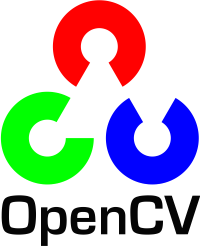
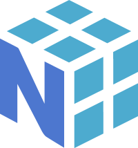
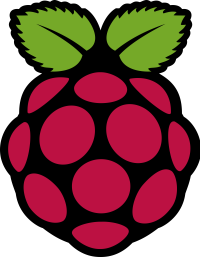

# Librerías {:#libraries}

## PyTorch {:#pytorch}

    
    <i>Logo de PyTorch</i>

PyTorch es una librería de software de código abierto diseñada originalmente por Adam Paszke, Sam Gross, Soumith Chintala y Gregory Chanan en septiembre de 2016, principalmente para que ayude en el desarrollo del Aprendizaje Automático (Machine Learning), y, en particular para el Aprendizaje Profundo (Deep Learning). PyTorch se ha convertido en uno de los frameworks más populares para el desarrollo de las IA [[1](#pytorch-docs)].

Al igual que muchas de las librerías ya mencionadas, PyTorch es bastante útil cuando se trata de desarrollar un programa que involucre Visión por Computadoras, o el Aprendizaje por Refuerzo. Ya que, facilitan el desarrollo de modelos de Inteligencia Artificial.

## Ultralytics YOLO {:#ultralytics-yolo}

    
    <i>Logo de Ultralytics</i>

La librería Ultralytics YOLO está construida sobre PyTorch y se caracteriza por su modularidad y su enfoque en la eficiencia y la facilidad de uso. Todo gira en torno a la clase YOLO, que encapsula todas las funcionalidades clave. En su núcleo se basa en los modelos You Only Look Once (YOLO) originales, que, a diferencia de los algoritmos de dos etapas (primero proponen regiones y luego la clasifica) los modelos YOLO se caracterizan por su detección de objetos de una pasada en la red neuronal, dándole una gran velocidad de detección.

### Clase YOLO

Es la interfaz principal para interactuar con los modelos. Permite cargar modelos preentrenados, construir nuevos modelos desde cero, entrenar, validar, realizar inferencias, exportar y rastrear objetos. Además de la clase, la librería contiene múltiples modos para poder organizar todas sus funciones (como `train`, `val`, `predict` o `export`).

### Detección de Objetos

La tarea central de YOLO. Identifica la ubicación de objetos en una imagen/video mediante cajas delimitadoras (bounding boxes) y asigna una clase a cada objeto. Los modelos están disponibles en diferentes tamaños (Nano `n`, Small `s`, Medium `m`, Large `l`, XLarge `x`) para escalar según las necesidades de rendimiento y precisión. Si bien la librería contiene múltiples usos, en el caso de Klevor utilizamos la Detección de Objetos para poder detectar e identificar los obstáculos [[2](#ultralytics-yolo-docs)].

## OpenCV {:#opencv}

    
    <i>Logo de OpenCV</i>

Esta librería es desarrollada por Intel Corporation, y luego ésta fue mantenida por Willow Garage, y luego Itseez (quien luego fue adquirida por Intel), el proyecto OpenCV fue iniciado en 1999 por Intel como una iniciativa para avanzar en las tareas que son utilizan muchos recursos del procesador. 

Open Source Computer Vision Library (OpenCV) es una de las librerías de software más populares y potentes del mundo para la visión por computadora y el aprendizaje automático (Machine Learning). Fue desarrollada inicialmente por Intel y ahora es mantenida por una comunidad global activa. En su esencia, OpenCV es una colección masiva de algoritmos y funciones que te permiten procesar imágenes y videos, extraer información de ellos y hacer que las computadoras "vean" y "entiendan" el mundo visual de una manera similar a como lo hacen los humanos.

Su propósito principal es proporcionar una infraestructura común para aplicaciones de visión por computadora y acelerar el uso de la percepción automática en productos comerciales, investigación y desarrollo [[3](#opencv-docs)].

## NumPy {:#numpy}

    
    <i>Logo de NumPy</i>

Desarrollada por Travis Oliphant, la librería NumPy contiene dos paquetes, el primero fue lanzado como Numeric en 1995, luego Numarray fue lanzado, la cual podía realizar operaciones más rápido que Numeric en arrays grandes, pero tardaba más que Numericen realizar las mismas operaciones pero con arrays pequeños. 

Así que, para evitar tener que usar una librería u otra, Travis Oliphant, combinó a Numeric y a Numarray en lo que hoy es NumPy.

La librería NumPy o Numerical Python es una librería la cual contiene muchísimas funciones utilizadas ampliamente en el ecosistema de Python, gracias a esta librería, otras más populares y más flexibles como TensorFlow y PyTorch pudieron ser construidas. Esta librería se basa en la computación numérica y científica en Python.

El propósito general es permitir operaciones numéricas rápidas y eficientes en grandes cantidades de datos [[4](#numpy-docs)]. Estos cálculos tan extensos, se utilizan para el procesamiento de imágenes de Klevor, aunque también tiene usos como el análisis de datos.

## PiCamera 2 {:#picamera-2}

    
    <i>Logo de Raspberry Pi</i>

La librería Picamera fue lanzada inicialmente alrededor de septiembre de 2013. Fue desarrollada por Dave Jones, un desarrollador externo, y no directamente por la Fundación Raspberry Pi en sus inicios. Sin embargo, mientras Raspberry Pi se enfocaba más en APIs de Linux, la libreria `picamera` se volvió incompatible y no podía recibir mantenimiento en versiones futuras de Raspberry Pi OS.

La librería PiCamera 2 es la sucesora de la `picamera` original, desarrollada por Raspberry Pi Foundation [[5](#the-picamera2-library)]. Esta librería permite la conexión entre la RPi Camera Module 3 y el Modelo de Detección de Obstáculos. Entre sus múltiples funciones se encuentran:

- Obtener streams de video para procesamiento en tiempo real (por ejemplo, con OpenCV o NumPy).
- Controlar diversos parámetros de la cámara (exposición, ganancia, balance de blancos, modos de enfoque, etc.).

Además de, obviamente, permitir la toma de imágenes y videos

## Hailo Platform {:#hailo-platform}

    
    <i>Logo de Hailo Platform</i>

Hailo Technologies fue fundada en Tel Aviv, Israel, por Orr Danon, Avi Baum, Hadar Zeitlin y Rami Feig, en febrero de 2017.

El propósito fundamental de Hailo Technologies es reimaginar la arquitectura tradicional de los procesadores para llevar el rendimiento de la IA de clase de centro de datos a los dispositivos de borde. En el momento de su fundación, las tecnologías disruptivas de IA estaban limitadas en gran medida a los centros de datos debido a su alto costo, los requisitos de gran potencia computacional y hardware extenso, y el consumo significativo de energía.

Hailo se propuso resolver estos desafíos desarrollando procesadores de IA especializados que pudieran realizar tareas sofisticadas de aprendizaje profundo, como la detección y segmentación de objetos, en tiempo real, con un consumo mínimo de energía, tamaño y costo.

Hailo Platform es un ecosistema tanto de hardware y software desarrollado por la empresa Hailo Technologies, este ecosistema está diseñado para llevar un modelo de Deep Learning desde su entrenamiento hasta su aplicación en tiempo real en periféricos [[6](#hailo-ai-software-suite)].

Además de esto, la Hailo Platform también incluye múltiples librerías, el objetivo principal de estas librerías (como HailoRT o PyHailoRT) es la de acelerar el proceso de desarrollo de extremo a extremo, tanto en la compilación y optimización hasta su uso en tiempo real.

# Referencias Bibliográficas

1. *PyTorch Documentation*. (2025). PyTorch Contributors. <a id="pytorch-docs" href="https://docs.pytorch.org/docs/stable/index.html">https://docs.pytorch.org/docs/stable/index.html</a>

2. *Ultralytics Docs*. (2025). Ultralytics Inc. <a id="ultralytics-yolo-docs" href="https://docs.ultralytics.com/#where-to-start">https://docs.ultralytics.com/#where-to-start</a>

3. *OpenCV Documentation*. (2025). OpenCV. <a id="opencv-docs" href="https://docs.opencv.org/4.11.0/d1/dfb/intro.html">https://docs.opencv.org/4.11.0/d1/dfb/intro.html</a>

4. *NumPy Documentation*. (2024). NumPy Developers. <a id="numpy-docs" href="https://numpy.org/doc/stable/user/index.html">https://numpy.org/doc/stable/user/index.html</a>

5. *The PiCamera 2 Library*. (2025). Raspberry Pi Ltd. <a id="the-picamera2-library" href="https://datasheets.raspberrypi.com/camera/picamera2-manual.pdf">https://datasheets.raspberrypi.com/camera/picamera2-manual.pdf</a>

6. *Hailo AI Software Suite*. (2025). Hailo Technologies Ltd. <a id="hailo-ai-software-suite" href="https://hailo.ai/products/hailo-software/hailo-ai-software-suite/#sw-overview">https://hailo.ai/products/hailo-software/hailo-ai-software-suite/#sw-overview</a>
