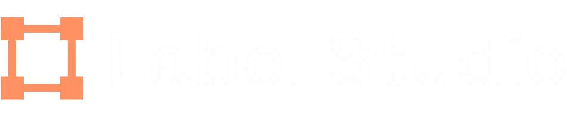
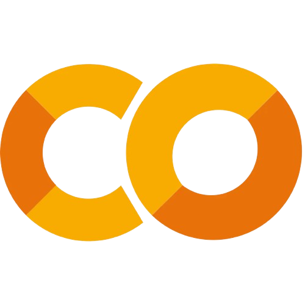
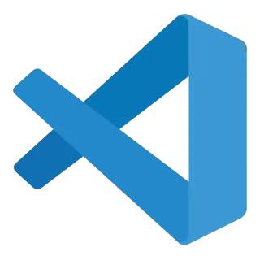
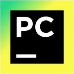
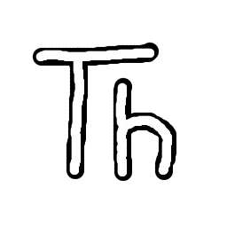
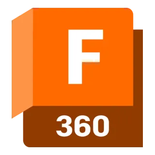
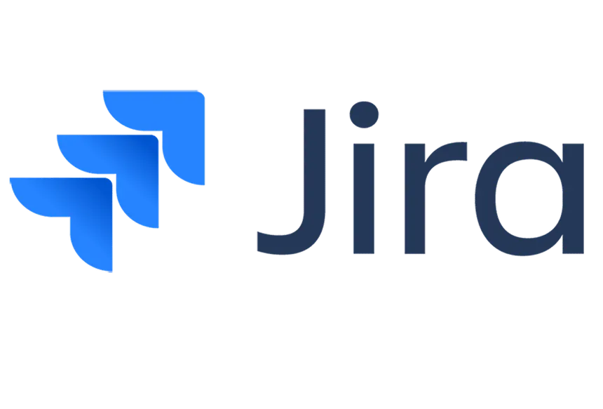

# Software {:software}

Aquí se encuentran todos los programas que utilizamos como Team Steelbot para poder desarrollar a Klevor.

## Label Studio {:label_studio}

    
    <i>Label Studio</i>

Label Studio es un programa open-source (de código abierto) el cual nos permite preparar las fotos para poder entrenar una Inteligencia Artificial, en el caso de Klevor, este programa se uitilizo para remarcar dónde están los bloques en las fotos de entrenamiento para que así, después de dejar el modelo entrenando un rato (ya sea de manera local o en la nube), este pueda reconocer los bloques por sí solo.

## Google Colab {:google_colab}

    
    <i>Google Colab</i>

Como se mencionó anteriormente, un modelo de Inteligencia Artificial debe se ser entrenado, ya sea de manera local o en la nube, pues Google Colab cumple exactamente está función. Google Colab es una página web que te permite ejecutar código en Python en tu propio navegador web, además de brindar acceso gratuito a GPUs y TPUs que puedan ser utilizadas en línea. En el caso de Klevor, utilizamos esta página para poder entrenar el modelo YOLO que se mencionó anteriormente.
## Visual Studio Code {:visual_studio_code}

    
    <i>Visual Studio Code</i>

Visual Studio Code es un programa de desarrollo de software o también conocido como un Entorno de Desarrollo Integrado, en el caso de Klevor, nosotros utilizamos Visual Studio Code principalmente para poder visualizar y desarrollar el progreso de la documentación, ya que, su terminal actúa exactamente como el Windows PowerShell, así que podemos utilizar la página de manera local, sin necesidad de estar subiendo cada cambio minúsculo al GitHub principal.

## PyCharm {:pycharm}

    
    <i>PyCharm</i>

PyCharm es otro programa de desarrollo de software, sin embargo éste presenta muchas más funcionalidades que Visual Studio Code, con el detalle que este programa necesita de una licencia, mientras que una Visual Studio Code no necesita de una licencia.

## Thonny {:thonny}

    
    <i>Thonny</i>

Thonny es otro programa de desarrollo de software, la diferencia principal es que editor es compatible únicamente con Python, este programa fue utilizado principalmente para poder ejecutar código directamente en la Raspberry Pi Pico 2W, tanto para probar, como para utilizarlo en los Desafíos, ya que este programa se puede instalar en la Raspberry Pi 5.

## Canva {:canva}

    
    <i>Canva</i>

Canva es una plataforma de diseño en línea, la cual te permite diseñar cualquier cosa en 2D, decidimos utilizar Canva principalmente para la elaboración de los diagramas de conexiones y diagramas de flujo, como una solución rápida y efectiva para la documentación, sin embargo, notamos que nuestros diagramas eran muy complejos y tomaban mucho tiempo de hacer, por lo que cambiamos a otras soluciones en línea.

## Mermaid {:mermaid}

    
    <i>Mermaid</i>

Después de no lograr los resultados esperados con Canva, decidimos optar por Mermaid, el cual es un programa open-source (de código abierto) que se especializa principalmetne en la creación de diagramas con texto, con un sistema parecido a Markdown, con el objetivo de elaborar los diagramas de conexiones y los diagramas de flujo.

## Draw.io {:draw_io}

    
    <i>Draw.io</i>

Draw.io es una página web que permite la creación de diagramas en línea, con la posibilidad de que varios usuarios lo puedan modificar al mismo tiempo, algo así como Canva, el cual te permite convertir tu diagrama en un proyecto colaborativo, además de poder hacer distintos tipos de diagramas.
## Fusion 360 {:fusion_360}

    
    <i>Fusion 360</i>

Fusion 360 es un programa de diseño 3D, ahora bien, cabe recalcar que este programa de una licencia para poder funcionar, al contrario de varios otros programas mencionados en esta lista, gracias a este programa pudimos diseñar e imprimir las piezas en 3D con mucha facilidad, sin la necesidad de estar rediseñando e reimprimir las piezas (ya sea porque no tienen las medidas necesarias), además de poder visualizar como se vería el resultado final de cada prototipo antes de armarlo.

## Jira {:jira}

    
    <i>Jira</i>

Jira es una página web cuyo objetivo es la de organizar las tareas de un equipo de trabajo y asignarles una prioridad, básicamente es una página de organización de trabajo, como bien lo puede ser GitHub, en nuestro caso nos permitió mantener el desarrollo de Klevor a un ritmo adecuado.