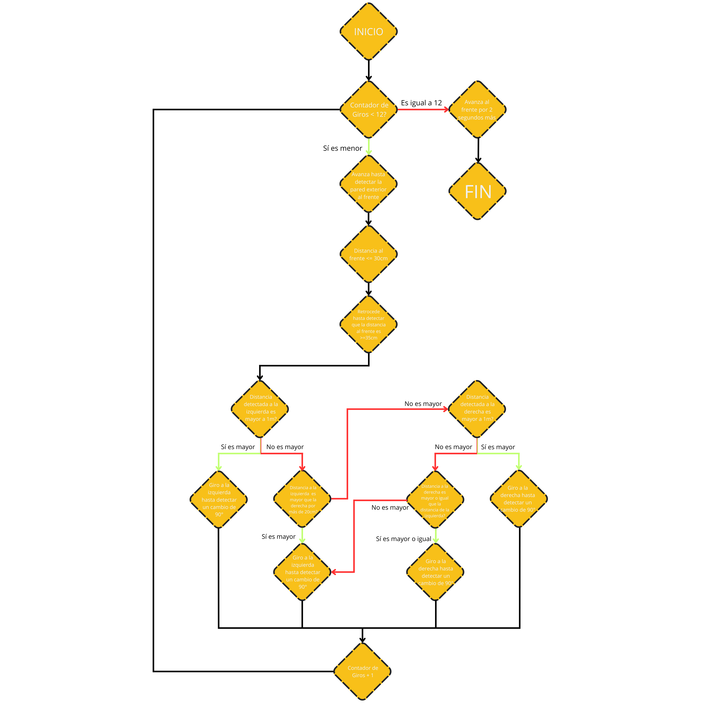

Esta carpeta tiene todo el código hecho en CircuitPython para el desarrollo de Klevor, se recomienda utilizar una Raspberry Pi Pico (aunque, cualquier microcontrolador con CircuitPython debería de poder funcionar si se hacen algunas correciones) para poder ejecutar los archivos.

<h2 id="open-challenge-explanation">Cómo funciona Klevor durante el Desafío Abierto?</h2>

Durante el Desafío Abierto, Klevor prioriza cumplir una serie de pasos antes de dar una vuelta, esto está mejor definido en el [Diagrama de Flujo](../../../schemes/open_challenge_flowchart.png) (click aquí para poder hacer zoom).

    

Como se puede apreciar, Klevor siempre intenta cumplir una serie de pasos:

- Al iniciar la ronda, Klevor avanza hasta que detecte que la pared esté a 30cm de distancia o menos de su sensor al frente
- Después, retrocede hasta que la pared esté a 35cm de distancia.
- Tras esto, se considera que Klevor está en una buena posición para girar, así que, empieza a comparar los sensores que están a su izquierda y su derecha para saber hacia dónde girar.
- Si cualquiera de los lados empieza a detectar las distancias como 'inf', Klevor gira hacia ese lado, ya que se considera que la pared exterior está fuera de rango del sensor (esto normalmente indica que esta a 2 metros o más), si ninguna de estas condiciones se cumple, Klevor simplemente va a girar hacia el lado que detecta la pared más lejana (Esta desición se debe a una falla consistente de los datos de los sensores ToF VL53L0X que tuvimos, a veces en vez de que los sensores comunicaran que en vez de que la pared exterior estuviese fuera de rango, simplemente declara que estaba a 50cm de distancia, cuando ese evidentemente no era el caso)
- Mientras está girando, empieza a leer los datos del giroscopio, cuando detecte un cambio de al menos 90°, empieza a avanzar hacia adelante, sumándole 1 a su contador de giros, en caso contrario, simplemente sigue girando.
- Tras completar sus 12 giros, Klevor simplemente avanza por un breve momento (para asegurar que esté en la zona de salida) y se detiene, completando así el Desafío Abierto. 

Ahora bien, este es el caso de nuestro primer prototipo, con respecto a nuestro segundo prototipo, gran parte de la lógica se mantiene intacta, realmente lo único que cambia es la forma en la obtenemos los datos de la distancia, gracias a la forma en la que Klevor está diseñado el [RPLiDAR C1](../../../README.md/#componentes-rplidar-c1) tiene un rango de visión de más o menos 200 grados, además de que sus mediciones son mucho más confiables que utilizar múltiples sensores ToF a la vez, y sus mediciones son mucho más rápidas, ya que cada sensor ToF necesita de alrededor de 50ms para poder dar una medición lo suficientemente precisa, tras ese cambio, el resto de la lógica en el Desafío Abierto es casi exactamente lo mismo.