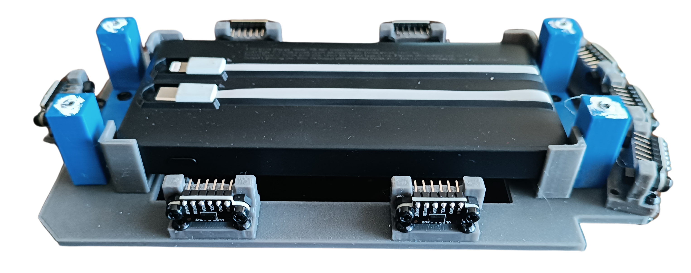
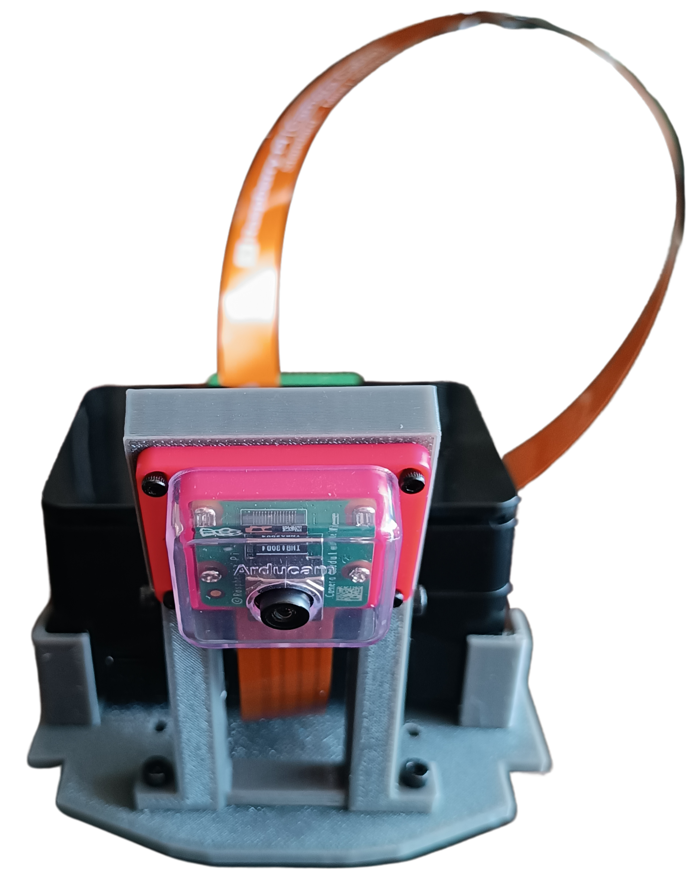

<h1 id="index">Índice</h1>

1. **[Introducción](#introduccion)**
2. **[Capas](#capas)**
    1. [Primera Capa](#primera-capa)
    1. [Segunda Capa](#segunda-capa)
    1. [Tercera Capa](#tercera-capa)
3. **[Lista de Materiales](#lista-de-materiales)**

<h1 id="introduccion">Introducción</h1> 
En esta sección detallaremos los componentes y su funcionalidad dentro de cada capa del robot. Explicaremos el propósito de cada pieza y cómo su integración contribuye al rendimiento general de “Klevor” en el recorrido de pista.

En esta primera capa toda la parte motriz de nuestro robot. 

<table>
    <tr>
        <td>
            

                
            

            

                <i>Primera capa, vista delantera</i>
            

        </td>
        <td>
            

                
            

            

                <i>Primera capa, vista trasera</i>
            

        </td>
    </tr>
    <tr>
        <td>
            

                
            

            

                <i>Primera capa, vista izquierda</i>
            

        </td>
        <td>
            

                
            

            

                <i>Primera capa, vista derecha</i>
            

        </td>
    </tr>
</table>

    

    <i>Primera capa, vista superior</i>

 
A continuación, explicaremos a detalle cómo funciona este 
sistema motriz. Para lograrlo, nos basamos en el sistema mecánico de un automóvil; cuyo funcionamiento depende de un diferencial (una pieza formada por varios engranajes cubiertos por una carcasa) para el movimiento de dos ruedas, al usar cuatro ruedas, usamos dos diferenciales (uno para las delanteras, otro para las traseras) conectados mediante un eje transmisor para el movimiento uniforme de todas estas.
Estos diferenciales se mueven en conjunto mediante un engranaje que está conectado al eje transmisor. El eje transmisor únicamente tiene la funcion de conectar ambos diferenciales entre sí por medio de una ranura en estos, y tiene la adición de un engranaje en la parte donde va nuestro motor ([INJORA 48T](../../README.md/#componentes-injora-180-motor-48t)). Dicho motor originalmente lo conectamos al engranaje del eje transmisor, pero no funcionó, ya que este no cuenta con la suficiente fuerza para mover el sistema. Esto nos condujo a crear un sistema de reducción de RPM, para así, añadir más torque al motor. Esta modificación consta de un engranaje en la boquilla del motor, que a su vez está acoplado a 3 piñones más junto al engranaje principal del eje transmisor de los diferenciales, lo que finalmente le permitió a Klevor moverse.

Otra parte fundamental para nuestro robot es su sistema de cruce, que consta de un servomotor ([INJORA 7kg 2065](../../README.md/#componentes-injora-7kg-2065-micro-servo)) conectado a nuestro sistema "Ackermann" que funciona conectando ambas ruedas delanteras a una dirección o "sistema de trapecio". El servomotor mueve unas barras que a su vez están conectados a unos muñones de dirección que están en las ruedas, permitiendo así que, uno de los muñones de dirección anteriormente mencionados, sea empujado hacia un lado por el movimiento del servomotor y a su vez, tire de la otra rueda hacia el lado opuesto. Debido a los angulos del trapecio, esto provoca que la rueda interior gire más que la exterior.

Algunos componentes que también están en esta capa son el [giroscopio](../../README.md/#gyroscope-gy-bno085) y una batería de 7.4V y 3000mAh ([URGENEX 7.4 BATTERY](../../README.md/#componentes-urgenex-74v-battery)), y los ya mencionados INJORA 48T (motor) y el Microservo INJORA 7kg 2065.

¿Por qué diseñamos de esta manera la primera capa de nuestro robot?

Esta capa fue 100% diseñada e impresa por nosotros. Al tener múltiples piezas de kits que no son modificables (como los diferenciales, el eje de transmisión y los muñones de dirección) tuvimos que acoplar el diseño de esta primera capa a esas piezas, y a la vez dejar espacio para los componentes restantes. Las ruedas también fueron diseñadas por nosotros, con ranuras hechas a la medida de los kits ya mencionados.

<h2 id="segunda-capa">Segunda Capa</h2>
<table>
    <tr>
        <td>
            

                
            

            

                <i>Segunda capa, vista delantera</i>
            

        </td>
        <td>
            

                
            

            

                <i>Segunda capa, vista trasera</i>
            

        </td>
    </tr>
    <tr>
        <td>
            

                
            

            

                <i>Segunda capa, vista izquierda</i>
            

        </td>
        <td>
            

                
            

            

                <i>Segunda capa, vista derecha</i>
            

        </td>
    </tr>
</table>

    

    <i>Segunda capa, vista superior</i>

Esta segunda capa está dedicada a la alimentación y los [sensores ToF](../../README.md/#sensor-tof-hiletgo) (Time of Flight) del robot.

 Klevor consta de ocho sensores colocados estratégicamente para medir la proximidad en diferentes ángulos mientras se mueve, como se puede ver en las fotos del robot, los sensores están fijados en unos soportes que diseñamos en 3D y luego imprimimos. Tiene dos de estos en cada lateral, tres al frente (uno colocado horizontalmente y otros dos a los lados que están puestos a 15 grados respecto al sensor central) y uno ubicado en el centro de la parte trasera de Klevor. Todos estos se conectan a una protoboard en la parte superior de Klevor.

A futuro queremos colocar un [RPLidar C1](../../README.md/#componentes-rplidar-c1), un componente que mejorará el funcionamiento del robot, tanto en su tiempo de respuesta como en su ángulo de visión.

La parte de la alimentación cuenta con un Powerbank por el cual los componentes de la capa superior reciben electricidad.

Nuestra segunda capa también fue diseñada en 3D para que el powerbank pudiera tener un espacio hecho a su medida en el medio, por otro lado, los sensores ToF tienen un soporte también diseñado e impreso por nostros ¡Están justo a su medida!

<h2 id="tercera-capa">Tercera Capa</h2>

<table>
    <tr>
        <td>
            

                
            

            

                <i>Tercera capa, vista delantera</i>
            

        </td>
        <td>
            

                
            

            

                <i>Tercera capa, vista trasera</i>
            

        </td>
    </tr>
    <tr>
        <td>
            

                
            

            

                <i>Tercera capa, vista izquierda</i>
            

        </td>
        <td>
            

                
            

            

                <i>Tercera capa, vista derecha</i>
            

        </td>
    </tr>
</table>

    

    <i>Tercera capa, vista superior</i>

La tercera capa de Klevor cuenta con todas las partes que contienen su programación y control, tales son la [Raspberry Pi 5](../../README.md/#componentes-raspberry-pi-5) y la [Raspberry Pi Pico 2](../../README.md/#componentes-raspberry-pi-pico-2-wh), la Raspberry Pi 5 está conectada por USB-C a la PowerBank que se encuentra en la segunda capa; esta se encargará de darle directrices a nuestra [Raspberry Cam Module 3 Wide](../../README.md/#componentes-raspberry-pi-camera-module-3-wide), que funciona mas eficientemente gracias a un AI Hat+ que funciona detectando las formas y colores de los obstaculos en pista. Se encuentra en la parte posterior del robot en un soporte que también fue diseñado e impreso por nosotros.

Nuestra antes mencionada Raspberry Pi Pico 2 se encarga de darle órdenes a los sensores ToF ubicados en la segunda capa, además de también estar comunicada con nuestro giroscopio; el motor INJORA 48T y el servomotror INJORA 7kg 2065, todos ubicados en la primera capa. Esta es alimentada mediante la batería de 7.4V y 3000mAh (ubicada también en la primera capa). La Raspberry Pi Pico 2 soporta hasta 5.5V, es decir, no soporta estos 7.4 voltios, razón por la que pusimos un "StepDown", un componente que se encarga de reducir el voltaje, evitando que nuestra Raspberry Pi Pico 2 sufra consecuencias por el sobrevoltaje. Tanto nuestra Raspberry Pi 5 y nuestra Raspberry Pi Pico 2 están conectados entre sí por un cable de tipo USB-C.

Esta parte superior también la diseñamos e imprimimos, principalmente recortando espacios por el peso y haciendo un soporte para nuestra cámara que mediante 2 tornillos permite que la cámara gire su ángulo de inclinación, esto lo hicimos para probar en que inclinación quedaba mejor esta cámara y así no tener errores más adelante.