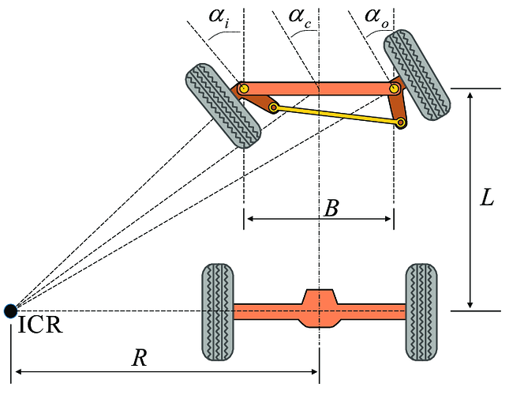

<h1 id="index">Índice</h1>

1. **[Introducción](#introduccion)**
2. **[Capas](#capas)**
    1. **[Primera Capa](#primera-capa)**
    1. **[Segunda Capa](#segunda-capa)**

 <h1 id="introduccion">Introducción</h1> 
Este es un segundo prototipo de Klevor, donde se le hicieron correcciones esenciales y se agregaron nuevos componentes que explicaremos detalladamente.

<h1 id="capas">Capas</h1>

<h2 id="primera-capa">Primera Capa</h2>

En esta primera capa, al igual que en nuestro primer prototipo, tenemos nuestro sistema motriz, al cual no se le hicieron modificaciones. Este funciona como el sistema mecánico de un automovil, un mecanismo 4x4 de dos diferenciales (sistema de engranajes cubiertos por una carcasa) conectados entre si por un eje transmisor. Nosotros conectamos nuestro motor ([INJORA 48T](../../README.md/#componentes-injora-180-motor-48t)) a un piñón que tiene el eje transmisor, esto hace que los diferenciales giren en un mismo sentido y que por consecuencia, Klevor se mueva.

Una parte fundamental para nuestro robot es su sistema de cruce. Es basado en un mecanismo Ackermann, que consiste en que las dos ruedas están conectadas por una dirección o "sistema de trapecio", esto lo que hace es que, mediante una fuerza que haga el cruce (en este caso nuestro servomotor [INJORA 7kg 2065](../../README.md/#componentes-injora-7kg-2065-micro-servo)) la dirección se mueva y eso hace girar ambas ruedas al mismo lado, debido a la geometría y forma de trapecio que tiene la dirección, las ruedas no giran con el mismo ángulo si no que, la rueda interna respecto al cruce gira más que la rueda externa.

Las ruedas para funcionar están conectadas a un muñón de dirección, luego a un "palier" o "semieje" que pasa por dentro del muñón y se junta con la rueda para que esta gire, el palier gira mientras está junto al diferencial. 

    

En este diagrama se ve un ejemplo más claro de cómo funciona este sistema. Describiremos a continuación el significado de cada término:

**ICR** (Centro Instantáneo de Rotación): Es el punto alrededor del cual el eje delantero está girando.

**R**: Es el radio del giro del vehículo, medido desde el ICR hasta el centro del eje trasero.

**L**: Es la distancia entre el eje delantero y el eje trasero de Klevor, o la distancia de nuestro eje transmisor.

**B**: Es la distancia entre los muñones de dirección (La pieza en la que va la rueda y se conecta a la dirección)

**a(i)**: Es el ángulo de giro de nuestra rueda interior respecto a la curva.

**a(o)**: Es el ángulo de nuestra rueda exterior respecto al giro.

Esto ilustra más la geometría de la dirección que permite que las ruedas delanteras giren en ángulos diferentes y a su vez en la misma dirección, consiguiendo así un giro eficiente. 

Nuestro motor [INJORA 48T](../../README.md/#componentes-injora-180-motor-48t) es el que se encarga de mover gran parte del sistema motriz, pero presentó una falla al no tener el suficiente torque para mover el robot. Por esto tomamos la decisión de hacer un sistema reductor de RPM, consta de un piñón que está en la boquilla del motor y que se conecta a 2 piñones más junto al engranaje principal del eje transmisor, reduciendo así la velocidad del motor, pero añadiendo más fuerza al mismo.

Seguiremos explicando esta primera capa de nuestro robot. De componentes tiene un [giroscopio](../../README.md/#gyroscope-gy-bno085) que ayuda al robot a orientarse y así contar el número de vueltas que da, tiene una batería [URGENEX 7.4](../../README.md/#componentes-urgenex-74v-battery) que alimenta al [INJORA MB100 20A mini ESC](../../README.md/#componentes-injora-mb100-20a-mini-esc) que es un regulador de velocidad y a su vez también alimenta el motor INJORA 48T y el servomotor INJORA 7kg 2065.

<h3 id="por-que">¿Por qué diseñamos así nuestro chasis?</h3>

Este chasis es una modificación de la primera capa del primer prototipo de Klevor. Decidimos modificarla por el peso, reduciendo el espacio por componentes que ya no están, esta primera capa también está diseñada con esa forma debido a las piezas de kits que no son modificables, como lo son los diferenciales, los muñones de dirección y el eje transmisor. Así hicimos un espacio a medida para cada componente. Esta también es la razón por la que diseñamos toda la parte de conexión de las ruedas (Ruedas, Semiejes y cajas de diferenciales).